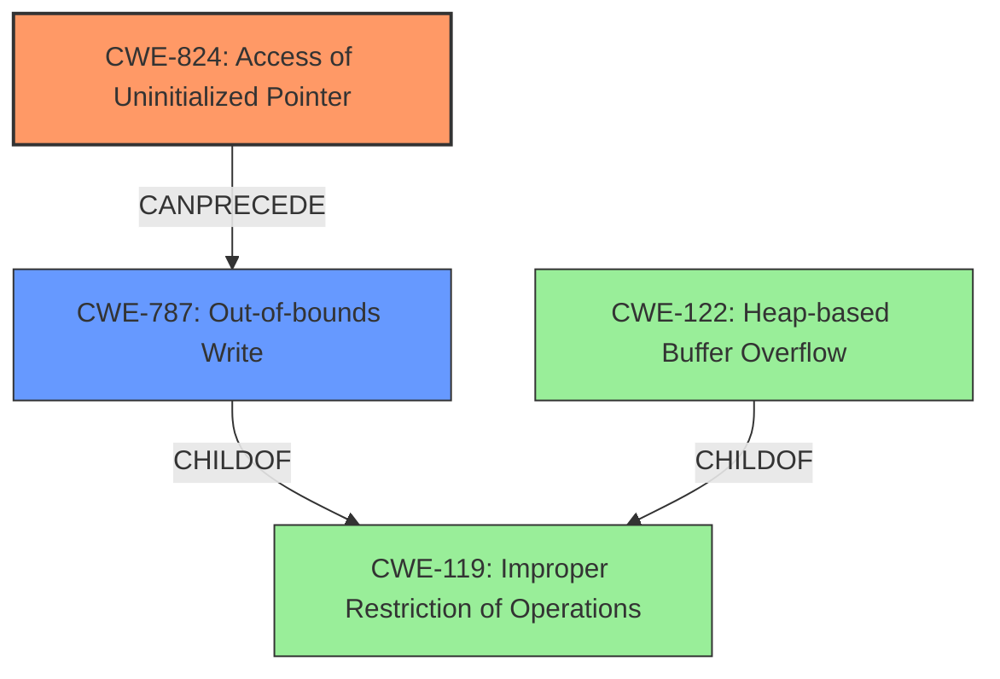

# Final Resolution for CVE-2022-30540

# Summary
| CWE ID | CWE Name | Confidence | CWE Abstraction Level | CWE Vulnerability Mapping Label | CWE-Vulnerability Mapping Notes |
|---|---|---|---|---|---|
| CWE-824 | Access of Uninitialized Pointer | 0.9 | Base | Allowed | This is the primary **root cause**; the **uninitialized pointer** is then used to cause the overflow. |
| CWE-787 | Out-of-bounds Write | 0.9 | Base | Allowed | This is a **weakness**, caused by the **uninitialized pointer**, leading to an out-of-bounds write, which is the cause of the buffer overflow. |

## Evidence and Confidence

*   **Confidence Score:** 0.9
*   **Evidence Strength:** HIGH

## Relationship Analysis
The primary relationship influencing the decision is the chain relationship between **CWE-824 (Access of Uninitialized Pointer)** and **CWE-787 (Out-of-bounds Write)**. The **uninitialized pointer** directly leads to an out-of-bounds write, which then causes the buffer overflow. While **CWE-122 (Heap-based Buffer Overflow)** was initially considered, **CWE-787** is a more accurate description of the direct consequence of using the **uninitialized pointer**. **CWE-787** is a child of **CWE-119**, but using the more specific **CWE-787** is preferred.

## Vulnerability Chain
The vulnerability chain starts with the **root cause** of an **uninitialized pointer (CWE-824)**. This leads to an out-of-bounds write **(CWE-787)**, which overwrites memory, resulting in a heap-based buffer overflow. The final impact is the potential execution of arbitrary code.

## Summary of Analysis
The initial analysis correctly identified **CWE-824** as the primary **root cause** due to the presence of an **uninitialized pointer**. The criticism suggested replacing **CWE-122 (Heap-based Buffer Overflow)** with **CWE-787 (Out-of-bounds Write)**, which is a more direct consequence of using the **uninitialized pointer**. The vulnerability description mentions "heap-based buffer overflow via uninitialized pointer." This evidence supports the selection of **CWE-824** as the **root cause** and **CWE-787** as the resulting **weakness**. The relationships between the CWEs, particularly the CanPrecede relationship between **CWE-824** and **CWE-787**, further validate this choice. The selected CWEs are at the optimal level of specificity, with **CWE-824** being a Base level CWE and **CWE-787** also being a Base level CWE, providing a clear and accurate representation of the vulnerability.

The analysis heavily relies on the provided evidence, specifically the vulnerability description, which explicitly states the presence of an **uninitialized pointer** leading to a **heap-based buffer overflow**.