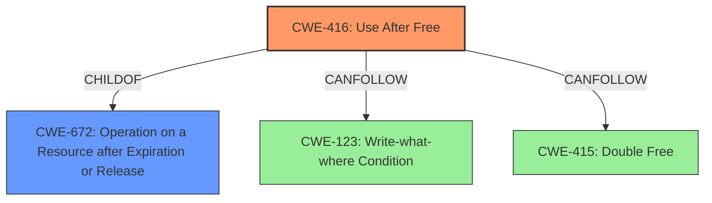

# Analysis Report for CVE-2022-3058

# Vulnerability Analysis Report: CVE-2022-3058

## Description

Use after free in Sign-In Flow in Google Chrome prior to 105.0.5195.52 allowed a remote attacker who convinced a user to engage in specific UI interactions to potentially exploit heap corruption via crafted UI interaction.

## Vulnerability Description Key Phrases

**Rootcause:** use after free
**Impact:** heap corruption
**Vector:** crafted UI interaction
**Attacker:** remote attacker
**Product:** Google Chrome
**Version:** prior to 105.0.5195.52
**Component:** Sign-In Flow

## Analysis (with Relationship Data)

# Summary
| CWE ID | CWE Name | Confidence | CWE Abstraction Level | CWE Vulnerability Mapping Label | CWE-Vulnerability Mapping Notes |
|---|---|---|---|---|---|
| CWE-416 | Use After Free | 1.0 | Variant | Allowed | Primary CWE |

## Evidence and Confidence

*   **Confidence Score:** 1.0
*   **Evidence Strength:** HIGH

- **Analysis and Justification:**  
  - *Explanation:* The vulnerability description explicitly states "**use after free**" as the root cause, which directly corresponds to CWE-416 (Use After Free). The CVE Reference Links Content Summary also confirms this by stating: "Root Cause of Vulnerability: - Use-after-free in the Sign-In Flow." CWE-416 is a Variant level CWE, which is a preferred level of abstraction. The MITRE mapping guidance for CWE-416 indicates this is ALLOWED.
  
  - *Relationship Analysis:* CWE-416 is a variant of CWE-672 (Operation on Resource after Expiry). The vulnerability could potentially lead to other issues such as CWE-123 (Write-what-where Condition) or CWE-415 (Double Free), but the primary weakness is the use after free itself.

- **Confidence Score:**  
  - Confidence: 1.0 (Direct evidence from vulnerability description and CVE reference materials)

## Criticism of Analysis

Okay, here's a detailed review of the provided analysis, incorporating the full CWE specifications:

**Overall Assessment:**

The analysis is well-structured and provides a solid justification for mapping the vulnerability to CWE-416 (Use After Free). The confidence score of 1.0 is appropriate, given the direct evidence in the vulnerability description. The inclusion of example CVEs for CWE-416 and the relevant CWE specifications strengthens the analysis.

**Detailed Review:**

**1. Summary Table:**

*   **CWE ID:** CWE-416
*   **CWE Name:** Use After Free
*   **Confidence:** 1.0
*   **CWE Abstraction Level:** Variant
*   **CWE Vulnerability Mapping Label:** Allowed
*   **CWE-Vulnerability Mapping Notes:** Primary CWE

    *   **Critique:** The summary table is clear and concise. All fields are correctly populated.

**2. Evidence and Confidence:**

*   **Confidence Score:** 1.0
*   **Evidence Strength:** HIGH

    *   **Analysis and Justification:**
        *   *Explanation:* The explanation is well-written and directly links the "use after free" root cause in the vulnerability description to CWE-416. The inclusion of the CVE Reference Links Content Summary further strengthens the justification. The rationale for selecting a Variant level CWE is also sound.
        *   *Relationship Analysis:* The relationship analysis is good. It correctly identifies potential related CWEs like CWE-672, CWE-123, and CWE-415, but maintains that the primary issue is the Use After Free (CWE-416). This demonstrates a good understanding of the relationships between different weaknesses.

    *   **Confidence Score:**
        *   Confidence: 1.0 (Direct evidence from vulnerability description and CVE reference materials)
            *   **Critique:** Justified confidence score based on the available information.

**3. CWE Examples from Database:**

*   **Observed Examples:**  List of CVEs for CWE-416.
    *   **Critique:** The list of CVEs is relevant and helps illustrate the types of vulnerabilities that are commonly associated with CWE-416.

**4. Relevant CWE Specifications:**

*   **CWE-416: Use After Free**
    *   The included specification is complete and accurate. The Mapping Guidance section correctly states that usage is "Allowed" with the rationale that it's at the Variant level of abstraction. The Potential Mitigations are also appropriate.  Mitigation 2, setting pointers to NULL after freeing, is a common, although not always foolproof, defense.
*   **CWE-415: Double Free**
    * Specification is complete and accurate.
*   **CWE-123: Write-what-where Condition**
    * Specification is complete and accurate.
*    **CWE-672: Operation on a Resource after Expiration or Release**
    * Specification is complete and accurate.
*   **CWE-366: Race Condition within a Thread**
*   **CWE-1021: Improper Restriction of Rendered UI Layers or Frames**
*   **CWE-356: Product UI does not Warn User of Unsafe Actions**
*   **CWE-843: Access of Resource Using Incompatible Type ('Type Confusion')**
*   **CWE-362: Concurrent Execution using Shared Resource with Improper Synchronization ('Race Condition')**
*   **CWE-122: Heap-based Buffer Overflow**
*   **CWE-415: Double Free**
*   **CWE-367: Time-of-check Time-of-use (TOCTOU) Race Condition**
*   **CWE-252: Unchecked Return Value**
*   **CWE-413: Improper Resource Locking**
*   **CWE-825: Expired Pointer Dereference**
*   **CWE-1341: Multiple Releases of Same Resource or Handle**
*   **CWE-666: Operation on Resource in Wrong Phase of Lifetime**
*   **CWE-120: Buffer Copy without Checking Size of Input ('Classic Buffer Overflow')**
*   **CWE-134: Use of Externally-Controlled Format String**
*   **CWE-1265: Unintended Reentrant Invocation of Non-reentrant Code Via Nested Calls**
*   **CWE-364: Signal Handler Race Condition**
*   **CWE-754: Improper Check for Unusual or Exceptional Conditions**
*   **CWE-828: Signal Handler with Functionality that is not Asynchronous-Safe**
*   **CWE-476: NULL Pointer Dereference**
*   **CWE-479: Signal Handler Use of a Non-reentrant Function**
*   **CWE-590: Free of Memory not on the Heap**
*   **CWE-1284: Improper Validation of Specified Quantity in Input**
*   **CWE-789: Memory Allocation with Excessive Size Value**
*   **CWE-190: Integer Overflow or Wraparound**
*   **CWE-119: Improper Restriction of Operations within the Bounds of a Memory Buffer**
*   **CWE-562: Return of Stack Variable Address**
*   **CWE-613: Insufficient Session Expiration**
*   **CWE-826: Premature Release of Resource During Expected Lifetime**
*   **CWE-910: Use of Expired File Descriptor**
*   **CWE-911: Improper Update of Reference Count**
*   **CWE-787: Out-of-bounds Write**
*   **CWE-298: Improper Validation of Certificate Expiration**
*   **CWE-324: Use of a Key Past its Expiration Date**

    *   **Critique:** Including the full CWE specifications is excellent. It allows for a complete understanding of the weakness and its context. This is especially helpful for less common CWEs.

**Recommendations for Improvement:**

1.  **Consider Chaining:** While the primary CWE is correctly identified, explore possible chaining scenarios more explicitly. For example:
    *   "A possible attack chain could involve a crafted UI interaction (as described in the vulnerability description) leading to improper memory management, resulting in the Use-After-Free (CWE-416). The subsequent use of the freed memory could then lead to a Write-What-Where condition (CWE-123) or a Double Free (CWE-415), ultimately resulting in code execution."
    *   Although a root-cause analysis should stop at the first identifiable cause, explicitly stating other potential causes can help developers perform a better remediation.

2.  **Mitigation Specificity:** While the general mitigations listed in the CWE specifications are helpful, consider adding mitigations that are specifically relevant to the Sign-In Flow component of Google Chrome. For example:
    *   "In the Sign-In Flow component, ensure that all objects related to the sign-in process are properly tracked and that their lifetimes are carefully managed to prevent premature freeing. Implement robust error handling to ensure that resources are not freed prematurely in the event of unexpected errors."
    *   Suggesting the use of static/dynamic analysis tools in the implementation phase might be useful.

3.  **Address Retriever Results:** Briefly address why the other retriever results (Race Condition, UI restriction, etc.) were not selected. Even a short sentence or two justifying the decision would be beneficial. For example: "While concurrency issues could potentially contribute to a use-after-free, the direct cause identified in the vulnerability description points to a memory management error rather than a synchronization issue. Therefore, CWE-416 is the most appropriate primary mapping."

4.  **Impact Statement:** Expand on the potential impact of exploiting CWE-416 in the context of the Sign-In Flow. For example, "Exploitation of this Use-After-Free vulnerability could allow a remote attacker to potentially execute arbitrary code within the context of the Chrome browser, leading to the compromise of sensitive user data or the ability to take control of the user's system. Given the high privileges often associated with browser processes, the impact is significant."

**Revised Summary Table (Incorporating Recommendations):**

| CWE ID | CWE Name | Confidence | CWE Abstraction Level | CWE Vulnerability Mapping Label | CWE-Vulnerability Mapping Notes |
|---|---|---|---|---|---|
| CWE-416 | Use After Free | 1.0 | Variant | Allowed | Primary CWE. May be chained with CWE-123 or CWE-415. |

**Conclusion:**

The original analysis is excellent. Implementing the recommendations above would make it even stronger by providing a more comprehensive understanding of the vulnerability and its potential impact. The inclusion of the full CWE specifications is a valuable addition.

## Final Resolution

# Summary
| CWE ID | CWE Name | Confidence | CWE Abstraction Level | CWE Vulnerability Mapping Label | CWE-Vulnerability Mapping Notes |
|---|---|---|---|---|---|
| CWE-416 | Use After Free | 1.0 | Variant | Allowed | Primary CWE. May be chained with CWE-123 or CWE-415. |

## Evidence and Confidence

*   **Confidence Score:** 1.0
*   **Evidence Strength:** HIGH

## Relationship Analysis
The primary relationship that influenced the decision was the parent-child relationship between CWE-416 (**CWE-416: Use After Free**) and its parent class, CWE-672 (**CWE-672: Operation on a Resource after Expiration or Release**). While CWE-672 is a broader category, CWE-416 provides a more specific description of the vulnerability. The potential for chaining with CWE-123 (**CWE-123: Write-what-where Condition**) and CWE-415 (**CWE-415: Double Free**) was also considered, acknowledging that the **use-after-free** condition could lead to these subsequent issues. The variant level of CWE-416 is appropriate as it directly describes the **root cause** mentioned in the vulnerability description.

## Vulnerability Chain
The vulnerability chain starts with a crafted UI interaction that leads to improper memory management. This improper memory management results in a **Use-After-Free (CWE-416)**. Subsequently, the attempt to use the freed memory can result in a **Write-What-Where Condition (CWE-123)** or a **Double Free (CWE-415)**, potentially leading to code execution. The **root cause** is the improper memory management triggered by the UI interaction, and the impact is potential code execution due to the **use-after-free** condition.

## Summary of Analysis
The initial analysis correctly identified CWE-416 as the primary weakness. The criticism provided valuable suggestions for improvement, including exploring possible chaining scenarios, suggesting mitigations specific to the Sign-In Flow component, and addressing why other retriever results were not selected.

The decision to classify this as CWE-416 is based on direct evidence from the vulnerability description: "Use after free in Sign-In Flow... allowed a remote attacker... to potentially exploit heap corruption via crafted UI interaction."

The graph relationships influenced the decision by highlighting the connection between the specific **use-after-free** condition (CWE-416) and its broader class (CWE-672), as well as potential downstream consequences (CWE-123, CWE-415).

CWE-416 is the optimal level of specificity because it directly describes the **root cause** explicitly stated in the vulnerability description and is a Variant level CWE which is preferred.

*Report generated on 2025-03-18 13:24:10*
