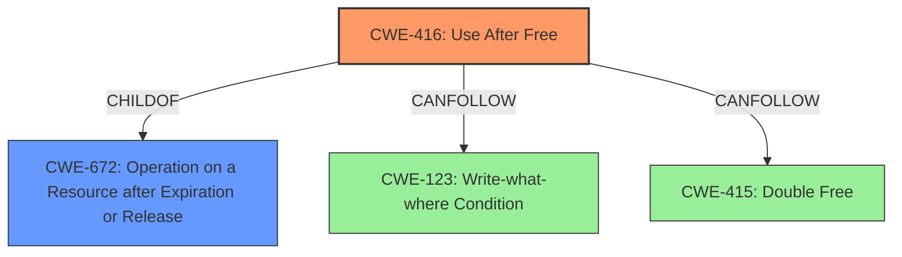

# Final Resolution for CVE-2022-3058

# Summary
| CWE ID | CWE Name | Confidence | CWE Abstraction Level | CWE Vulnerability Mapping Label | CWE-Vulnerability Mapping Notes |
|---|---|---|---|---|---|
| CWE-416 | Use After Free | 1.0 | Variant | Allowed | Primary CWE. May be chained with CWE-123 or CWE-415. |

## Evidence and Confidence

*   **Confidence Score:** 1.0
*   **Evidence Strength:** HIGH

## Relationship Analysis
The primary relationship that influenced the decision was the parent-child relationship between CWE-416 (**CWE-416: Use After Free**) and its parent class, CWE-672 (**CWE-672: Operation on a Resource after Expiration or Release**). While CWE-672 is a broader category, CWE-416 provides a more specific description of the vulnerability. The potential for chaining with CWE-123 (**CWE-123: Write-what-where Condition**) and CWE-415 (**CWE-415: Double Free**) was also considered, acknowledging that the **use-after-free** condition could lead to these subsequent issues. The variant level of CWE-416 is appropriate as it directly describes the **root cause** mentioned in the vulnerability description.

## Vulnerability Chain
The vulnerability chain starts with a crafted UI interaction that leads to improper memory management. This improper memory management results in a **Use-After-Free (CWE-416)**. Subsequently, the attempt to use the freed memory can result in a **Write-What-Where Condition (CWE-123)** or a **Double Free (CWE-415)**, potentially leading to code execution. The **root cause** is the improper memory management triggered by the UI interaction, and the impact is potential code execution due to the **use-after-free** condition.

## Summary of Analysis
The initial analysis correctly identified CWE-416 as the primary weakness. The criticism provided valuable suggestions for improvement, including exploring possible chaining scenarios, suggesting mitigations specific to the Sign-In Flow component, and addressing why other retriever results were not selected.

The decision to classify this as CWE-416 is based on direct evidence from the vulnerability description: "Use after free in Sign-In Flow... allowed a remote attacker... to potentially exploit heap corruption via crafted UI interaction."

The graph relationships influenced the decision by highlighting the connection between the specific **use-after-free** condition (CWE-416) and its broader class (CWE-672), as well as potential downstream consequences (CWE-123, CWE-415).

CWE-416 is the optimal level of specificity because it directly describes the **root cause** explicitly stated in the vulnerability description and is a Variant level CWE which is preferred.