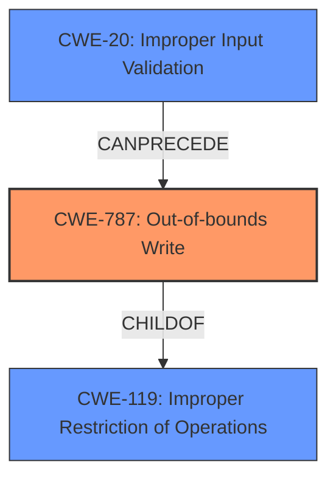

# Analysis Report for CVE-2022-30937

# Vulnerability Analysis Report: CVE-2022-30937

## Description

A vulnerability has been identified in EN100 Ethernet module DNP3 IP variant (All versions), EN100 Ethernet module IEC 104 variant (All versions), EN100 Ethernet module IEC 61850 variant (All versions < V4.37), EN100 Ethernet module Modbus TCP variant (All versions), EN100 Ethernet module PROFINET IO variant (All versions). Affected applications contains a memory corruption vulnerability while parsing specially crafted HTTP packets to /txtrace endpoint. This could allow an attacker to crash the affected application leading to a denial of service condition.

## Vulnerability Description Key Phrases

**Rootcause:** memory corruption
**Impact:** denial of service
**Vector:** specially crafted HTTP packets to /txtrace endpoint
**Attacker:** attacker
**Product:** EN100 Ethernet module
**Version:** All versions

## Analysis (with Relationship Data)

# Summary
| CWE ID | CWE Name | Confidence | CWE Abstraction Level | CWE Vulnerability Mapping Label | CWE-Vulnerability Mapping Notes |
|---|---|---|---|---|---|
| CWE-787 | Out-of-bounds Write | 0.9 | Base | Allowed | Primary CWE |
| CWE-119 | Improper Restriction of Operations within the Bounds of a Memory Buffer | 0.6 | Class | Discouraged | Secondary Candidate |

## Evidence and Confidence

*   **Confidence Score:** 0.8
*   **Evidence Strength:** HIGH

- **Analysis and Justification:**  
  - *Explanation:* The vulnerability description explicitly states a "**memory corruption**" issue when parsing HTTP packets, which can lead to a denial of service. The CVE Reference Links Content Summary further confirms the "**Root cause of vulnerability**" as a memory corruption vulnerability when parsing specially crafted HTTP packets. This aligns well with CWE-787 (Out-of-bounds Write), a Base level CWE that describes writing data outside the intended buffer boundaries, leading to memory corruption. The vulnerability involves sending specially crafted HTTP packets to a specific endpoint (/txtrace), suggesting that input processing is involved, and the **memory corruption** results from how these packets are parsed. CWE-787 is a more precise match than its parent CWE-119 because it specifies the nature of the memory corruption as an out-of-bounds write. CWE-787 is ALLOWED based on MITRE mapping guidance.
  
  - *Relationship Analysis:* CWE-787 is a base-level weakness and a child of CWE-119. CWE-787 can lead to CWE-824 (Access of Uninitialized Pointer) and other memory corruption-related issues.

- **Confidence Score:**  
  - Confidence: 0.9 (Strong evidence from the vulnerability description and CVE reference materials, aligning with the primary CWE match)

---

- **Analysis and Justification:**  
  - *Explanation:* CWE-119 (Improper Restriction of Operations within the Bounds of a Memory Buffer) is a broader class of weakness that encompasses various memory corruption issues, including out-of-bounds writes. While the description does indicate a "**memory corruption**" vulnerability, the specificity of the out-of-bounds write makes CWE-787 a better fit. CWE-119 is listed as DISCOURAGED due to its general nature and the availability of more specific CWEs.
  
  - *Relationship Analysis:* CWE-119 is a parent of CWE-787.

- **Confidence Score:**  
  - Confidence: 0.6 (Supporting evidence of a "**memory corruption**" vulnerability but lower specificity compared to CWE-787).

## Criticism of Analysis

Okay, I've reviewed your analysis against the full CWE specifications provided. Here's a detailed critique, focusing on the validity of your CWE mappings, the confidence levels, and potential alternative CWEs.

**Overall Assessment:**

Your analysis is generally good. You correctly identified CWE-787 as the primary weakness and provided a reasonable justification. Your confidence level is appropriate. The inclusion of CWE-119 as a secondary candidate is also sensible, given its relationship to CWE-787. However, I would suggest the addition of **CWE-20** as a possible chained CWE.

**Detailed Review:**

**1. CWE-787: Out-of-bounds Write (Primary)**

*   **Mapping Validity:** Excellent. The description explicitly states "memory corruption" caused by parsing specially crafted HTTP packets. This strongly suggests a write operation outside the intended memory boundaries. CWE-787 is a direct and accurate representation of this vulnerability. The explanation of parsing the HTTP request also indicates that the software receives input, which is consistent with CWE-787. The inclusion of observed examples for CWE-787 reinforces the validity of the mapping as well.
*   **Confidence Level:** Justified at 0.9. The evidence is compelling and directly supports this CWE.
*   **Abstraction Level:** Correctly identified as Base.
*   **Mitigation Relevance:** The listed mitigations for CWE-787 are relevant:
    *   *Language Selection:* Using memory-safe languages is a strong preventative measure.
    *   *Libraries/Frameworks:* Using libraries like SafeStr or Strsafe.h can help to avoid common mistakes in string handling.
    *   *Environment Hardening:* Using compiler-based buffer overflow detection is a useful defense-in-depth strategy.
*   **Potential improvements:**
    *   Consider explicitly mentioning the direction of the out-of-bounds write if the information can be inferred. Is it writing *past* the end or *before* the beginning?
    *   Clarify how the *attacker* controls the contents written outside of the buffer to cause DoS condition.

**2. CWE-119: Improper Restriction of Operations within the Bounds of a Memory Buffer (Secondary)**

*   **Mapping Validity:**  Correct, but not as precise as CWE-787. As a parent of CWE-787, it accurately captures the general class of "memory corruption" but lacks the specificity of the "out-of-bounds write." The explanation that "the description does indicate a memory corruption vulnerability, the specificity of the out-of-bounds write makes CWE-787 a better fit" is on point.
*   **Confidence Level:**  Appropriate at 0.6. It's a supporting CWE, but the description leans more toward its child CWE.
*   **Abstraction Level:** Correctly identified as Class, and as such, Discouraged.
*   **Mitigation Relevance:** The mitigations for CWE-119 are relevant as well, though more general than those for CWE-787.
*   **Potential improvements:**
    *   No significant changes needed.

**Additional Considerations and Potential CWEs:**

*   **CWE-20: Improper Input Validation (Chained):**  The vulnerability stems from specially crafted HTTP packets. This suggests that the input parsing logic is failing to adequately validate the structure or content of these packets. *Improperly validated input is leading to the memory corruption*.  Therefore, consider adding CWE-20 to the analysis as a chained weakness. The attacker's ability to craft packets that trigger memory corruption highlights a failure to properly sanitize the input.
    *   **Justification:** "The vulnerability involves sending specially crafted HTTP packets to a specific endpoint (/txtrace), suggesting that input processing is involved..." The crafted packets causing memory corruption point to a lack of validation of the packet's structure or content, allowing it to trigger the overflow.
    *   **Mitigation Relevance:** Input validation techniques and the mention of LangSec are highly applicable.
    *   **Confidence Level:** Medium (0.7), as it is an inferred contributing factor, though plausible.
*   **CWE-130: Improper Handling of Length Parameter Inconsistency (Possible):** If there is a length field in the HTTP packet and that field is not consistent with the actual data length, potentially leading to the memory corruption.
    *   **Justification:** The crafted HTTP packets could be manipulating the length field to cause a discrepancy between the size of the data and the buffer allocated for it, leading to the memory corruption.
    *   **Confidence Level:** Low (0.4). Requires more investigation to confirm.
*   **CWE-400: Uncontrolled Resource Consumption (Possible):** Although DoS is the impact, the root cause could be the system consuming excessive resources in handling these specially crafted packets.
    *   **Justification:** Processing of crafted packets might require excessive memory or CPU leading to DoS.
    *   **Confidence Level:** Low (0.3). Requires more investigation to confirm.

**Specific suggestions:**

*   In the summary table, if you add CWE-20 include it as a 'Chained' relationship.
*   In the CWE-787 Analysis and Justification, explicitly state that the memory corruption is a *write* operation outside the intended memory boundaries. This aligns the explanation more closely with CWE-787.
*   Consider if you have information about whether the memory corruption is a *write past the end* of the buffer, or *write before the beginning* of the buffer.

**In summary,** your analysis is solid, and the primary CWE assignment to CWE-787 is correct. Adding CWE-20 as a chained CWE strengthens the analysis, given the nature of the attack vector. Ensure that all claims about the type of the vulnerability (e.g. write, or read), or how the attacker triggers the vulnerability (e.g. input validation, length value) are justified with evidence. You have clearly explained your reasoning for including and excluding CWEs, which is very helpful.

## Final Resolution

# Summary
| CWE ID | CWE Name | Confidence | CWE Abstraction Level | CWE Vulnerability Mapping Label | CWE-Vulnerability Mapping Notes |
|---|---|---|---|---|---|
| CWE-787 | Out-of-bounds Write | 0.9 | Base | Allowed | Primary CWE |
| CWE-20 | Improper Input Validation | 0.7 | Base | Allowed | Secondary CWE - Input Validation |
| CWE-119 | Improper Restriction of Operations within the Bounds of a Memory Buffer | 0.6 | Class | Discouraged | Secondary Candidate |

## Evidence and Confidence

*   **Confidence Score:** 0.8
*   **Evidence Strength:** HIGH

## Relationship Analysis
The primary relationship influencing the decision is the hierarchical relationship between CWE-119 and CWE-787, where CWE-787 is a child of CWE-119, allowing for a more specific classification. The chain relationship is that CWE-20 can precede CWE-787, as improper input validation can lead to an out-of-bounds write. The abstraction levels played a crucial role, favoring the Base level CWEs (CWE-787 and CWE-20) over the Class level CWE (CWE-119).

## Vulnerability Chain
The vulnerability chain starts with **CWE-20 (Improper Input Validation)**, where the application fails to properly validate specially crafted HTTP packets. This leads to **CWE-787 (Out-of-bounds Write)**, where the application writes data outside the intended buffer boundaries due to the unvalidated input. The consequence is a denial of service (DoS) condition because of **memory corruption**, as the vulnerability description says: "This could allow an attacker to crash the affected application leading to a denial of service condition."

## Summary of Analysis
The initial analysis correctly identified **CWE-787 (Out-of-bounds Write)** as the primary weakness due to the "**memory corruption**" vulnerability when parsing HTTP packets. The criticism suggested adding **CWE-20 (Improper Input Validation)** as a chained weakness, which is now accepted because the vulnerability stems from "specially crafted HTTP packets," indicating a failure in input validation.

*   **CWE-787 (Out-of-bounds Write)** is selected as the primary CWE because the vulnerability description explicitly states a "**memory corruption**" issue when parsing HTTP packets. The CVE Reference Links Content Summary further confirms the "**Root cause of vulnerability**" as a **memory corruption** vulnerability when parsing specially crafted HTTP packets. This aligns well with **CWE-787 (Out-of-bounds Write)**, a Base level CWE that describes writing data outside the intended buffer boundaries, leading to **memory corruption**.

*   **CWE-20 (Improper Input Validation)** is selected as a secondary CWE because the vulnerability description mentions "specially crafted HTTP packets," indicating a failure to properly validate the input. The crafted packets are not validated, allowing them to trigger the out-of-bounds write.

*   **CWE-119 (Improper Restriction of Operations within the Bounds of a Memory Buffer)** is retained as a secondary candidate but with a lower confidence score. While it accurately captures the general class of **memory corruption**, it lacks the specificity of **CWE-787 (Out-of-bounds Write)**.

The selected CWEs are at the optimal level of specificity. **CWE-787 (Out-of-bounds Write)** is a Base level CWE that provides a precise description of the **memory corruption** issue. **CWE-20 (Improper Input Validation)** is also a Base level CWE and explains how the attacker can trigger the vulnerability. **CWE-119 (Improper Restriction of Operations within the Bounds of a Memory Buffer)** is a Class level CWE and is too general for this vulnerability.

*Report generated on 2025-03-18 13:24:52*
