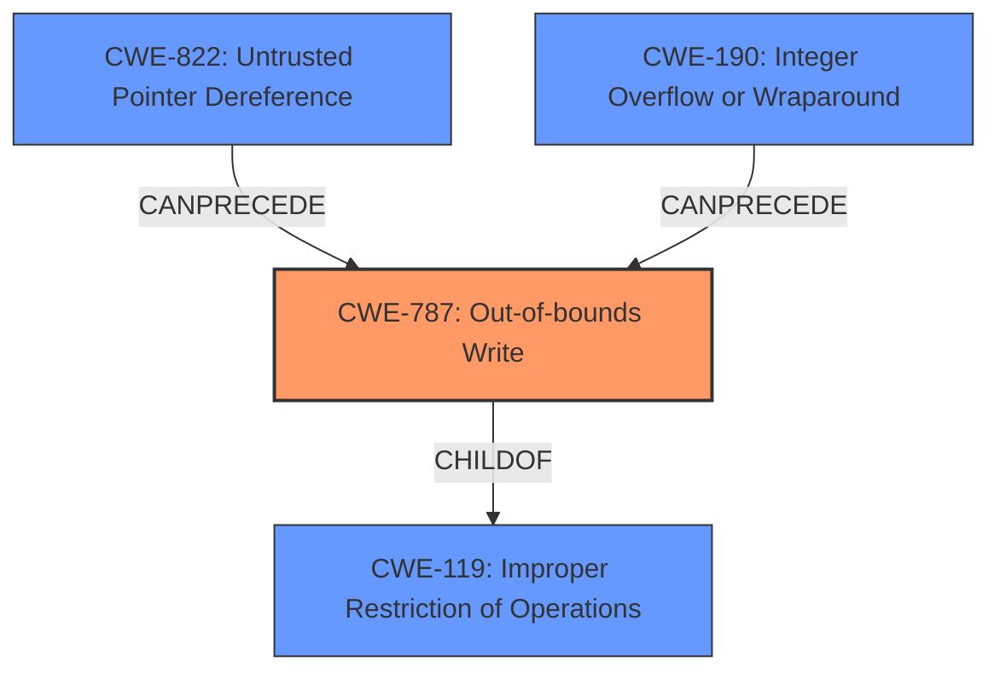

# Final Resolution for CVE-2022-30938

# Summary
| CWE ID  | CWE Name  | Confidence | CWE Abstraction Level | CWE Vulnerability Mapping Label | CWE-Vulnerability Mapping Notes |
|---|---|---|---|---|---|
| CWE-787 | Out-of-bounds Write | 0.95 | Base | Allowed | The vulnerability involves **memory corruption** due to parsing specially crafted HTTP packets, leading to an out-of-bounds write. |

## Evidence and Confidence

*   **Confidence Score:** 0.95
*   **Evidence Strength:** HIGH

## Relationship Analysis
The primary relationship that influenced the decision was the parent-child relationship between CWE-119 and CWE-787. While the CVE summary mentions CWE-119, CWE-787 provides a more specific description of the **memory corruption**. The analysis also considered the chain relationships of CWE-787, such as potentially following CWE-822 (Untrusted Pointer Dereference) or CWE-190 (Integer Overflow or Wraparound) if the crafted HTTP packets cause an integer overflow to occur which is then used in a write operation. The abstraction level of CWE-787 as a Base CWE further solidified its selection.

## Vulnerability Chain
The vulnerability chain starts with the receipt of specially crafted HTTP packets to the /txtrace endpoint. These packets manipulate a specific argument, leading to **memory corruption** (CWE-787). This out-of-bounds write can then lead to a crash of the affected application, resulting in a denial of service condition.

## Summary of Analysis
The initial analysis and criticism both converge on CWE-787 as the most appropriate classification. The decision is based on the vulnerability description, which highlights **memory corruption** caused by crafted HTTP packets. This aligns perfectly with the description of CWE-787 (Out-of-bounds Write).

The evidence from the vulnerability description: "Affected applications contains a memory corruption vulnerability while parsing specially crafted HTTP packets to /txtrace endpoint manupulating a specific argument. This could allow an attacker to crash the affected application leading to a denial of service condition" is directly related to CWE-787.

The graph relationships support this decision, as CWE-787 is a more specific child of the more general CWE-119, which is mentioned in the CVE summary.

The selection of CWE-787 is at the optimal level of specificity because it accurately describes the **root cause** of the vulnerability (the out-of-bounds write) without being overly broad (like CWE-119) or requiring more specific implementation details (like stack vs. heap).