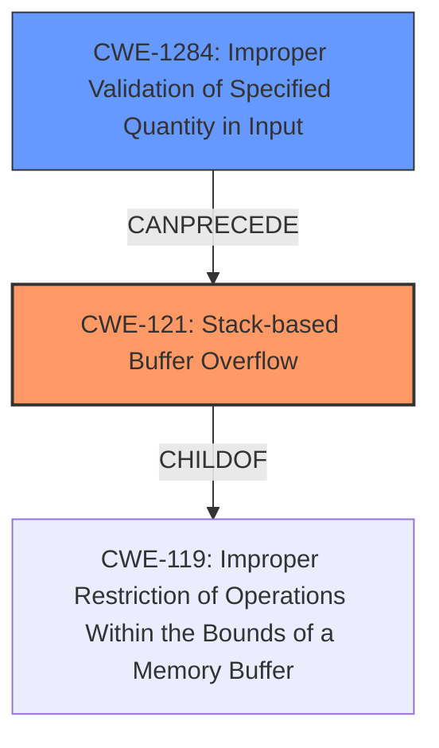

# Final Resolution for CVE-2022-31031

# Summary
| CWE ID | CWE Name | Confidence | CWE Abstraction Level | CWE Vulnerability Mapping Label | CWE-Vulnerability Mapping Notes |
|---|---|---|---|---|---|
| CWE-121 | Stack-based Buffer Overflow | 0.95 | Variant | Primary | Allowed |
| CWE-1284 | Improper Validation of Specified Quantity in Input | 0.7 | Base | Secondary | Allowed |

## Evidence and Confidence

*   **Confidence Score:** 0.9
*   **Evidence Strength:** HIGH

## Relationship Analysis
The primary relationship influencing the decision is that **CWE-121 (Stack-based Buffer Overflow)** is a specific type of buffer overflow, making it a child of **CWE-119 (Improper Restriction of Operations Within the Bounds of a Memory Buffer)** (not explicitly provided, but implied). **CWE-1284 (Improper Validation of Specified Quantity in Input)** can precede **CWE-121**, as the lack of input validation leads to the overflow.

## Vulnerability Chain
The vulnerability chain starts with **CWE-1284 (Improper Validation of Specified Quantity in Input)** where the STUN message attributes' size is not validated. This leads to **CWE-121 (Stack-based Buffer Overflow)** when the program attempts to write more data into the stack buffer than it can hold. The impact is potential arbitrary code execution and denial of service.

## Summary of Analysis
The initial analysis and criticism were both accurate. The assessment is based on the provided evidence, particularly the vulnerability description and CVE summary, which explicitly mention a **stack buffer overflow**. The graph relationships helped solidify the understanding that **CWE-121** is a specific instance of a buffer overflow and that **CWE-1284** can lead to **CWE-121**.

The decision to prioritize **CWE-121** is justified by the direct mention of a "stack buffer overflow" in the vulnerability description. The criticism's suggestion to consider why other retriever results were not chosen was helpful.

*   **CWE-770 (Allocation of Resources Without Limits or Throttling):** While related to resource exhaustion, the root cause is the overflow of a stack buffer due to a missing boundary check.
*   **CWE-126 (Buffer Over-read):** While an over-read could occur, the primary issue is the out-of-bounds write.

The confidence score for **CWE-1284** has been increased to 0.7 because the description mentions "missing boundary check," which is a form of improper validation. "PJSIP is a free and open source multimedia communication library written in C language implementing standard based protocols such as SIP, SDP, RTP, STUN, TURN, and ICE. In versions prior to and including 2.12.1 a stack buffer overflow vulnerability affects PJSIP users that use STUN in their applications, either by setting a STUN server in their account/media config in PJSUA/PJSUA2 level, or directly using `pjlib-util/stun_simple` API." This confirms the lack of validation on the STUN attributes.

The selected CWEs are at the optimal level of specificity. **CWE-121** is a **Variant** that accurately describes the stack-based nature of the overflow, while **CWE-1284** is a **Base** CWE that captures the lack of input validation leading to the overflow.