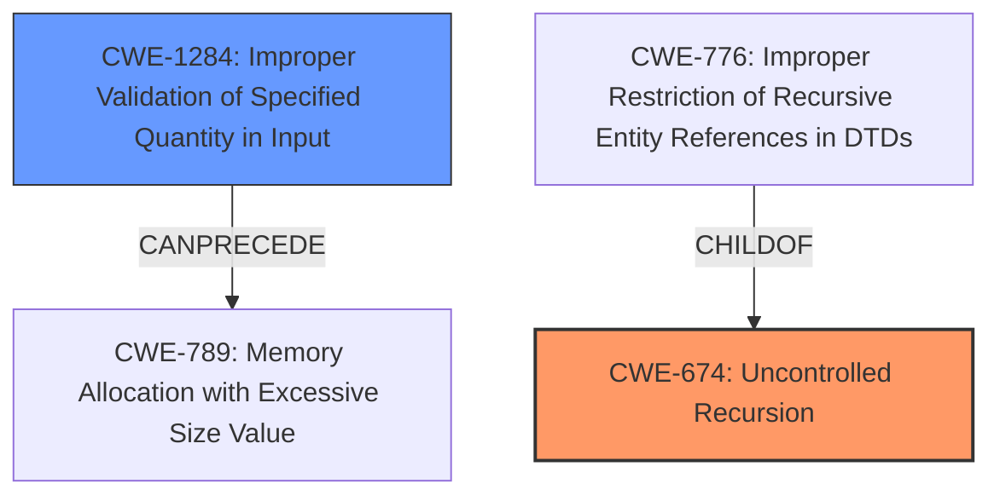

# Final Resolution for CVE-2022-31099

# Summary
| CWE ID | CWE Name | Confidence | CWE Abstraction Level | CWE Vulnerability Mapping Label | CWE-Vulnerability Mapping Notes |
|---|---|---|---|---|---|
| CWE-674 | **Uncontrolled Recursion** | 0.9 | Class | Allowed-with-Review | Primary CWE: The product does not properly control the amount of recursion that takes place, consuming excessive resources, such as allocated memory or the program stack. |
| CWE-1284 | **Improper Validation of Specified Quantity in Input** | 0.4 | Base | Allowed | Secondary Candidate: The product receives input that is expected to specify a quantity (such as size or length), but it does not validate or incorrectly validates that the quantity has the required properties. |

## Evidence and Confidence

*   **Confidence Score:** 0.9
*   **Evidence Strength:** HIGH

## Relationship Analysis
The primary relationship influencing the decision is the parent-child relationship where CWE-674 is a class-level CWE. The analysis considered if any child CWEs offered a more specific classification. Although CWE-776 (Improper Restriction of Recursive Entity References in DTDs ('XML Entity Expansion')) is a child of CWE-674, it pertains specifically to XML entity expansion, which is not applicable in this case.

CWE-1284, while initially considered a secondary weakness, has a CANPRECEDE relationship to CWE-789 (Memory Allocation with Excessive Size Value), suggesting a potential allocation issue following improper input validation. However, given the nature of the uncontrolled recursion leading to a stack overflow, CWE-674 remains the most relevant root cause.

## Vulnerability Chain
The vulnerability chain starts with the lack of control over recursion depth (CWE-674). The absence of validation on the nesting depth (potentially CWE-1284) allows an attacker to craft an expression with excessive nesting. This leads to uncontrolled recursion, consuming excessive stack memory and ultimately resulting in a stack overflow. The consequence is a denial-of-service, as the process aborts when the stack overflows.

## Summary of Analysis
The initial analysis correctly identified CWE-674 (**Uncontrolled Recursion**) as the primary **weakness**. The vulnerability description explicitly states, "When parsing untrusted rulex expressions, the stack may overflow...This happens when parsing an expression with several hundred levels of nesting...". This directly points to the **root cause** being the lack of control over recursion depth, which aligns perfectly with the description of CWE-674: "The product does not properly control the amount of recursion that takes place, consuming excessive resources, such as allocated memory or the program stack."

The criticism suggested considering child CWEs of CWE-674 for a more specific classification. However, none of the children are as directly relevant as CWE-674 itself. For example, CWE-776 relates to XML entity expansion, which is not the case here.

The analysis acknowledges that CWE-1284 (**Improper Validation of Specified Quantity in Input**) could be a contributing factor, as the depth of nesting can be viewed as a quantity that is not validated. However, the core issue remains the uncontrolled recursion itself (CWE-674), making it the primary concern.

The selected CWEs are at the optimal level of specificity. While more specific CWEs might exist under different vulnerability scenarios, CWE-674 directly addresses the **root cause** described in the vulnerability, and CWE-1284 provides a potential secondary factor. The decision is strongly based on the provided evidence and the MITRE mapping guidance, with a high confidence score.