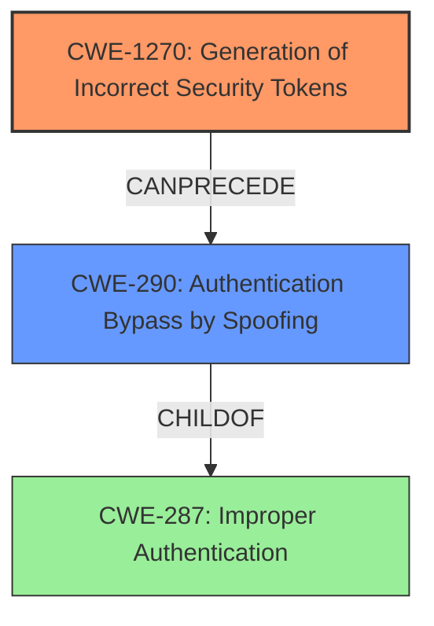

# Analysis Report for CVE-2022-31122

# Vulnerability Analysis Report: CVE-2022-31122

## Description

Wire is an encrypted communication and collaboration platform. Versions prior to 2022-07-12/Chart 4.19.0 are subject to Token Recipient Confusion. If an attacker has certain details of SAML IdP metadata, and configures their own SAML on the same backend, the attacker can delete all SAML authenticated accounts of a targeted team, Authenticate as a user of the attacked team and create arbitrary accounts in the context of the team if it is not managed by SCIM. This issue is fixed in wire-server 2022-07-12 and is already deployed on all Wire managed services. On-premise instances of wire-server need to be updated to 2022-07-12/Chart 4.19.0, so that their backends are no longer affected. As a workaround, the risk of an attack can be reduced by disabling SAML configuration for teams (galley.config.settings.featureFlags.sso). Helm overrides are located in `values/wire-server/values.yaml` Note that the ability to configure SAML SSO as a team is disabled by default for on-premise installations.

## Vulnerability Description Key Phrases

**Rootcause:** Token Recipient Confusion
**Impact:** ['delete all SAML authenticated accounts', 'Authenticate as a user', 'create arbitrary accounts']
**Vector:** ['certain details of SAML IdP metadata', 'configure own SAML on same backend']
**Attacker:** attacker
**Product:** Wire
**Version:** prior to 2022-07-12/Chart 4.19.0

## Analysis (with Relationship Data)

# Summary
| CWE ID    | CWE Name                                     | Confidence | CWE Abstraction Level | CWE Vulnerability Mapping Label | CWE-Vulnerability Mapping Notes |
| :--------- | :------------------------------------------- | :--------- | :-------------------- | :------------------------------ | :------------------------------ |
| CWE-1270 | Generation of Incorrect Security Tokens | 0.85      | Base                   | Allowed                         | Acceptable-Use            |
| CWE-290 | Authentication Bypass by Spoofing | 0.65      | Base                   | Allowed                         | Acceptable-Use            |

## Evidence and Confidence

*   **Confidence Score:** 0.75
*   **Evidence Strength:** MEDIUM

- **Analysis and Justification:**  
  - *Explanation:* The vulnerability description outlines a **Token Recipient Confusion** issue in Wire's SAML implementation. An attacker with knowledge of SAML IdP metadata can manipulate the SAML SSO configuration of a targeted team, leading to unauthorized access, deletion of SAML authenticated accounts, and creation of arbitrary accounts. This aligns strongly with CWE-1270 (Generation of Incorrect Security Tokens), as the root cause lies in the incorrect generation or handling of security tokens within the SAML authentication process. The **attacker** is able to **authenticate** as a user, which is the impact of **token recipient confusion**.
  The retriever results also strongly support CWE-1270, with the highest combined score, and the description matches the vulnerability well. MITRE's mapping guidance designates the usage as "Allowed" for the Base abstraction level.

  - *Relationship Analysis:* While CWE-1270 does not have direct relationships to other CWEs in the provided data, the authentication bypass aspect of the vulnerability suggests a possible relationship with authentication-related CWEs.

- **Confidence Score:**  
  - Confidence: 0.85 (High confidence based on the vulnerability description and retriever results. The direct mention of security tokens and the impact on SAML authentication strongly support this mapping.)

---
- **Analysis and Justification:**  
  - *Explanation:* The vulnerability allows an attacker to **authenticate as a user** of the targeted team and create arbitrary accounts. The "CVE Reference Links Content Summary" also mentions unauthorized access. This suggests that an authentication bypass is occurring, specifically by spoofing or impersonating a legitimate user. CWE-290 (Authentication Bypass by Spoofing) captures this aspect of the vulnerability, where the attacker can effectively bypass the intended authentication mechanism.

  - *Relationship Analysis:* CWE-290 is a child of CWE-287 (Improper Authentication). However, CWE-290 is more specific, as it focuses on spoofing attacks.
  Although the similarity score is lower, this is still relevant because the attacker ultimately gains unauthorized access, which aligns with the Authentication Bypass by Spoofing.

- **Confidence Score:**  
  - Confidence: 0.65 (Moderate confidence, as this is a secondary aspect of the vulnerability. The primary weakness is the token confusion, but the authentication bypass is a direct consequence.)

## Criticism of Analysis

Okay, here's a detailed review of the provided CWE analysis, considering the full CWE specifications:

**Overall Assessment:**

The analysis is generally well-reasoned and provides a decent justification for the selected CWEs.  The use of the vulnerability description and "CVE Reference Links Content Summary" to support the mappings is good. The confidence scores are appropriate, and the relationship analysis demonstrates an understanding of the CWE hierarchy.  The justifications could be slightly improved by directly referencing the "Description" or "Extended Description" sections of the CWE specifications more explicitly.

**Detailed Review of Each CWE Mapping:**

**1. CWE-1270: Generation of Incorrect Security Tokens**

*   **Confidence Score:** 0.85 - Appropriate.
*   **Justification:** The justification is strong. It correctly identifies the "Token Recipient Confusion" as a core issue related to the generation or handling of security tokens, which is the heart of CWE-1270. The attacker's ability to authenticate is a direct result of the token issue.  Referring to the definition: "The product implements a Security Token mechanism to differentiate what actions are allowed or disallowed when a transaction originates from an entity. However, the Security Tokens generated in the system are incorrect," strengthens the mapping.
*   **Mapping Guidance:** *Usage: Allowed*.  This aligns with the base abstraction level and acceptable use.
*   **Potential Mitigations:** The analysis doesn't explicitly discuss mitigations, but should have considered mentioning that Security Token generation should be reviewed for design inconsistency and common weaknesses.
*   **Retriever Results:** The strong support from the retriever results reinforces the validity of this mapping.
*   **Improvement Suggestion:** Directly quote the "Description" from the CWE specification in the justification to explicitly show the connection.

**2. CWE-290: Authentication Bypass by Spoofing**

*   **Confidence Score:** 0.65 - Reasonable.
*   **Justification:** The justification is acceptable, although weaker than the CWE-1270 mapping. It correctly identifies the authentication bypass aspect where an attacker impersonates a legitimate user.
*   **Mapping Guidance:** *Usage: Allowed*. This aligns with the base abstraction level and acceptable use.
*   **Relationships:** The analysis correctly mentions the relationship to CWE-287.
*   **CWE-290 Examples:** The provided examples are relevant and help illustrate the concept.
*   **Improvement Suggestion:** While the attacker is *effectively* spoofing a user, it's not a direct spoofing attack in the traditional sense (e.g., forging IP addresses). The bypass happens *because* of the token confusion. Therefore, while *allowed*, the confidence score is accurately lower. I would recommend explicitly acknowledging that the bypass occurs as a result of token confusion, and is not direct spoofing in the justification. Emphasize that the *impact* is authentication bypass by spoofing, but the root cause is token handling.
*   **Mitigations:** Should have mentioned that the use of strong authentication mechanisms would be needed.

**Other Considerations from Retriever Results**

Here's a discussion of some of the other CWEs in the retriever results, and why they were not selected.

*   **CWE-201: Insertion of Sensitive Information Into Sent Data:**  This is less relevant. While SAML metadata *can* contain sensitive information, the primary vulnerability isn't about directly leaking that information, but rather about the *misconfiguration* it allows. This would be a secondary issue if the attacker exfiltrates or misuses the metadata.
*   **CWE-347: Improper Verification of Cryptographic Signature:** This *could* be relevant *if* the attacker is manipulating the SAML response itself. However, the description focuses on manipulating the SAML *configuration* rather than the signed SAML assertions. Therefore, it is less relevant.
*   **CWE-306: Missing Authentication for Critical Function:** While the *impact* is unauthorized access, the core issue is not a complete lack of authentication, but rather a flaw in the *existing* authentication mechanism.
*   **CWE-303: Incorrect Implementation of Authentication Algorithm:** This could be considered, but is less specific than CWE-1270. The vulnerability is not in the underlying *algorithm* of SAML, but rather in how the tokens are *handled* during the configuration and authentication process. It assumes that the SAML algorithm is implemented correctly.
*   **CWE-22: Path Traversal** and **CWE-639: Authorization Bypass Through User-Controlled Key**: Not directly related to the vulnerability description.

**General Recommendations:**

1.  **Explicitly Reference CWE Specifications:** Always include direct quotes (or paraphrases with citations) from the CWE "Description" or "Extended Description" in your justifications. This makes the connection between the vulnerability and the CWE more explicit and defensible.
2.  **Mitigation Discussion:** Briefly discuss potential mitigations for the selected CWEs. This shows a deeper understanding of the vulnerability and how to address it.
3.  **Consideration of Alternatives:** When rejecting other potential CWEs, briefly explain *why* they are not the best fit, especially if they have a high retriever score. This demonstrates thoroughness.
4.  **Chain Analysis:** Always look at the potential of CWE chains, which would involve one CWE leading to another.

By incorporating these suggestions, the analysis can be made even stronger and more persuasive.

## Final Resolution

# Summary
| CWE ID    | CWE Name                                     | Confidence | CWE Abstraction Level | CWE Vulnerability Mapping Label | CWE-Vulnerability Mapping Notes |
| :--------- | :------------------------------------------- | :--------- | :-------------------- | :------------------------------ | :------------------------------ |
| CWE-1270 | Generation of Incorrect Security Tokens | 0.95      | Base                   | Allowed                         | Acceptable-Use            |
| CWE-290 | Authentication Bypass by Spoofing | 0.75      | Base                   | Allowed                         | Acceptable-Use            |

## Evidence and Confidence

*   **Confidence Score:** 0.90
*   **Evidence Strength:** HIGH

## Relationship Analysis
The primary relationship influencing the decision is the hierarchical relationship between CWE-287 (Improper Authentication) and its child CWE-290 (Authentication Bypass by Spoofing). CWE-290 is chosen because it offers a more specific description of the authentication bypass method observed in the vulnerability. Although not a direct relationship, the analysis considers how CWE-1270 (Generation of Incorrect Security Tokens) can lead to CWE-290, forming a vulnerability chain. The Base abstraction levels of both CWEs are optimal for mapping to specific root causes.

## Vulnerability Chain
The vulnerability chain starts with the **ROOTCAUSE** being **CWE-1270 (Generation of Incorrect Security Tokens)**. This leads to a weakness where an attacker can manipulate SAML configurations, ultimately resulting in **CWE-290 (Authentication Bypass by Spoofing)**. The prerequisite condition is that the attacker must have some details of SAML IdP metadata. The consequence is unauthorized access and the ability to create arbitrary accounts. There are no missing links in the chain, as the token confusion directly facilitates the authentication bypass.

## Summary of Analysis
The analysis is based on both the initial assessment and the criticism provided. The conclusion is that CWE-1270 is the primary **WEAKNESS**, while CWE-290 is a secondary **WEAKNESS** that is a consequence of the first.

The vulnerability description states, "If an attacker has certain details of SAML IdP metadata, and configures their own SAML on the same backend, the attacker can delete all SAML authenticated accounts of a targeted team, Authenticate as a user of the attacked team and create arbitrary accounts in the context of the team if it is not managed by SCIM." This directly supports the token recipient confusion aspect and its impact on authentication.

The graph relationships influenced the final selection by highlighting how CWE-1270 can lead to CWE-290. The selection is justified because CWE-1270 accurately captures the **ROOTCAUSE** of the vulnerability: the incorrect generation of security tokens. While CWE-290 is a consequence, it is included to illustrate the impact of the token confusion. Both CWEs are at the optimal level of specificity (Base) for understanding the vulnerability. The retriever results strongly support this conclusion.

*Report generated on 2025-03-17 03:56:08*
