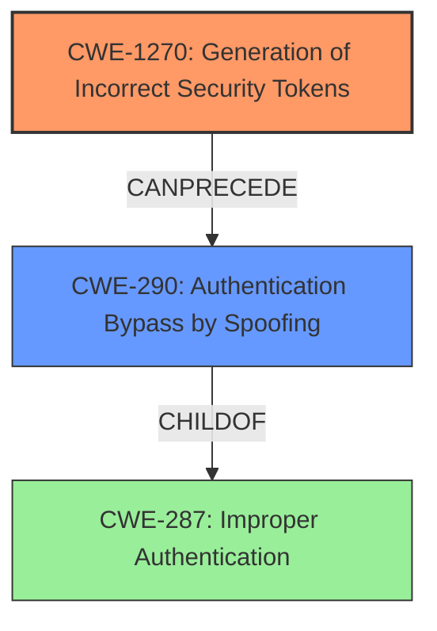

# Final Resolution for CVE-2022-31122

# Summary
| CWE ID    | CWE Name                                     | Confidence | CWE Abstraction Level | CWE Vulnerability Mapping Label | CWE-Vulnerability Mapping Notes |
| :--------- | :------------------------------------------- | :--------- | :-------------------- | :------------------------------ | :------------------------------ |
| CWE-1270 | Generation of Incorrect Security Tokens | 0.95      | Base                   | Allowed                         | Acceptable-Use            |
| CWE-290 | Authentication Bypass by Spoofing | 0.75      | Base                   | Allowed                         | Acceptable-Use            |

## Evidence and Confidence

*   **Confidence Score:** 0.90
*   **Evidence Strength:** HIGH

## Relationship Analysis
The primary relationship influencing the decision is the hierarchical relationship between CWE-287 (Improper Authentication) and its child CWE-290 (Authentication Bypass by Spoofing). CWE-290 is chosen because it offers a more specific description of the authentication bypass method observed in the vulnerability. Although not a direct relationship, the analysis considers how CWE-1270 (Generation of Incorrect Security Tokens) can lead to CWE-290, forming a vulnerability chain. The Base abstraction levels of both CWEs are optimal for mapping to specific root causes.

## Vulnerability Chain
The vulnerability chain starts with the **ROOTCAUSE** being **CWE-1270 (Generation of Incorrect Security Tokens)**. This leads to a weakness where an attacker can manipulate SAML configurations, ultimately resulting in **CWE-290 (Authentication Bypass by Spoofing)**. The prerequisite condition is that the attacker must have some details of SAML IdP metadata. The consequence is unauthorized access and the ability to create arbitrary accounts. There are no missing links in the chain, as the token confusion directly facilitates the authentication bypass.

## Summary of Analysis
The analysis is based on both the initial assessment and the criticism provided. The conclusion is that CWE-1270 is the primary **WEAKNESS**, while CWE-290 is a secondary **WEAKNESS** that is a consequence of the first.

The vulnerability description states, "If an attacker has certain details of SAML IdP metadata, and configures their own SAML on the same backend, the attacker can delete all SAML authenticated accounts of a targeted team, Authenticate as a user of the attacked team and create arbitrary accounts in the context of the team if it is not managed by SCIM." This directly supports the token recipient confusion aspect and its impact on authentication.

The graph relationships influenced the final selection by highlighting how CWE-1270 can lead to CWE-290. The selection is justified because CWE-1270 accurately captures the **ROOTCAUSE** of the vulnerability: the incorrect generation of security tokens. While CWE-290 is a consequence, it is included to illustrate the impact of the token confusion. Both CWEs are at the optimal level of specificity (Base) for understanding the vulnerability. The retriever results strongly support this conclusion.