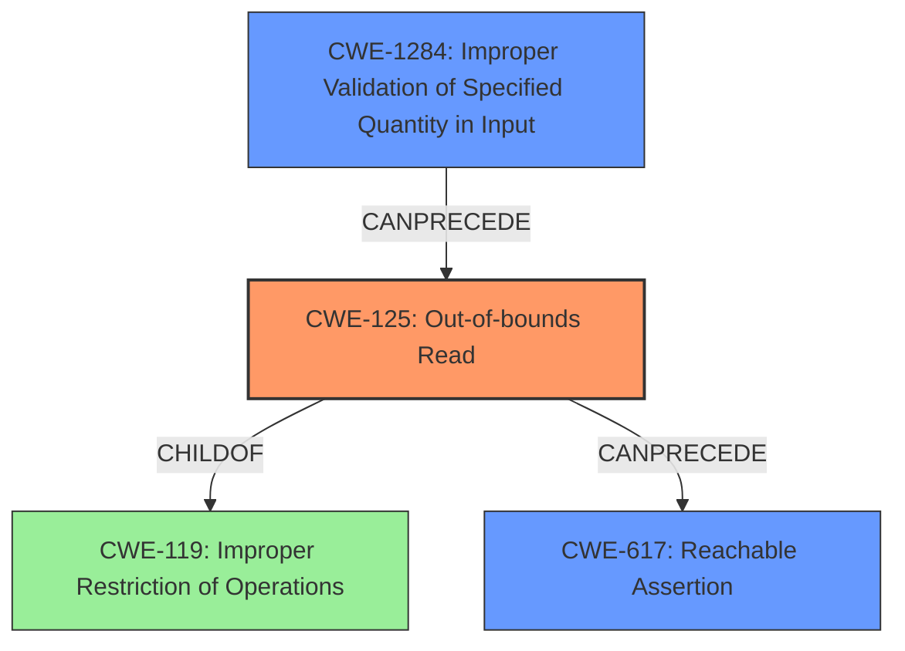

# Final Resolution for CVE-2022-31620

# Summary
| CWE ID | CWE Name | Confidence | CWE Abstraction Level | CWE Vulnerability Mapping Label | CWE-Vulnerability Mapping Notes |
|---|---|---|---|---|---|
| CWE-125 (**Out-of-bounds Read**) | The product reads data past the end, or before the beginning, of the intended buffer. | 0.95 | Base | Allowed | Primary CWE |
| CWE-617 (**Reachable Assertion**) | The product contains an assert() or similar statement that can be triggered by an attacker, which leads to an application exit or other behavior that is more severe than necessary. | 0.75 | Base | Allowed | Secondary Candidate |
| CWE-1284 (**Improper Validation of Specified Quantity in Input**) | The product receives input that is expected to specify a quantity (such as size or length), but it does not validate or incorrectly validates that the quantity has the required properties. | 0.50 | Base | Allowed | Supporting |

## Evidence and Confidence

*   **Confidence Score:** 0.90
*   **Evidence Strength:** HIGH

## Relationship Analysis
The primary weakness is **CWE-125 (Out-of-bounds Read)**, which is a child of **CWE-119 (Improper Restriction of Operations within the Bounds of a Memory Buffer)**. While **CWE-119** is a more general category, **CWE-125** provides the necessary specificity for this vulnerability. **CWE-617 (Reachable Assertion)** is a consequence of the **out-of-bounds read** and contributes to the denial-of-service impact. I'm also adding **CWE-1284 (Improper Validation of Specified Quantity in Input)** to reflect the root cause of the vulnerability. The crafted input that leads to the **out-of-bounds read** suggests a failure to properly validate the input.

## Vulnerability Chain
The vulnerability chain starts with **CWE-1284 (Improper Validation of Specified Quantity in Input)**, where the application fails to properly validate the size or length of the input data. This leads to **CWE-125 (Out-of-bounds Read)**, where the application reads data beyond the allocated buffer. This **out-of-bounds read** then triggers **CWE-617 (Reachable Assertion)**, causing the application to terminate and resulting in a denial of service.

## Summary of Analysis
The initial analysis correctly identified **CWE-125 (Out-of-bounds Read)** and **CWE-617 (Reachable Assertion)** as the primary and secondary weaknesses, respectively. The criticism provided valuable suggestions, including explicitly mentioning mitigations and considering input validation.

The decision to include **CWE-1284 (Improper Validation of Specified Quantity in Input)** as a contributing factor is based on the understanding that the vulnerability stems from the application's failure to validate the input data, allowing a crafted input to trigger the **out-of-bounds read**. This is further supported by the CVE Reference Links Content Summary, which states that "The vulnerability stems from a lack of proper bounds checking during the decoding of lossless JPEG images." While the direct consequence is the **out-of-bounds read**, the root cause lies in the improper input validation.

The selected CWEs are at the optimal level of specificity. **CWE-125** accurately describes the **out-of-bounds read**, **CWE-617** captures the assertion failure, and **CWE-1284** addresses the root cause of improper input validation.