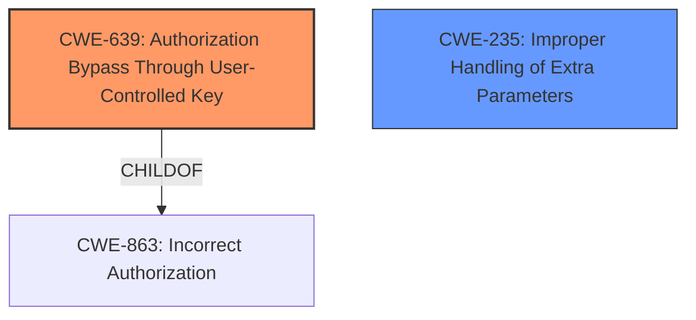

# Final Resolution for CVE-2022-31683

# Summary
| CWE ID | CWE Name | Confidence | CWE Abstraction Level | CWE Vulnerability Mapping Label | CWE-Vulnerability Mapping Notes |
|---|---|---|---|---|---|
| CWE-639 | Authorization Bypass Through User-Controlled Key | 0.95 | Base | Allowed | The vulnerability involves manipulating the `team_name` parameter to bypass authorization checks, aligning with the CWE's description of gaining unauthorized access by modifying key values. Mitigations 1 & 2 are relevant. **Primary CWE** |
| CWE-235 | Improper Handling of Extra Parameters | 0.75 | Variant | Allowed | The vulnerability involves HTTP parameter pollution, where extra parameters in the request body override URL parameters, which is directly related to the description of this CWE. **Secondary Candidate** |

## Evidence and Confidence

*   **Confidence Score:** 0.90
*   **Evidence Strength:** HIGH

## Relationship Analysis
The primary relationship that impacted my decision was the parent-child relationship between CWE-863 (Incorrect Authorization), a Class-level CWE, and CWE-639 (**Authorization Bypass Through User-Controlled Key**), a Base-level CWE. CWE-639 provides a more specific description of the authorization bypass occurring through a user-controlled key, making it a better fit than the more general CWE-863. CWE-235 (**Improper Handling of Extra Parameters**) describes *how* the `team_name` is being overridden, it's a contributing factor, not the core **weakness**. The abstraction levels also influenced the selection, favoring the Base level CWE-639 over the Class level CWE-863.

## Vulnerability Chain
The vulnerability chain starts with **CWE-235** (**Improper Handling of Extra Parameters**), which allows the `team_name` parameter to be overridden via HTTP parameter pollution. This leads to **CWE-639** (**Authorization Bypass Through User-Controlled Key**), as the system fails to validate that the user is authorized to access resources associated with the modified `team_name`. The final impact is unauthorized access to resources belonging to other teams.

## Summary of Analysis
The analysis correctly identifies **CWE-639** (**Authorization Bypass Through User-Controlled Key**) as the primary **weakness**. The vulnerability description states that "A Concourse user can send a request with body including team_name=team2 to bypass team scope check to gain access to certain resources belong to any other team." This directly aligns with CWE-639's description: "The system's authorization functionality does not prevent one user from gaining access to another user's data or record by modifying the key value identifying the data."

The criticism is valid in pointing out the importance of assessing the mitigations outlined in the CWE. As the criticism states:
*   Mitigation 1: *"For each and every data access, ensure that the user has sufficient privilege to access the record that is being requested."*
*   Mitigation 2: *"Make sure that the key that is used in the lookup of a specific user's record is not controllable externally by the user or that any tampering can be detected."*
These mitigations are directly applicable to this vulnerability.

The retriever results suggest other potentially relevant CWEs, however, CWE-639 is the best fit because it accurately captures the root cause of the **authorization bypass**. CWE-235, while relevant, is more of a contributing factor explaining *how* the `team_name` is being overridden. The selection of CWE-639 is at the optimal level of specificity due to it being a Base level CWE and a child of the Class level CWE-863.