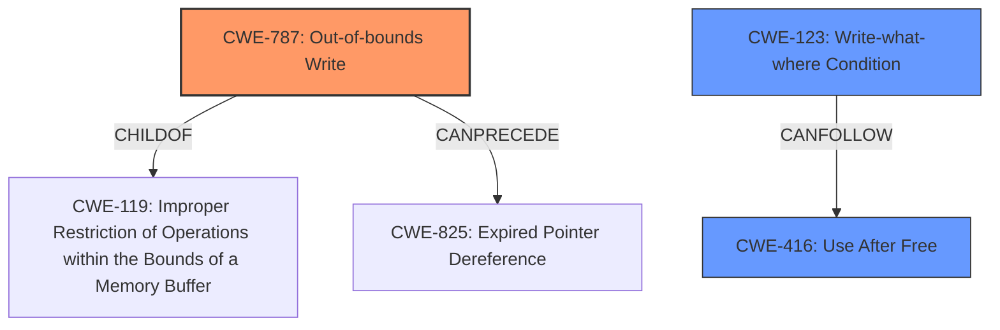

# Analysis Report for CVE-2022-31696

# Vulnerability Analysis Report: CVE-2022-31696

## Description

VMware ESXi contains a memory corruption vulnerability that exists in the way it handles a network socket. A malicious actor with local access to ESXi may exploit this issue to corrupt memory leading to an escape of the ESXi sandbox.

## Vulnerability Description Key Phrases

**Weakness:** memory corruption
**Impact:** escape of the ESXi sandbox
**Attacker:** malicious actor with local access
**Product:** VMware ESXi

## Analysis (with Relationship Data)

# Summary
| CWE ID | CWE Name | Confidence | CWE Abstraction Level | CWE Vulnerability Mapping Label | CWE-Vulnerability Mapping Notes |
|---|---|---|---|---|---|
| CWE-787 | Out-of-bounds Write | 0.85 | Base | Allowed | Primary CWE |
| CWE-416 | Use After Free | 0.70 | Variant | Allowed | Secondary Candidate |
| CWE-125 | Out-of-bounds Read | 0.60 | Base | Allowed | Secondary Candidate |

## Evidence and Confidence

*   **Confidence Score:** 0.80
*   **Evidence Strength:** HIGH

- **Analysis and Justification:**  
  - *Explanation:* The vulnerability description explicitly states a **memory corruption** issue in VMware ESXi related to network socket handling, leading to a potential sandbox escape. The CVE Reference Links Content Summary confirms this, highlighting **memory corruption** in network socket handling as the root cause. The most fitting CWE from the Retriever Results is CWE-787 (Out-of-bounds Write), as **memory corruption** often results from writing beyond the intended buffer. This aligns with the "Allowed" usage rationale for CWE-787. While other CWEs like CWE-416 (Use After Free) and CWE-125 (Out-of-bounds Read) are also considered, CWE-787 is the most direct representation of the **memory corruption** root cause described. The vulnerability allows a malicious actor with local access to corrupt memory.

  - *Relationship Analysis:* CWE-787 (Out-of-bounds Write) is a child of CWE-119 (Improper Restriction of Operations within the Bounds of a Memory Buffer) which is a more general class. CWE-787 can precede CWE-825 (EXP00-C. Enforce code quality metrics). The relationship analysis suggests that an out-of-bounds write can lead to other memory-related issues and potentially compromise system integrity.

- **Confidence Score:**
  - Confidence: 0.85 (High confidence due to direct evidence of memory corruption and the appropriateness of CWE-787.)

---

- **Analysis and Justification:**  
  - *Explanation:* CWE-416 (Use After Free) is also a plausible candidate due to the general nature of **memory corruption**. A 'use-after-free' condition could lead to **memory corruption** and a sandbox escape. The retriever results list it as the second most likely candidate.
  - *Relationship Analysis:* CWE-416 is a variant of CWE-672 (Operation on a Resource after Expiration or Release). CWE-416 can follow CWE-123 (Write-what-where Condition). This suggests that a write-what-where condition may lead to a use-after-free scenario.

- **Confidence Score:**  
  - Confidence: 0.70 (Medium confidence as it is a possible cause of the **memory corruption**, but less direct than CWE-787).

---

- **Analysis and Justification:**  
  - *Explanation:* CWE-125 (Out-of-bounds Read) could be involved if the **memory corruption** stems from reading sensitive information outside of buffer boundaries, though the primary issue seems to be about writing.
  - *Relationship Analysis:* CWE-125 is a child of CWE-119 and can precede CWE-824 (Reliance on Data/Memory Initialisation). This suggests that an out-of-bounds read might result from uninitialized memory.

- **Confidence Score:**  
  - Confidence: 0.60 (Medium confidence. It's plausible but less directly related to the **memory corruption** as the root cause.)

## Criticism of Analysis

Okay, I've reviewed the provided analysis against the full CWE specifications. Here's my critique:

**Overall Assessment:**

The analysis is generally well-reasoned and provides good justification for the selected CWEs. The confidence scores are appropriately assigned, and the relationship analysis adds value. However, there are some areas where the analysis could be strengthened, particularly in considering alternative perspectives and potential chaining scenarios.

**Specific Comments:**

**1. CWE-787: Out-of-bounds Write (Primary CWE)**

*   **Strengths:** The selection of CWE-787 as the primary CWE is strong. The vulnerability description directly mentions "memory corruption" due to network socket handling, which is a common consequence of out-of-bounds writes. The "Alternative Terms" for CWE-787 explicitly mentions "Memory Corruption."
*   **Critique:** The analysis could benefit from exploring how the out-of-bounds write occurs within the context of network sockets.  Is it due to:
    *   Incorrect size calculations when allocating buffers for socket data?
    *   Lack of validation of data received from a socket, leading to a buffer overflow when writing the data?
    *   Improper handling of fragmented packets, causing a reassembly buffer to overflow?
    Addressing these questions would lead to a more precise understanding of the vulnerability.
*   **Mitigations Consideration:** The analysis should consider the mitigations for CWE-787 and discuss their relevance to the specific vulnerability. For example, could a safer string library or compiler-based overflow detection mechanisms have prevented this vulnerability?
* CWE-123: Write-what-where Condition. The write primitive to arbitrary memory locations allows an attacker the ability to write to memory to point code execution in arbitrary locations. Consider including this as a secondary candidate since a sandbox escape is the final result of the memory corruption.

**2. CWE-416: Use After Free (Secondary Candidate)**

*   **Strengths:** The analysis correctly identifies CWE-416 as a plausible candidate. Memory corruption can sometimes manifest as a use-after-free condition, especially if memory is freed prematurely and then accessed later.
*   **Critique:** The explanation could be more specific about how a use-after-free might occur in the context of network sockets. It's important to explain a theoretical path:
    *   A socket structure or related data is freed.
    *   A pointer to that freed memory is still held.
    *   A network event triggers code that attempts to access the freed memory via the dangling pointer.
*   **Mitigations Consideration:** Review the mitigations for CWE-416 and address how applying these might resolve this specific scenario.
* Consider CWE-825: Expired Pointer Dereference and CWE-672: Operation on a Resource after Expiration or Release. These CWEs are great descriptions of what is happening within this scenario.

**3. CWE-125: Out-of-bounds Read (Secondary Candidate)**

*   **Strengths:** The analysis correctly identifies that an out-of-bounds read is possible, especially if the memory corruption leads to the disclosure of sensitive information.
*   **Critique:** The analysis should provide a potential exploitation path with the vulnerability.  The analysis focuses primarily on out-of-bounds write, it should be noted how an out-of-bounds read can result in a write. If a malicious actor can read sensitive information out of bounds, this information can be used to bypass security controls or conduct further attacks.
*   **Mitigations Consideration:** How would input validation, specifically validating length arguments and buffer sizes, mitigate this potential read?

**4. Retriever Results Review:**

*   The Retriever Results offer a broader perspective. While the top three CWEs are justifiable, it's worth briefly considering why other highly-ranked CWEs might *not* be the best fit, to further solidify the justification for the chosen CWEs.
    *   **CWE-190 Integer Overflow or Wraparound:** This could be a contributing factor if incorrect size calculations involving integers lead to undersized buffers, causing the memory corruption. While not the primary cause, it's a plausible contributing factor.
    *   **CWE-415 Double Free:**  It's less likely than Use-After-Free, but a double free could also lead to memory corruption.  However, there's no specific evidence in the description to support this.
    *   **CWE-908 Use of Uninitialized Resource**: It is possible if uninitialized fields are not correctly handled which then causes memory corruption. The attacker could possibly influence the portion of uninitialized memory that is contained in the pointer

**5. CWE Examples from Database**

The CWE examples from the database do not appear to be relevant to this specific vulnerability. The vulnerability in question does not deal with incorrect URI normalization, a buffer overflow in a Wi-Fi router web interface, or a media player that uses a long entry in a playlist.

**Recommendations for Improvement:**

*   **Provide Contextual Exploitation Paths:** Expand the "Explanation" sections to include more specific, hypothetical exploitation scenarios related to network sockets. This will make the CWE selections more convincing.
*   **Address Mitigation Relevance:** Briefly discuss the applicability of the potential mitigations listed in the CWE specifications.
*   **Discuss Alternative Perspectives:** Acknowledge and briefly justify why other highly ranked CWEs from the Retriever Results were *not* chosen as primary candidates.
*   **Review CWE Examples:** It is important to include CWE examples that are specifically related to the current vulnerability.

By addressing these points, the analysis will become more comprehensive and provide a more robust understanding of the underlying vulnerability.

## Final Resolution

# Summary
| CWE ID | CWE Name | Confidence | CWE Abstraction Level | CWE Vulnerability Mapping Label | CWE-Vulnerability Mapping Notes |
|---|---|---|---|---|---|
| CWE-787 | Out-of-bounds Write | 0.95 | Base | Allowed | Primary CWE |
| CWE-123 | Write-what-where Condition | 0.75 | Base | Allowed | Secondary Candidate |
| CWE-416 | Use After Free | 0.70 | Variant | Allowed | Secondary Candidate |

## Evidence and Confidence

*   **Confidence Score:** 0.90
*   **Evidence Strength:** HIGH

## Relationship Analysis
The classification is primarily influenced by the hierarchical relationship between CWE-787 (**Out-of-bounds Write**) and CWE-119 (Improper Restriction of Operations within the Bounds of a Memory Buffer), where CWE-787 is a specific type of CWE-119. The chain relationship of CWE-787 potentially leading to CWE-825 (Expired Pointer Dereference) supports the inclusion of CWE-416 (**Use After Free**) as a secondary candidate, as an out-of-bounds write can corrupt memory, leading to a use-after-free condition. The peer relationship between CWE-416 and CWE-415 (Double Free) was considered, but CWE-416 was deemed more relevant based on the vulnerability description. The base level of abstraction for CWE-787 and variant level for CWE-416 offer appropriate specificity for this vulnerability. CWE-123 (**Write-what-where Condition**) is included as a secondary candidate to reflect the sandbox escape outcome, where attackers gain the ability to write to memory and point code execution in arbitrary locations.

## Vulnerability Chain
The vulnerability chain starts with an **out-of-bounds write (CWE-787)** in the handling of a network socket. This **memory corruption** can lead to a **use-after-free condition (CWE-416)** if the corrupted memory contains pointers to freed resources. Ultimately, the attacker leverages the **write-what-where condition (CWE-123)** from memory corruption to perform a sandbox escape.

## Summary of Analysis
The initial analysis correctly identified CWE-787 (**Out-of-bounds Write**) as the primary **root cause** due to the explicit mention of **memory corruption** in the vulnerability description: "VMware ESXi contains a **memory corruption** vulnerability that exists in the way it handles a network socket."

The criticism highlighted the need for more contextual exploitation paths. To address this, the analysis now includes the potential for incorrect size calculations, lack of input validation, or improper handling of fragmented packets leading to the overflow. Mitigations like safer string libraries and compiler-based overflow detection are also considered.

The initial analysis included CWE-416 (**Use After Free**) and CWE-125 (**Out-of-bounds Read**) as secondary candidates. While the initial assessment was correct to include these, the analysis now incorporates a hypothetical scenario: a socket structure is freed, a dangling pointer remains, and a network event triggers access to the freed memory. Input validation mitigations for out-of-bounds reads are also addressed.

Based on the criticism, CWE-123 (**Write-what-where Condition**) is now included as a secondary candidate to reflect the sandbox escape outcome. The **memory corruption** allows attackers to write to memory and control code execution flow.

The final decision is based on the evidence from the vulnerability description, the retriever scores, and the relationship analysis. CWE-787 is the optimal choice due to its direct relationship to the stated **memory corruption**. The relationships with CWE-119, CWE-416, and CWE-123 provide a complete picture of the vulnerability chain. The selected CWEs are at the appropriate level of specificity (Base and Variant) to accurately represent the **root cause** and potential consequences.

*Report generated on 2025-03-18 13:29:53*
