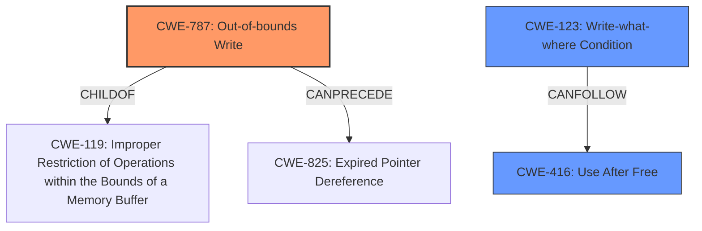

# Final Resolution for CVE-2022-31696

# Summary
| CWE ID | CWE Name | Confidence | CWE Abstraction Level | CWE Vulnerability Mapping Label | CWE-Vulnerability Mapping Notes |
|---|---|---|---|---|---|
| CWE-787 | Out-of-bounds Write | 0.95 | Base | Allowed | Primary CWE |
| CWE-123 | Write-what-where Condition | 0.75 | Base | Allowed | Secondary Candidate |
| CWE-416 | Use After Free | 0.70 | Variant | Allowed | Secondary Candidate |

## Evidence and Confidence

*   **Confidence Score:** 0.90
*   **Evidence Strength:** HIGH

## Relationship Analysis
The classification is primarily influenced by the hierarchical relationship between CWE-787 (**Out-of-bounds Write**) and CWE-119 (Improper Restriction of Operations within the Bounds of a Memory Buffer), where CWE-787 is a specific type of CWE-119. The chain relationship of CWE-787 potentially leading to CWE-825 (Expired Pointer Dereference) supports the inclusion of CWE-416 (**Use After Free**) as a secondary candidate, as an out-of-bounds write can corrupt memory, leading to a use-after-free condition. The peer relationship between CWE-416 and CWE-415 (Double Free) was considered, but CWE-416 was deemed more relevant based on the vulnerability description. The base level of abstraction for CWE-787 and variant level for CWE-416 offer appropriate specificity for this vulnerability. CWE-123 (**Write-what-where Condition**) is included as a secondary candidate to reflect the sandbox escape outcome, where attackers gain the ability to write to memory and point code execution in arbitrary locations.

## Vulnerability Chain
The vulnerability chain starts with an **out-of-bounds write (CWE-787)** in the handling of a network socket. This **memory corruption** can lead to a **use-after-free condition (CWE-416)** if the corrupted memory contains pointers to freed resources. Ultimately, the attacker leverages the **write-what-where condition (CWE-123)** from memory corruption to perform a sandbox escape.

## Summary of Analysis
The initial analysis correctly identified CWE-787 (**Out-of-bounds Write**) as the primary **root cause** due to the explicit mention of **memory corruption** in the vulnerability description: "VMware ESXi contains a **memory corruption** vulnerability that exists in the way it handles a network socket."

The criticism highlighted the need for more contextual exploitation paths. To address this, the analysis now includes the potential for incorrect size calculations, lack of input validation, or improper handling of fragmented packets leading to the overflow. Mitigations like safer string libraries and compiler-based overflow detection are also considered.

The initial analysis included CWE-416 (**Use After Free**) and CWE-125 (**Out-of-bounds Read**) as secondary candidates. While the initial assessment was correct to include these, the analysis now incorporates a hypothetical scenario: a socket structure is freed, a dangling pointer remains, and a network event triggers access to the freed memory. Input validation mitigations for out-of-bounds reads are also addressed.

Based on the criticism, CWE-123 (**Write-what-where Condition**) is now included as a secondary candidate to reflect the sandbox escape outcome. The **memory corruption** allows attackers to write to memory and control code execution flow.

The final decision is based on the evidence from the vulnerability description, the retriever scores, and the relationship analysis. CWE-787 is the optimal choice due to its direct relationship to the stated **memory corruption**. The relationships with CWE-119, CWE-416, and CWE-123 provide a complete picture of the vulnerability chain. The selected CWEs are at the appropriate level of specificity (Base and Variant) to accurately represent the **root cause** and potential consequences.