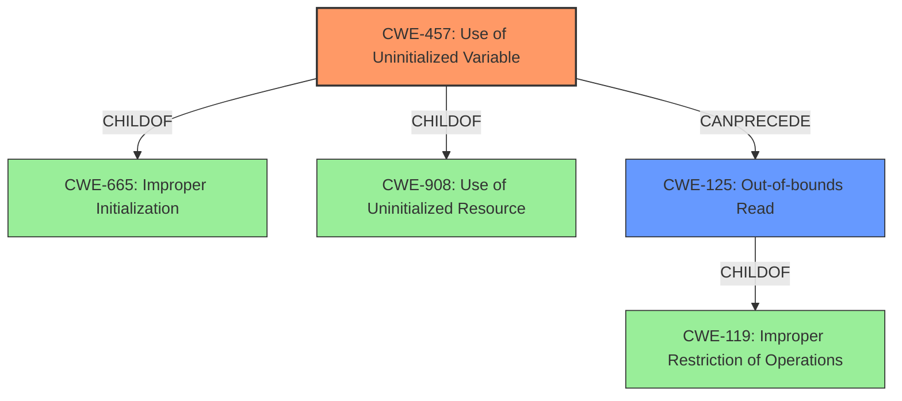

# Analysis Report for CVE-2022-31741

# Vulnerability Analysis Report: CVE-2022-31741

## Description

A crafted CMS message could have been processed incorrectly, leading to an invalid memory read, and potentially further memory corruption. This vulnerability affects Thunderbird < 91.10, Firefox < 101, and Firefox ESR < 91.10.

## Vulnerability Description Key Phrases

**Weakness:** invalid memory read
**Impact:** potentially further memory corruption
**Vector:** crafted CMS message
**Product:** ['Thunderbird', 'Firefox', 'Firefox ESR']
**Version:** ['< 91.10', '< 101', '< 91.10']

## Analysis (with Relationship Data)

# Summary
| CWE ID  | CWE Name                           | Confidence | CWE Abstraction Level | CWE Vulnerability Mapping Label | CWE-Vulnerability Mapping Notes |
|---------|------------------------------------|------------|-----------------------|---------------------------------|---------------------------------|
| CWE-457 | Use of Uninitialized Variable      | 0.95       | Variant               | Allowed                         | Primary CWE                      |
| CWE-125 | Out-of-bounds Read                 | 0.85       | Base                  | Allowed                         | Secondary Candidate           |

## Evidence and Confidence

*   **Confidence Score:** 0.90
*   **Evidence Strength:** HIGH

- **Analysis and Justification:**
  - *Explanation:* The vulnerability centers around the use of an **uninitialized variable** `dp` within the `NSS_CMSDigestContext_FinishSingle` function. The CVE Reference Links Content Summary explicitly states that the primary weakness is the **usage of an uninitialized variable**. When `NSS_CMSDigestContext_FinishMultiple` returns success without initializing `dp` (due to `cmsdigcx->saw_contents == 0`), subsequent code attempts to dereference `dp`, leading to undefined behavior. This aligns perfectly with CWE-457 (Use of Uninitialized Variable), which describes the condition where "The code uses a variable that has not been initialized, leading to unpredictable or unintended results." The use of a crafted CMS message to trigger this condition is the attack vector, but the underlying problem is the uninitialized variable.
  - *Justification for CWE-125:* Additionally, the uninitialized variable leads to an **invalid memory read**, as the program attempts to read from a random memory location. The vulnerability description mentions "**invalid memory read**", and the CVE summary also details this impact. This aligns with CWE-125 (Out-of-bounds Read), which describes when "The product reads data past the end, or before the beginning, of the intended buffer." The high graph score for CWE-125 also supports this selection.
  - *Why not CWE-787:* Although memory corruption is mentioned, the root cause isn't an out-of-bounds write. It stems from an uninitialized variable, making CWE-457 the primary weakness.

  - *Relationship Analysis:* CWE-457 is a variant of CWE-665 (Improper Initialization) and CWE-908 (Use of Uninitialized Resource). CWE-125 is related to CWE-119 (Improper Restriction of Operations within the Bounds of a Memory Buffer), but is more specific to read operations.

- **Confidence Score:**
  - Confidence: 0.95 (High evidence from technical description and CVE reference materials for CWE-457)
  - Confidence: 0.85 (Good evidence for CWE-125 as a secondary weakness)

## Criticism of Analysis

Okay, I've reviewed your analysis of the vulnerability along with the full CWE specifications you provided. Here's a breakdown of my critique:

**Overall Assessment:**

The analysis is generally strong, and the CWE mappings are well-reasoned and supported by the provided information. The selection of CWE-457 as the primary weakness and CWE-125 as a secondary consequence is appropriate. The confidence scores are justified, and the explanations are clear.

**Detailed Critique:**

*   **CWE-457 (Use of Uninitialized Variable) - Primary CWE:**
    *   **Strengths:**
        *   Excellent justification, directly referencing the CVE Reference Links Content Summary's emphasis on the "usage of an uninitialized variable."
        *   The explanation clearly connects the vulnerable code path (`cmsdigcx->saw_contents == 0` in `NSS_CMSDigestContext_FinishMultiple`) to the condition described by CWE-457: "The code uses a variable that has not been initialized, leading to unpredictable or unintended results."
        *   Correctly identifies CWE-457 as a Variant level CWE, which aligns with CWE's mapping guidance preferring Variant-level CWEs.
        *   The relationship analysis is accurate, linking CWE-457 to its parent classes CWE-665 (Improper Initialization) and CWE-908 (Use of Uninitialized Resource).
    *   **Areas for Potential Improvement (Minor):**
        *   While not strictly necessary, referencing the "Potential Mitigations" section of CWE-457 could slightly strengthen the analysis.  For example, "Mitigation 1: Assign all variables to an initial value" directly addresses the root cause. Mitigation 2, Enabling compiler warnings.

*   **CWE-125 (Out-of-bounds Read) - Secondary Candidate:**
    *   **Strengths:**
        *   Justified the selection of CWE-125 by accurately describing the consequence of the uninitialized variable: "invalid memory read, as the program attempts to read from a random memory location."
        *   Acknowledges the high graph score for CWE-125 provided by the retriever results, further solidifying the mapping.
        *   Correctly identifies CWE-125 as a Base level CWE, in line with CWE's mapping recommendations.
        *   Accurately points out CWE-125's relationship to CWE-119 (Improper Restriction of Operations within the Bounds of a Memory Buffer), indicating a solid understanding of the CWE hierarchy.
    *   **Areas for Potential Improvement (Minor):**
        *    Could slightly strengthen the justification by referencing the "Potential Mitigations" section of CWE-125. Mentioning that "Mitigation 1: Implementation: Assume all input is malicious" addresses the attack vector of a crafted CMS message.  However, because this is a *consequence* rather than the root cause, elaborating on input validation isn't as critical as it would be if CWE-125 were the primary CWE.

*   **Why Not CWE-787 (Out-of-bounds Write):**
    *   The explanation for excluding CWE-787 is correct. While memory corruption *can* occur, the initial problem isn't an *out-of-bounds write*. The core issue is the uninitialized variable, which *leads* to an out-of-bounds *read*.

*   **General Strengths:**
    *   The confidence scores (0.95 for CWE-457, 0.85 for CWE-125) are reasonable and reflective of the evidence.
    *   The analysis clearly articulates *why* each CWE was selected, rather than simply stating the CWE ID.
    *   The use of direct quotes from the CVE Reference Links Content Summary and the CWE descriptions enhances the analysis's credibility.
    *   The formatting and presentation are excellent, making the analysis easy to understand and follow.

**Suggestions for Slight Improvement:**

*   **Expand on Mitigation Strategies (Optional):** Although the analysis already sufficiently justifies the CWE mappings, considering the "Potential Mitigations" sections for each CWE could add further depth. Mentioning which mitigations directly address the identified weaknesses (as suggested above) strengthens the connection between the CWEs and practical remediation.
*   **Consider "Chaining" (Optional):** While not essential, you could explicitly discuss the *chain* of events:  Crafted CMS message -> Uninitialized variable -> Out-of-bounds read -> Memory Corruption. This highlights the sequential nature of the vulnerability.

**Conclusion:**

Your analysis is thorough, accurate, and well-justified. The choice of CWE-457 as the primary weakness and CWE-125 as a secondary consequence is correct. The explanation is clear, and the confidence scores are well-supported. The suggested improvements are minor and intended to enhance the analysis further, but the current analysis is already very good.

## Final Resolution

# Summary
| CWE ID  | CWE Name                           | Confidence | CWE Abstraction Level | CWE Vulnerability Mapping Label | CWE-Vulnerability Mapping Notes |
|---------|------------------------------------|------------|-----------------------|---------------------------------|---------------------------------|
| CWE-457 | Use of Uninitialized Variable      | 0.95       | Variant               | Allowed                         | Primary CWE                      |
| CWE-125 | Out-of-bounds Read                 | 0.85       | Base                  | Allowed                         | Secondary Candidate           |

## Evidence and Confidence

*   **Confidence Score:** 0.95
*   **Evidence Strength:** HIGH

## Relationship Analysis
The primary weakness is identified as CWE-457, a Variant of CWE-665 (Improper Initialization) and CWE-908 (Use of Uninitialized Resource). The secondary weakness, CWE-125, is a Base level CWE related to CWE-119 (Improper Restriction of Operations within the Bounds of a Memory Buffer). The relationship analysis confirms that CWE-457 leads to CWE-125, as the uninitialized variable causes an out-of-bounds read.

## Vulnerability Chain
The vulnerability chain starts with a crafted CMS message leading to the **uninitialized variable** (CWE-457) within the `NSS_CMSDigestContext_FinishSingle` function. This occurs when `NSS_CMSDigestContext_FinishMultiple` returns success without initializing `dp`. Consequently, the code attempts to dereference the uninitialized `dp`, causing an **out-of-bounds read** (CWE-125). This can then lead to memory corruption, as stated in the vulnerability description.

## Summary of Analysis
The initial analysis correctly identifies CWE-457 as the primary **ROOTCAUSE**, with CWE-125 as a secondary weakness resulting from the first. The criticism validates this assessment, highlighting the justification for choosing CWE-457 based on the CVE Reference Links Content Summary, which emphasizes the "**usage of an uninitialized variable**." The vulnerability description explicitly mentions "**invalid memory read**," supporting the inclusion of CWE-125.

The graph relationships confirm the chain, where the **uninitialized variable** (CWE-457) directly leads to an **out-of-bounds read** (CWE-125). The abstraction levels are also appropriate, with CWE-457 at the Variant level and CWE-125 at the Base level.

The choice of CWE-457 as the primary weakness is at the optimal level of specificity because the core issue is the **missing initialization** of the variable, not an out-of-bounds write. The out-of-bounds read is a consequence of the **uninitialized variable**, making CWE-125 a secondary concern. This decision is based on the evidence from the vulnerability description and the CVE summary, along with the relationship analysis and the CWE mapping guidance.

*Report generated on 2025-03-18 13:30:42*
