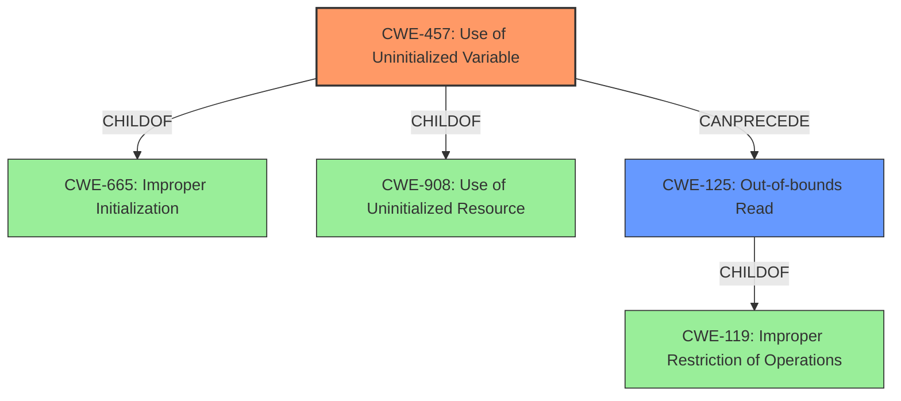

# Final Resolution for CVE-2022-31741

# Summary
| CWE ID  | CWE Name                           | Confidence | CWE Abstraction Level | CWE Vulnerability Mapping Label | CWE-Vulnerability Mapping Notes |
|---------|------------------------------------|------------|-----------------------|---------------------------------|---------------------------------|
| CWE-457 | Use of Uninitialized Variable      | 0.95       | Variant               | Allowed                         | Primary CWE                      |
| CWE-125 | Out-of-bounds Read                 | 0.85       | Base                  | Allowed                         | Secondary Candidate           |

## Evidence and Confidence

*   **Confidence Score:** 0.95
*   **Evidence Strength:** HIGH

## Relationship Analysis
The primary weakness is identified as CWE-457, a Variant of CWE-665 (Improper Initialization) and CWE-908 (Use of Uninitialized Resource). The secondary weakness, CWE-125, is a Base level CWE related to CWE-119 (Improper Restriction of Operations within the Bounds of a Memory Buffer). The relationship analysis confirms that CWE-457 leads to CWE-125, as the uninitialized variable causes an out-of-bounds read.

## Vulnerability Chain
The vulnerability chain starts with a crafted CMS message leading to the **uninitialized variable** (CWE-457) within the `NSS_CMSDigestContext_FinishSingle` function. This occurs when `NSS_CMSDigestContext_FinishMultiple` returns success without initializing `dp`. Consequently, the code attempts to dereference the uninitialized `dp`, causing an **out-of-bounds read** (CWE-125). This can then lead to memory corruption, as stated in the vulnerability description.

## Summary of Analysis
The initial analysis correctly identifies CWE-457 as the primary **ROOTCAUSE**, with CWE-125 as a secondary weakness resulting from the first. The criticism validates this assessment, highlighting the justification for choosing CWE-457 based on the CVE Reference Links Content Summary, which emphasizes the "**usage of an uninitialized variable**." The vulnerability description explicitly mentions "**invalid memory read**," supporting the inclusion of CWE-125.

The graph relationships confirm the chain, where the **uninitialized variable** (CWE-457) directly leads to an **out-of-bounds read** (CWE-125). The abstraction levels are also appropriate, with CWE-457 at the Variant level and CWE-125 at the Base level.

The choice of CWE-457 as the primary weakness is at the optimal level of specificity because the core issue is the **missing initialization** of the variable, not an out-of-bounds write. The out-of-bounds read is a consequence of the **uninitialized variable**, making CWE-125 a secondary concern. This decision is based on the evidence from the vulnerability description and the CVE summary, along with the relationship analysis and the CWE mapping guidance.