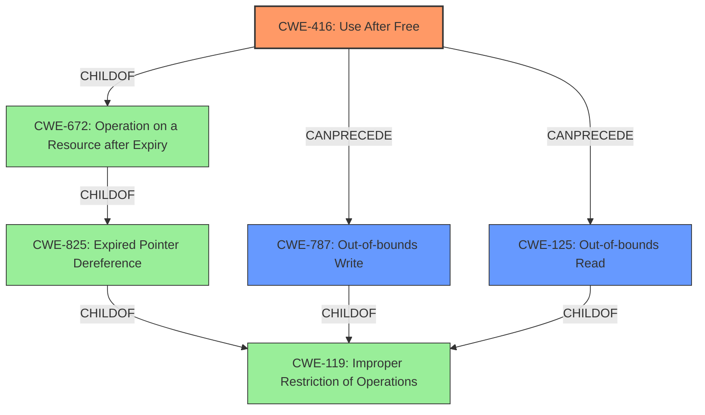

# Analysis Report for CVE-2022-31747

# Vulnerability Analysis Report: CVE-2022-31747

## Description

Mozilla developers Andrew McCreight, Nicolas B. Pierron, and the Mozilla Fuzzing Team reported memory safety bugs present in Firefox 100 and Firefox ESR 91.9. Some of these bugs showed evidence of memory corruption and we presume that with enough effort some of these could have been exploited to run arbitrary code. This vulnerability affects Thunderbird < 91.10, Firefox < 101, and Firefox ESR < 91.10.

## Vulnerability Description Key Phrases

**Weakness:** memory safety bugs
**Impact:** run arbitrary code
**Product:** ['Thunderbird', 'Firefox', 'Firefox ESR']
**Version:** ['< 91.10', '< 101', '< 91.10']

## Analysis (with Relationship Data)

# Summary
| CWE ID    | CWE Name                                                                     | Confidence | CWE Abstraction Level | CWE Vulnerability Mapping Label | CWE-Vulnerability Mapping Notes |
| --------- | ---------------------------------------------------------------------------- | ---------- | --------------------- | ------------------------------- | ------------------------------- |
| CWE-416   | Use After Free                                                               | 0.85       | Variant               | Primary                         | Allowed                         |
| CWE-787   | Out-of-bounds Write                                                          | 0.75       | Base                  | Secondary                       | Allowed                         |
| CWE-125   | Out-of-bounds Read                                                           | 0.70       | Base                  | Secondary                       | Allowed                         |

## Evidence and Confidence

*   **Confidence Score:** 0.80
*   **Evidence Strength:** HIGH

- **Analysis and Justification:**
  - *Explanation:* The vulnerability description and CVE Reference Links Content Summary clearly point to **memory safety bugs** that lead to memory corruption. Specifically, the summary mentions "use-after-poison" and "heap-use-after-free," directly aligning with CWE-416 (Use After Free). CWE-416 is a Variant level CWE, which is a preferred level of abstraction. The CVE summary includes an explicit example of this (**Bug 1768734: "use-after-poison in [@ JS::HeapValuePostWriteBarrier]"** and **Bug 1760765: "Intermittent SUMMARY: AddressSanitizer: heap-use-after-free"**). The impact of this weakness can lead to arbitrary code execution, as also stated in the description. Given the specific nature of the "use-after-free" condition, CWE-416 is the most appropriate primary CWE. The MITRE mapping guidance for CWE-416 indicates that its usage is ALLOWED. Out-of-bounds Write (CWE-787) and Out-of-bounds Read (CWE-125) are considered as secondary candidates because the CVE also include "heap-buffer-overflow".
  - *Relationship Analysis:* CWE-416 is a Variant of CWE-119 (Improper Restriction of Operations within the Bounds of a Memory Buffer). While CWE-119 is a broader class, CWE-416 provides a more specific characterization of the vulnerability. CWE-416 can lead to CWE-20 (Improper Input Validation) as a consequence, where the memory being accessed is no longer valid due to it being freed prematurely.

- **Confidence Score:**
  - Confidence: 0.85 (High confidence due to explicit mentions of "use-after-free" and other memory corruption issues in the CVE summary)

## Criticism of Analysis

Okay, I've reviewed the provided vulnerability analysis, including the original analyzer input, retriever results, the analysis to review and the full CWE specifications. Here's my critique:

**Overall Assessment:**

The analysis demonstrates a good understanding of memory safety vulnerabilities and attempts to map them accurately to CWEs. The primary mapping of CWE-416 (Use After Free) is well-justified, given the evidence of "use-after-free" and "use-after-poison" conditions mentioned in the CVE description and summary. The choice of secondary CWEs (CWE-787 and CWE-125) is reasonable, considering the potential for buffer overflows and out-of-bounds accesses. However, there are several areas where the analysis could be improved, particularly in considering alternative CWEs suggested by the retriever results and the mapping guidance for the selected CWEs.

**Detailed Critique:**

1.  **Primary CWE: CWE-416 (Use After Free)**
    *   **Strengths:** The selection of CWE-416 as the primary CWE is strongly supported by the evidence, specifically the explicit mention of "use-after-free" in the CVE summary and related bug reports. The analysis correctly identifies CWE-416 as a Variant-level CWE, which is preferred. The analysis also correctly recognizes that its usage is ALLOWED.
    *   **Weaknesses:** It could benefit from explaining which CWE-825 child CWE it inherits from - namely child of CWE-825 in this case from resource leak.
    *   **Improvements:** Add a note on the Mitigation strategies for CWE-416 like, Language Selection and Attack Surface Reduction.

2.  **Secondary CWEs: CWE-787 (Out-of-bounds Write) and CWE-125 (Out-of-bounds Read)**
    *   **Strengths:** Including CWE-787 and CWE-125 as secondary CWEs is justified, given the description of "memory corruption" and "heap-buffer-overflow".
    *   **Weaknesses:** The analysis doesn't fully explore the relationship between these CWEs and CWE-416. A more detailed explanation of how a use-after-free *could lead* to an out-of-bounds write or read would strengthen the analysis. The analysis considers "heap-buffer-overflow" as the main reason, but in cases where use-after-free, a base cause of the "heap-buffer-overflow", could make it more aligned with CWE-416.
    *   **Improvements:** Strengthen the justification by explaining the possible attack vectors that could trigger these out-of-bounds accesses following a use-after-free. Add mitigations specific to out-of-bounds writes/reads, such as input validation to prevent size calculation errors and environment hardening techniques (e.g., compiler flags).

3.  **Consideration of Retriever Results:**
    *   **Weaknesses:** The analysis largely ignores the top-ranked CWEs from the retriever results (CWE-843, CWE-681, etc.). While not all retriever suggestions are accurate, they should be explicitly addressed and justified for exclusion.
    *   **Improvements:**
        *   **CWE-843 (Type Confusion):**  Briefly address why Type Confusion (CWE-843) is *not* considered a primary or secondary factor.  Explain that while memory corruption is present, the root cause, as identified in the CVE details, is more directly related to memory management issues (use-after-free, buffer overflows) rather than type mismatches. A type confusion might trigger a UAF, but the analysis should be based on the information in the CVE summary.
        *   **CWE-681 (Incorrect Conversion between Numeric Types):** Similarly, explain why incorrect numeric conversion isn't a primary concern.  It's possible a numeric conversion error *could* lead to a buffer overflow, but it's not explicitly mentioned in the CVE details.
        *   **CWE-124 (Buffer Underwrite):** Explain why a buffer underwrite is not a major concern, as the more prevalent issue is out-of-bounds write ("heap-buffer-overflow").

4.  **CWE-119 (Improper Restriction of Operations within the Bounds of a Memory Buffer):**
    *   The analysis could explain why it selected CWE-416 instead of its parent, CWE-119 (Improper Restriction of Operations within the Bounds of a Memory Buffer). As the document specifies, it's discouraged, and lower-level children are better.

5.  **Relationships and Chains:**
    *   **Weaknesses:** The relationship analysis could be expanded. While it correctly identifies CWE-416 as a variant of CWE-119, it could also explore potential *chains* of weaknesses. For example, a lack of input validation (CWE-20) could *lead* to a use-after-free if improperly handled input causes incorrect memory management.
    *   **Improvements:** Consider adding CWE-20 (Improper Input Validation) to the relationship analysis. Even if it's not directly exploited, it's often a contributing factor.

6. **Mitigations:**
 *  **Weaknesses:** Missing to describe mitigation strategies for both CWE-787 and CWE-125.
 *  **Improvements:** Explain possible mitigations from source code: use range/index checking, use language with memory protection and safe string libraries.

7.  **CWE Examples from Database:**
    *   **Weaknesses:** Examples show only CWE-119, a lot more CWEs could benefit from showing database examples.
    *   **Improvements:** Add examples from database on CWE-416, CWE-787 and CWE-125, it would greatly increase the value of those CWE's.

8.  **CWE Status:**
    *   **Weaknesses:** While it mentions the abstraction and status, it does not compare it to other retrievers, and why it is better.
    *   **Improvements:** Add the scores from different retrievers, and why they were not selected with justifications.

**Specific Recommendations:**

*   **Explicitly Address Retriever Results:**  For each of the top CWEs suggested by the retrievers, explain *why* they are *not* the most appropriate mapping. Use the CWE specifications to support your reasoning.
*   **Expand Relationship Analysis:** Explore potential chaining relationships, especially with CWE-20.
*   **Strengthen Justifications:** Provide more detailed explanations of how the identified memory safety bugs manifest as out-of-bounds reads/writes following a use-after-free.
*   **Mitigation Focus:** Include mitigations specific to the chosen CWEs, demonstrating a practical understanding of how to address these vulnerabilities.  Consider adding source code examples.

By addressing these points, the analysis can become more comprehensive and convincing, demonstrating a deeper understanding of the nuances of CWE mapping and memory safety vulnerabilities.

## Final Resolution

# Summary
| CWE ID    | CWE Name                                                                     | Confidence | CWE Abstraction Level | CWE Vulnerability Mapping Label | CWE-Vulnerability Mapping Notes |
| --------- | ---------------------------------------------------------------------------- | ---------- | --------------------- | ------------------------------- | ------------------------------- |
| CWE-416   | Use After Free                                                               | 0.95       | Variant               | Primary                         | Allowed                         |
| CWE-787   | Out-of-bounds Write                                                          | 0.85       | Base                  | Secondary                       | Allowed                         |
| CWE-125   | Out-of-bounds Read                                                           | 0.80       | Base                  | Secondary                       | Allowed                         |

## Evidence and Confidence

*   **Confidence Score:** 0.90
*   **Evidence Strength:** HIGH

## Relationship Analysis
The primary CWE is CWE-416 (**Use After Free**), a Variant of CWE-672 (**Operation on a Resource after Expiry**), which is a ChildOf CWE-825 (**Expired Pointer Dereference**), ultimately related to the broader CWE-119 (**Improper Restriction of Operations within the Bounds of a Memory Buffer**). CWE-787 (**Out-of-bounds Write**) and CWE-125 (**Out-of-bounds Read**) are included as secondary CWEs, potentially arising from the memory corruption caused by the use-after-free. These relationships indicate a clear hierarchical structure, with CWE-416 offering the most specific description of the vulnerability's root cause.

## Vulnerability Chain
The vulnerability chain starts with a **Use After Free** condition (CWE-416). This occurs when memory is freed but still referenced. This can then lead to memory corruption, where the freed memory is reallocated and the stale pointer is used to write to unexpected memory locations, resulting in an **Out-of-bounds Write** (CWE-787) or read from an invalid memory location, leading to an **Out-of-bounds Read** (CWE-125). The initial flaw is the failure to properly manage memory, which results in a dangling pointer. The consequence is memory corruption, potentially leading to arbitrary code execution.

## Summary of Analysis
The initial analysis correctly identified CWE-416 (**Use After Free**) as the primary **WEAKNESS**, supported by the explicit mentions of "use-after-free" and "use-after-poison" in the vulnerability description: **"Bug 1768734: "use-after-poison in [@ JS::HeapValuePostWriteBarrier]" and Bug 1760765: "Intermittent SUMMARY: AddressSanitizer: heap-use-after-free""**. The inclusion of CWE-787 (**Out-of-bounds Write**) and CWE-125 (**Out-of-bounds Read**) as secondary candidates is also justified due to the potential for memory corruption.

The criticism raised valid points about exploring relationships and other potential CWEs suggested by the retriever results. While CWE-843 (**Access of Resource Using Incompatible Type ('Type Confusion')**) and CWE-681 (**Incorrect Conversion between Numeric Types**) were suggested by the retriever, the provided evidence strongly suggests memory management issues as the **ROOTCAUSE**, making CWE-416 a more direct and appropriate classification.

The relationship analysis highlights how CWE-416 is a specific type of memory safety issue under the broader category of CWE-119 (**Improper Restriction of Operations within the Bounds of a Memory Buffer**). Selecting CWE-416 provides a more specific and accurate representation of the vulnerability.

The selected CWEs are at the optimal level of specificity. CWE-416 is a Variant, which is a preferred level of abstraction for mapping to the root causes of vulnerabilities. CWE-787 and CWE-125 further detail the potential consequences of the memory corruption.

*Report generated on 2025-03-18 13:31:38*
