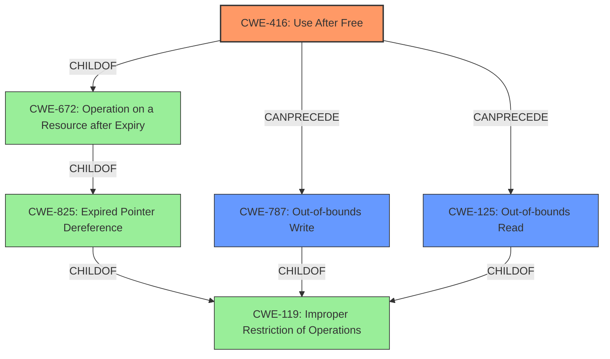

# Final Resolution for CVE-2022-31747

# Summary
| CWE ID    | CWE Name                                                                     | Confidence | CWE Abstraction Level | CWE Vulnerability Mapping Label | CWE-Vulnerability Mapping Notes |
| --------- | ---------------------------------------------------------------------------- | ---------- | --------------------- | ------------------------------- | ------------------------------- |
| CWE-416   | Use After Free                                                               | 0.95       | Variant               | Primary                         | Allowed                         |
| CWE-787   | Out-of-bounds Write                                                          | 0.85       | Base                  | Secondary                       | Allowed                         |
| CWE-125   | Out-of-bounds Read                                                           | 0.80       | Base                  | Secondary                       | Allowed                         |

## Evidence and Confidence

*   **Confidence Score:** 0.90
*   **Evidence Strength:** HIGH

## Relationship Analysis
The primary CWE is CWE-416 (**Use After Free**), a Variant of CWE-672 (**Operation on a Resource after Expiry**), which is a ChildOf CWE-825 (**Expired Pointer Dereference**), ultimately related to the broader CWE-119 (**Improper Restriction of Operations within the Bounds of a Memory Buffer**). CWE-787 (**Out-of-bounds Write**) and CWE-125 (**Out-of-bounds Read**) are included as secondary CWEs, potentially arising from the memory corruption caused by the use-after-free. These relationships indicate a clear hierarchical structure, with CWE-416 offering the most specific description of the vulnerability's root cause.

## Vulnerability Chain
The vulnerability chain starts with a **Use After Free** condition (CWE-416). This occurs when memory is freed but still referenced. This can then lead to memory corruption, where the freed memory is reallocated and the stale pointer is used to write to unexpected memory locations, resulting in an **Out-of-bounds Write** (CWE-787) or read from an invalid memory location, leading to an **Out-of-bounds Read** (CWE-125). The initial flaw is the failure to properly manage memory, which results in a dangling pointer. The consequence is memory corruption, potentially leading to arbitrary code execution.

## Summary of Analysis
The initial analysis correctly identified CWE-416 (**Use After Free**) as the primary **WEAKNESS**, supported by the explicit mentions of "use-after-free" and "use-after-poison" in the vulnerability description: **"Bug 1768734: "use-after-poison in [@ JS::HeapValuePostWriteBarrier]" and Bug 1760765: "Intermittent SUMMARY: AddressSanitizer: heap-use-after-free""**. The inclusion of CWE-787 (**Out-of-bounds Write**) and CWE-125 (**Out-of-bounds Read**) as secondary candidates is also justified due to the potential for memory corruption.

The criticism raised valid points about exploring relationships and other potential CWEs suggested by the retriever results. While CWE-843 (**Access of Resource Using Incompatible Type ('Type Confusion')**) and CWE-681 (**Incorrect Conversion between Numeric Types**) were suggested by the retriever, the provided evidence strongly suggests memory management issues as the **ROOTCAUSE**, making CWE-416 a more direct and appropriate classification.

The relationship analysis highlights how CWE-416 is a specific type of memory safety issue under the broader category of CWE-119 (**Improper Restriction of Operations within the Bounds of a Memory Buffer**). Selecting CWE-416 provides a more specific and accurate representation of the vulnerability.

The selected CWEs are at the optimal level of specificity. CWE-416 is a Variant, which is a preferred level of abstraction for mapping to the root causes of vulnerabilities. CWE-787 and CWE-125 further detail the potential consequences of the memory corruption.