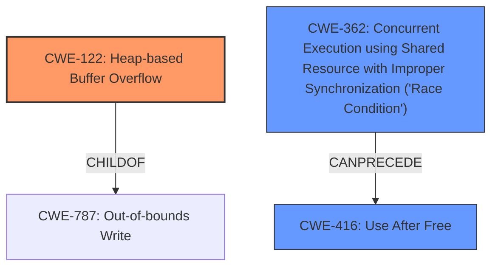

# Final Resolution for CVE-2022-31748

# Summary
| CWE ID | CWE Name | Confidence | CWE Abstraction Level | CWE Vulnerability Mapping Label | CWE-Vulnerability Mapping Notes |
|---|---|---|---|---|---|
| CWE-122 | Heap-based Buffer Overflow | 0.75 | Variant | Allowed | Primary CWE. Root cause involves writing data past the end of a heap allocated buffer, leading to memory corruption and potential arbitrary code execution. |
| CWE-416 | Use After Free | 0.65 | Variant | Allowed | Secondary CWE. The description mentions use-after-free as one of the memory safety bugs contributing to the vulnerability. |
| CWE-362 | Concurrent Execution using Shared Resource with Improper Synchronization ('Race Condition') | 0.40 | Class | Allowed-with-Review | Potentially relevant if the Use-After-Free or other memory corruption issues are triggered by concurrent access to shared resources. Requires further investigation to confirm. |

## Evidence and Confidence

*   **Confidence Score:** 0.70
*   **Evidence Strength:** MEDIUM

## Relationship Analysis
The analysis focuses on parent-child relationships to achieve greater specificity. `CWE-122` is a variant of a buffer overflow, specifically on the heap, making it a child of more general buffer overflow CWEs. This specificity is crucial for accurate classification. `CWE-362` is considered as a potential preceding cause for `CWE-416`, suggesting a chain relationship where a race condition can lead to a use-after-free vulnerability. The abstraction levels (Variant, Class) are considered to ensure the classification is neither too general nor overly specific.

## Vulnerability Chain
The vulnerability chain potentially starts with a race condition (`CWE-362`), which leads to a use-after-free condition (`CWE-416`). Independently, or potentially in conjunction with the previous chain, a heap-based buffer overflow (`CWE-122`) results in memory corruption, which can be exploited for arbitrary code execution. The description highlights the presence of both heap-buffer-overflow and use-after-free, so the chain is based on these issues. The missing link is more detailed information on how `CWE-362` leads to `CWE-416`, which is not explicitly described.

## Summary of Analysis
The analysis builds upon the initial assessment and incorporates the criticism to provide a more refined classification. The decision to use `CWE-122` (Heap-based Buffer Overflow) as the primary CWE instead of `CWE-787` (Out-of-bounds Write) is based on the explicit mention of "heap-buffer-overflow" in the vulnerability description. This change increases the specificity of the classification and aligns better with the available evidence. The inclusion of `CWE-362` (Concurrent Execution using Shared Resource with Improper Synchronization ('Race Condition')) as a secondary CWE is speculative but plausible, given the mention of "data races". However, the confidence in `CWE-362` remains low due to the lack of specific details. The analysis relies heavily on the provided evidence, particularly the vulnerability description and the CVE reference materials. The graph relationships helped visualize potential chains and dependencies, guiding the selection of relevant CWEs. The final classification reflects a balance between specificity and the level of detail available in the vulnerability description.