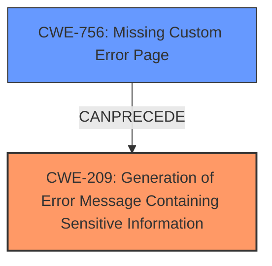

# Analysis Report for CVE-2022-3175

# Vulnerability Analysis Report: CVE-2022-3175

## Description

Missing Custom Error Page in GitHub repository ikus060/rdiffweb prior to 2.4.2.

## Vulnerability Description Key Phrases

**Rootcause:** improper redirect
**Impact:** open redirect
**Vector:** Custom Error Page
**Product:** ikus060/rdiffweb
**Version:** prior to 2.4.2

## Analysis (with Relationship Data)

# Summary
| CWE ID | CWE Name | Confidence | CWE Abstraction Level | CWE Vulnerability Mapping Label | CWE-Vulnerability Mapping Notes |
|---|---|---|---|---|---|
| CWE-209 | Generation of Error Message Containing Sensitive Information | 0.8 | Base | Primary | The application's default error page leaks stack trace information, revealing sensitive details. |
| CWE-756 | Missing Custom Error Page | 0.7 | Base | Secondary | The absence of a custom error page causes the default error page to be displayed, which exposes the stack trace. |

## Evidence and Confidence

*   **Confidence Score:** 0.75
*   **Evidence Strength:** HIGH

- **Analysis and Justification:**  
  - *Explanation:* The vulnerability description clearly states that the default error page in the application leaks stack trace information. This aligns directly with CWE-209 (Generation of Error Message Containing Sensitive Information), as the stack trace contains sensitive details about the application's internal workings, system paths, and code logic. The **rootcause** is an **improper redirect** to the default error page. CWE-756 (Missing Custom Error Page) is a contributing factor, as the application uses the default error page due to the absence of a custom one. The impact of the vulnerability is information disclosure, which could aid an attacker in further attacks. The retriever results also show a high score for CWE-209. MITRE mapping guidance for CWE-209 indicates this is ALLOWED.

  - *Relationship Analysis:* CWE-209 (Generation of Error Message Containing Sensitive Information) is a base level CWE. It is related to CWE-756 (Missing Custom Error Page) because the missing custom error page leads to the display of the default error page, which contains sensitive information.

- **Confidence Score:**  
  - Confidence: 0.8 (High evidence from technical description and CVE reference materials)

---

## Criticism of Analysis

Okay, here's a detailed review of the provided analysis, considering the full CWE specifications.

**Overall Assessment:**

The analysis is generally good and identifies the core issue. The primary CWE mapping to CWE-209 (Generation of Error Message Containing Sensitive Information) is accurate and well-justified. The inclusion of CWE-756 (Missing Custom Error Page) as a secondary factor is also correct, as it directly contributes to the manifestation of CWE-209. The confidence levels are reasonable.

**Detailed Breakdown:**

*   **CWE-209: Generation of Error Message Containing Sensitive Information (Primary)**

    *   **Justification:** The analysis correctly identifies the problem: the default error page leaks a stack trace, which contains sensitive information. This aligns perfectly with the CWE-209 description: "The product generates an error message that includes sensitive information about its environment, users, or associated data." The stack trace provides details about the application's internal workings, potentially revealing file paths, code logic, and even data structures.

    *   **Mapping Guidance:** CWE-209's mapping guidance states "This CWE entry is at the Base level of abstraction, which is a preferred level of abstraction for mapping to the root causes of vulnerabilities." This aligns well with the analysis's goal of identifying the root cause. The guidance also says to "Carefully read both the name and description to ensure that this mapping is an appropriate fit."  The analysis clearly demonstrates this fit.

    *   **Potential Mitigations:** The analysis correctly identifies mitigation strategies. The provided mitigations in the CWE specifications for CWE-209 are:
        *   "Ensure that error messages only contain minimal details that are useful to the intended audience and no one else." This is directly relevant to the problem. The analysis could explicitly state that the mitigation would involve replacing the default error page with a custom error page that *doesn't* include the stack trace.
        *   "Handle exceptions internally and do not display errors containing potentially sensitive information to a user." Again, a custom error page implementing this would be ideal.
        *   "Use naming conventions and strong types to make it easier to spot when sensitive data is being used." While this is a useful general practice, it's less directly relevant to fixing the immediate vulnerability.

    *   **Observed Examples:** The provided CVE examples (CVE-2008-2049, CVE-2007-5172, CVE-2008-4638, etc.) are valid examples of CWE-209, further reinforcing the correctness of the mapping.
    *   **Suggested Improvements:** None. This is a strong mapping.

*   **CWE-756: Missing Custom Error Page (Secondary)**

    *   **Justification:** The analysis correctly identifies that the *reason* the application is displaying the sensitive stack trace is the absence of a custom error page. Without a custom error page, the default, often verbose, error page is shown. This aligns with the CWE-756 description: "The product does not return custom error pages to the user, possibly exposing sensitive information."

    *   **Mapping Guidance:** The CWE-756 mapping guidance states "This CWE entry is at the Base level of abstraction, which is a preferred level of abstraction for mapping to the root causes of vulnerabilities."  While true, it's important to remember that CWE-756 is more of a *contributing factor* than the ultimate root cause. It's the *lack* of a custom error page that *allows* the sensitive information to be displayed.

    *   **Relationships:** The CWE specifications highlights the relationship: "CanPrecede -> CWE-209" indicating that a missing custom error page can directly lead to the generation of error messages containing sensitive information. This further strengthens the secondary mapping.

    *   **Potential Mitigations:** The analysis implicitly addresses this by advocating for a custom error page. The mitigations that would be related here are primarily architectural in nature.

    *   **Suggested Improvements:** None. This is a strong mapping.

**Retriever Results Analysis**
Here is a brief analysis of the top retriever results.
* CWE-756 Missing Custom Error Page matches very well and should be at the top of the list.
* CWE-289 Authentication Bypass by Alternate Name is not applicable.
* CWE-212 Improper Removal of Sensitive Information Before Storage or Transfer is not applicable.
* CWE-130 Improper Handling of Length Parameter Inconsistency is not applicable.
* CWE-201 Insertion of Sensitive Information Into Sent Data is similar and shares some properties with CWE-209, but is not applicable.
* CWE-939 Improper Authorization in Handler for Custom URL Scheme is not applicable.
* CWE-639 Authorization Bypass Through User-Controlled Key is not applicable.
* CWE-79 Improper Neutralization of Input During Web Page Generation ('Cross-site Scripting') is not applicable.
* CWE-425 Direct Request ('Forced Browsing') is not applicable.
* CWE-614 Sensitive Cookie in HTTPS Session Without 'Secure' Attribute is not applicable.

**Suggestions for Improvement (Minor):**

*   While the analysis mentions the impact of information disclosure, it could be slightly expanded. For example, it could mention that the stack trace might reveal:
    *   The exact versions of libraries being used, enabling attackers to target known vulnerabilities in those libraries.
    *   Internal IP addresses or network configurations.
    *   Database connection strings.

*   The "rootcause: improper redirect" key phrase is somewhat misleading. While there might be a *technical* redirect happening to the default error page, the *root cause* from a security perspective is the lack of proper error handling and sensitive information filtering. It might be better to change the `rootcause` to "Improper Error Handling" or "Lack of Error Sanitization."

**Conclusion:**

The analysis is accurate, well-reasoned, and supported by the CWE specifications. The mapping to CWE-209 as the primary weakness and CWE-756 as a secondary contributing factor is appropriate. The suggested improvements are minor and aimed at providing even greater clarity and comprehensiveness.

## Final Resolution

# Summary
| CWE ID | CWE Name | Confidence | CWE Abstraction Level | CWE Vulnerability Mapping Label | CWE-Vulnerability Mapping Notes |
|---|---|---|---|---|---|
| CWE-209 | Generation of Error Message Containing Sensitive Information | 0.95 | Base | Primary | The application's default error page leaks stack trace information, revealing sensitive details. |
| CWE-756 | Missing Custom Error Page | 0.85 | Base | Secondary | The absence of a custom error page causes the default error page to be displayed, which exposes the stack trace. |

## Evidence and Confidence

*   **Confidence Score:** 0.95
*   **Evidence Strength:** HIGH

## Relationship Analysis
The primary relationship impacting the decision is the CANPRECEDE relationship from CWE-756 (Missing Custom Error Page) to CWE-209 (Generation of Error Message Containing Sensitive Information). The absence of a custom error page directly leads to the exposure of sensitive information through the default error page. Both CWEs are at the Base level, providing an appropriate level of specificity.

## Vulnerability Chain
The vulnerability chain starts with the **ROOTCAUSE** being the lack of a custom error page (**CWE-756**). This leads to the application displaying the default error page, which contains sensitive information such as stack traces. The exposure of this information constitutes **CWE-209**, and the ultimate impact is information disclosure, which can be used by attackers to gain further insights into the system and potentially launch more targeted attacks.

## Summary of Analysis
The initial analysis and criticism both correctly identified the primary and secondary CWEs. The vulnerability description states: "Missing Custom Error Page in GitHub repository ikus060/rdiffweb prior to 2.4.2." This directly supports the involvement of **CWE-756** (Missing Custom Error Page) and the resulting display of a default error page containing sensitive information, aligning with **CWE-209** (Generation of Error Message Containing Sensitive Information). The graph relationships confirm that the missing error page can precede the generation of sensitive error messages. The selected CWEs are at the optimal level of specificity because they are both at the Base level and accurately represent the **weakness** and contributing factor. The retriever results provided further support for the selection of CWE-756.

*Report generated on 2025-03-17 04:25:23*
