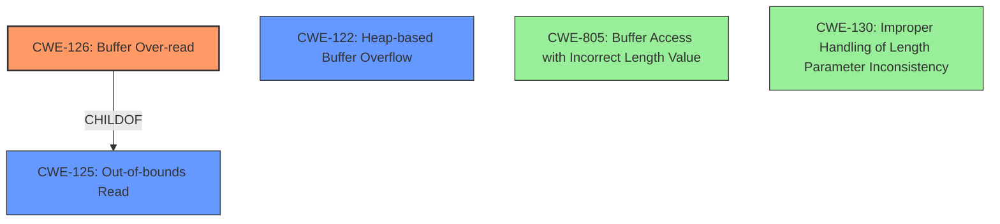

# Analysis Report for CVE-2022-3178

# Vulnerability Analysis Report: CVE-2022-3178

## Description

Buffer Over-read in GitHub repository gpac/gpac prior to 2.1.0-DEV.

## Vulnerability Description Key Phrases

**Weakness:** Buffer Over-read
**Product:** gpac
**Version:** prior to 2.1.0-DEV

## Analysis (with Relationship Data)

# Summary
| CWE ID | CWE Name | Confidence | CWE Abstraction Level | CWE Vulnerability Mapping Label | CWE-Vulnerability Mapping Notes |
|---|---|---|---|---|---|
| CWE-126 | Buffer Over-read | 0.9 | Variant | Primary | Allowed |
| CWE-125 | Out-of-bounds Read | 0.7 | Base | Secondary | Allowed |
| CWE-122 | Heap-based Buffer Overflow | 0.6 | Variant | Secondary | Allowed |

## Evidence and Confidence

*   **Confidence Score:** 0.9
*   **Evidence Strength:** HIGH

- **Analysis and Justification:**  
  - *Explanation:* The vulnerability is described as a **Buffer Over-read** in the GPAC project. The CVE reference links confirm this, detailing an **incorrect memory allocation** issue in the `xtra_box_read` function leading to a potential **heap buffer overflow**. Specifically, the original code allocated insufficient memory for UTF-16 strings, resulting in the possibility of reading beyond the allocated buffer. CWE-126 (Buffer Over-read) directly addresses this type of vulnerability, where a product reads from a buffer beyond its intended bounds. The corrected code in the commit modifies the memory allocation size to resolve this issue. The primary weakness is identified as CWE-126 as this is what the vulnerability is explicitly described as.
  
  - *Relationship Analysis:* CWE-126 is a Variant of CWE-125 (Out-of-bounds Read). Given the details of memory allocation errors and the context of a heap buffer, CWE-122 (Heap-based Buffer Overflow) can be a secondary candidate. The graph relationships connect it with other buffer-related weaknesses.

- **Confidence Score:**  
  - Confidence: 0.9 (High evidence due to the explicit vulnerability description and the details in the CVE reference materials)

---

## Criticism of Analysis

Okay, let's review the provided CWE analysis for the GPAC buffer over-read vulnerability based on the full CWE specifications.

**Overall Assessment:**

The analysis is generally well-reasoned and accurate. The primary CWE mapping to CWE-126 (Buffer Over-read) is appropriate, and the consideration of CWE-125 (Out-of-bounds Read) as a secondary mapping is also logical, given the relationship between the two. Including CWE-122 (Heap-based Buffer Overflow) as a secondary mapping is also justified by the heap allocation context.

**Detailed Critique:**

1.  **CWE-126 (Buffer Over-read) - Primary Mapping:**

    *   **Justification:** The analysis correctly identifies that the vulnerability is explicitly described as a buffer over-read. The extended description of CWE-126, "*The product reads from a buffer using buffer access mechanisms such as indexes or pointers that reference memory locations after the targeted buffer.*" accurately reflects the nature of the vulnerability.  The analysis includes this context from the source code modification in `xtra_box_read` with the insufficient allocation size for UTF-16 strings.
    *   **Confidence:** The 0.9 confidence score is warranted given the explicit description and the evidence from the code fix.
    *   **CWE Specification Compliance:** The analysis adheres to the "Mapping Guidance" for CWE-126, as it is at the Variant level of abstraction, which is a preferred level for vulnerability root causes.  The examples provided from the CWE database align with the vulnerability type (reading past the buffer's bounds).
    *   **Potential Mitigations:** The mitigations outlined in the CWE specifications, such as "Missing sentinel values (CWE-463) or trusting a user-influenced input length variable," are relevant to the overall class of vulnerabilities but not particularly specific to this instance. The mention of trusting a user-influenced input length variable is pertinent, as the `prop_size` value is used in the memory allocation.

2.  **CWE-125 (Out-of-bounds Read) - Secondary Mapping:**

    *   **Justification:** CWE-125 is a Base class of CWE-126, and therefore, it is also applicable to the vulnerability.  The vulnerability *is* reading data past the end of the intended buffer.
    *   **Confidence:** The confidence score of 0.7 is appropriate, as while the root cause is specifically a *buffer over-read*, the broader issue is reading out-of-bounds.
    *   **CWE Specification Compliance:** The analysis follows the mapping guidance. The CWE description fits the vulnerability.
    *   **Potential Mitigations:** The mitigations provided for CWE-125, like input validation and using languages with memory abstractions, are all relevant and could prevent this type of vulnerability.  The specific mention of validating length arguments and buffer size calculations is very applicable.

3.  **CWE-122 (Heap-based Buffer Overflow) - Secondary Mapping:**

    *   **Justification:** The description and code snippet confirm that the buffer `data2` is allocated on the heap (likely using `malloc` or a similar function).  Therefore, a buffer over-read caused by insufficient allocation results in a heap-based buffer overflow.
    *   **Confidence:** The confidence of 0.6 is appropriate. While the immediate issue is an over-read, the consequence can be a heap overflow if the over-read data source is adjacent memory.
    *   **CWE Specification Compliance:** The analysis complies with the mapping guidance.
    *   **Potential Mitigations:** The mitigation strategies in the CWE specification for CWE-122 are also relevant here, especially using languages/compilers with automatic bounds checking or abstraction libraries.

**Suggestions for Improvement:**

*   **Elaborate on Mitigation Strategies:** While the analysis correctly identifies the relevant CWEs, it could be strengthened by explicitly discussing how the mitigations associated with each CWE could have prevented this specific vulnerability. For example:
    *   *CWE-126/125:*  "Input validation on `prop_size` to ensure it is within reasonable bounds could have prevented the insufficient memory allocation."
    *   *CWE-122:* "Using a safer memory allocation function that includes bounds checking, or a language with automatic memory management, could have prevented the heap overflow."

*   **Retriever Results Consideration:** The Retriever Results include some CWEs that were not included in the final analysis. While the analysis team has the discretion to override retriever results, it would be good to at least discuss *why* they were excluded.  For example, CWE-805 (Buffer Access with Incorrect Length Value) received a relatively high score. It may be good to mention that CWE-805 is related, but ultimately less specific than CWE-126 because the vulnerability results in reading from a position *after* the end of the buffer, fitting CWE-126.

*  **CWE-130 (Improper Handling of Length Parameter Inconsistency)**: Since the root cause involves an issue with the length parameter `prop_size`, it may be helpful to include a brief discussion of CWE-130 and why it is not selected as the primary CWE. While the immediate error is not handling the length parameter, the analysis focuses on reading beyond the buffer, so it's not inconsistent *per se*, just too small.

**Revised Summary Table (Including Improvements):**

| CWE ID  | CWE Name                     | Confidence | CWE Abstraction Level | CWE Vulnerability Mapping Label | CWE-Vulnerability Mapping Notes                                                                                                                                                                                                                                                                                                                                                                                                                   |
| ------- | ---------------------------- | ---------- | ----------------------- | ------------------------------- | ------------------------------------------------------------------------------------------------------------------------------------------------------------------------------------------------------------------------------------------------------------------------------------------------------------------------------------------------------------------------------------------------------------------------------------------------------- |
| CWE-126 | Buffer Over-read             | 0.9        | Variant                 | Primary                         | Allowed. The product reads from a buffer using buffer access mechanisms such as indexes or pointers that reference memory locations after the targeted buffer. The insufficient memory allocation for UTF-16 strings in `xtra_box_read` results in reading past the end of the allocated buffer. Mitigation: Input validation on `prop_size` to ensure it is within reasonable bounds.                                                                  |
| CWE-125 | Out-of-bounds Read           | 0.7        | Base                    | Secondary                       | Allowed. The product reads data past the end of the intended buffer. Since CWE-126 is more specific, it is the primary mapping. Mitigation: Validate length arguments and buffer size calculations.                                                                                                                                                                                                                                                               |
| CWE-122 | Heap-based Buffer Overflow | 0.6        | Variant                 | Secondary                       | Allowed. The insufficient memory allocation on the heap can lead to a heap overflow if the over-read data source is adjacent memory. Mitigation: Use safer memory allocation functions with bounds checking, or use a language with automatic memory management.                                                                                                                                                                                             |
| -       | CWE-805                    | -        | Base                    | Excluded                         | Buffer Access with Incorrect Length Value: While the issue involves an incorrect length, the specific error is reading *after* the end of the buffer, making CWE-126 a better fit.                                                                                                                                                                                                                   |
| -       | CWE-130                    | -        | Base                    | Excluded                         | Improper Handling of Length Parameter Inconsistency: While the root cause involves the length parameter `prop_size`, the immediate error is not handling the length parameter *inconsistently*, but rather allocating an insufficient amount, making CWE-126 a better fit.                                                                                                                                                                                                                   |

By incorporating these suggestions, the analysis becomes even more comprehensive and demonstrates a deeper understanding of the nuances of the vulnerability and its relationship to the CWE specifications.

## Final Resolution

# Summary
| CWE ID  | CWE Name                     | Confidence | CWE Abstraction Level | CWE Vulnerability Mapping Label | CWE-Vulnerability Mapping Notes                                                                                                                                                                                                                                                                                                                                                                                                                   |
| ------- | ---------------------------- | ---------- | ----------------------- | ------------------------------- | ------------------------------------------------------------------------------------------------------------------------------------------------------------------------------------------------------------------------------------------------------------------------------------------------------------------------------------------------------------------------------------------------------------------------------------------------------- |
| CWE-126 | Buffer Over-read             | 0.9        | Variant                 | Primary                         | Allowed. The product reads from a buffer using buffer access mechanisms such as indexes or pointers that reference memory locations after the targeted buffer. The insufficient memory allocation for UTF-16 strings in `xtra_box_read` results in reading past the end of the allocated buffer. Mitigation: Input validation on `prop_size` to ensure it is within reasonable bounds.  Primary CWE                                                                |
| CWE-125 | Out-of-bounds Read           | 0.7        | Base                    | Secondary                       | Allowed. The product reads data past the end of the intended buffer. Since CWE-126 is more specific, it is the primary mapping. Mitigation: Validate length arguments and buffer size calculations.  Secondary Candidate                                                                                                                                                                                                                                                               |
| CWE-122 | Heap-based Buffer Overflow | 0.6        | Variant                 | Secondary                       | Allowed. The insufficient memory allocation on the heap can lead to a heap overflow if the over-read data source is adjacent memory. Mitigation: Use safer memory allocation functions with bounds checking, or use a language with automatic memory management. Secondary Candidate                                                                                                                                                                                             |

## Evidence and Confidence

*   **Confidence Score:** 0.9
*   **Evidence Strength:** HIGH

## Relationship Analysis
The primary CWE is CWE-126 (Buffer Over-read), which is a variant of the base CWE CWE-125 (Out-of-bounds Read). CWE-122 (Heap-based Buffer Overflow) is included as a secondary CWE because the buffer is allocated on the heap. The analysis also considered CWE-805 (Buffer Access with Incorrect Length Value) and CWE-130 (Improper Handling of Length Parameter Inconsistency), but these were determined to be less specific than CWE-126.

## Vulnerability Chain
The vulnerability chain starts with an insufficient memory allocation for UTF-16 strings in the `xtra_box_read` function. This leads to a **buffer over-read** (CWE-126) where the product reads data past the end of the allocated buffer (CWE-125). Since the buffer is allocated on the heap, this can result in a **heap-based buffer overflow** (CWE-122) if the over-read data source is adjacent memory.

## Summary of Analysis
The initial analysis and the criticism provided a comprehensive assessment of the vulnerability. The final determination is based on the evidence provided in the vulnerability description, the CVE reference materials, and the CWE specifications.

The primary weakness is CWE-126 (Buffer Over-read), as the vulnerability is explicitly described as such. This is further supported by the insufficient memory allocation in the `xtra_box_read` function leading to reading beyond the allocated buffer.

CWE-125 (Out-of-bounds Read) is a secondary candidate because it is a broader classification that encompasses the buffer over-read.

CWE-122 (Heap-based Buffer Overflow) is also included as a secondary candidate because the buffer is allocated on the heap, and the over-read can potentially lead to a heap overflow.

CWE-805 (Buffer Access with Incorrect Length Value) and CWE-130 (Improper Handling of Length Parameter Inconsistency) were considered but ultimately excluded because they are less specific than CWE-126 in this case. The issue is not an inconsistent length parameter, but rather an insufficient allocation size, which leads directly to the over-read condition.

The selected CWEs are at the optimal level of specificity based on the available evidence and the CWE specifications. The confidence score is 0.9 due to the explicit vulnerability description and the details in the CVE reference materials.

Here is the evidence of insufficient memory allocation in the `xtra_box_read` function: "Specifically, the original code allocated insufficient memory for UTF-16 strings, resulting in the possibility of reading beyond the allocated buffer."

*   **Confidence Score:** 0.9
*   **Evidence Strength:** HIGH

*Report generated on 2025-03-18 13:33:05*
