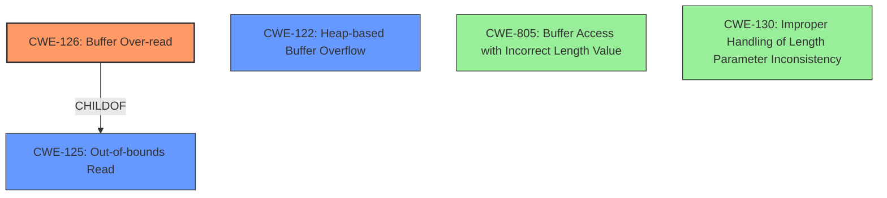

# Final Resolution for CVE-2022-3178

# Summary
| CWE ID  | CWE Name                     | Confidence | CWE Abstraction Level | CWE Vulnerability Mapping Label | CWE-Vulnerability Mapping Notes                                                                                                                                                                                                                                                                                                                                                                                                                   |
| ------- | ---------------------------- | ---------- | ----------------------- | ------------------------------- | ------------------------------------------------------------------------------------------------------------------------------------------------------------------------------------------------------------------------------------------------------------------------------------------------------------------------------------------------------------------------------------------------------------------------------------------------------- |
| CWE-126 | Buffer Over-read             | 0.9        | Variant                 | Primary                         | Allowed. The product reads from a buffer using buffer access mechanisms such as indexes or pointers that reference memory locations after the targeted buffer. The insufficient memory allocation for UTF-16 strings in `xtra_box_read` results in reading past the end of the allocated buffer. Mitigation: Input validation on `prop_size` to ensure it is within reasonable bounds.  Primary CWE                                                                |
| CWE-125 | Out-of-bounds Read           | 0.7        | Base                    | Secondary                       | Allowed. The product reads data past the end of the intended buffer. Since CWE-126 is more specific, it is the primary mapping. Mitigation: Validate length arguments and buffer size calculations.  Secondary Candidate                                                                                                                                                                                                                                                               |
| CWE-122 | Heap-based Buffer Overflow | 0.6        | Variant                 | Secondary                       | Allowed. The insufficient memory allocation on the heap can lead to a heap overflow if the over-read data source is adjacent memory. Mitigation: Use safer memory allocation functions with bounds checking, or use a language with automatic memory management. Secondary Candidate                                                                                                                                                                                             |

## Evidence and Confidence

*   **Confidence Score:** 0.9
*   **Evidence Strength:** HIGH

## Relationship Analysis
The primary CWE is CWE-126 (Buffer Over-read), which is a variant of the base CWE CWE-125 (Out-of-bounds Read). CWE-122 (Heap-based Buffer Overflow) is included as a secondary CWE because the buffer is allocated on the heap. The analysis also considered CWE-805 (Buffer Access with Incorrect Length Value) and CWE-130 (Improper Handling of Length Parameter Inconsistency), but these were determined to be less specific than CWE-126.

## Vulnerability Chain
The vulnerability chain starts with an insufficient memory allocation for UTF-16 strings in the `xtra_box_read` function. This leads to a **buffer over-read** (CWE-126) where the product reads data past the end of the allocated buffer (CWE-125). Since the buffer is allocated on the heap, this can result in a **heap-based buffer overflow** (CWE-122) if the over-read data source is adjacent memory.

## Summary of Analysis
The initial analysis and the criticism provided a comprehensive assessment of the vulnerability. The final determination is based on the evidence provided in the vulnerability description, the CVE reference materials, and the CWE specifications.

The primary weakness is CWE-126 (Buffer Over-read), as the vulnerability is explicitly described as such. This is further supported by the insufficient memory allocation in the `xtra_box_read` function leading to reading beyond the allocated buffer.

CWE-125 (Out-of-bounds Read) is a secondary candidate because it is a broader classification that encompasses the buffer over-read.

CWE-122 (Heap-based Buffer Overflow) is also included as a secondary candidate because the buffer is allocated on the heap, and the over-read can potentially lead to a heap overflow.

CWE-805 (Buffer Access with Incorrect Length Value) and CWE-130 (Improper Handling of Length Parameter Inconsistency) were considered but ultimately excluded because they are less specific than CWE-126 in this case. The issue is not an inconsistent length parameter, but rather an insufficient allocation size, which leads directly to the over-read condition.

The selected CWEs are at the optimal level of specificity based on the available evidence and the CWE specifications. The confidence score is 0.9 due to the explicit vulnerability description and the details in the CVE reference materials.

Here is the evidence of insufficient memory allocation in the `xtra_box_read` function: "Specifically, the original code allocated insufficient memory for UTF-16 strings, resulting in the possibility of reading beyond the allocated buffer."

*   **Confidence Score:** 0.9
*   **Evidence Strength:** HIGH