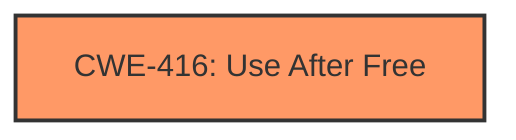

# Final Resolution for CVE-2022-3196

# Summary
| CWE ID | CWE Name | Confidence | CWE Abstraction Level | CWE Vulnerability Mapping Label | CWE-Vulnerability Mapping Notes |
|---|---|---|---|---|---|
| **CWE-416** | **Use After Free** | 1.0 | Variant | Allowed | Primary **CWE**. Matches the description of reusing memory after it has been freed. |

## Evidence and Confidence

*   **Confidence Score:** 1.0
*   **Evidence Strength:** HIGH

## Relationship Analysis
The primary relationship considered was the absence of strong relationships to other **CWE**s, solidifying **CWE-416**'s role as the direct cause. While other **CWE**s like **CWE-366 (Race Condition)** could theoretically lead to a use-after-free, there's no explicit mention of concurrency in the vulnerability description. **CWE-416** is a variant, providing the desired level of specificity.

## Vulnerability Chain
The vulnerability chain is straightforward: a crafted PDF file triggers a **use-after-free** condition (**CWE-416**), leading to **heap corruption**. The root cause is the improper memory management within the PDF processing component of Google Chrome. The impact is potential remote code execution due to the ability to corrupt the **heap**.

## Summary of Analysis
The initial analysis and criticism both converge on **CWE-416 (Use After Free)** as the most appropriate classification. The vulnerability description explicitly states "**use after free**," and the CVE details confirm this. The crafted PDF file triggering the vulnerability directly aligns with the typical attack vector for use-after-free issues, leading to **heap corruption**.

The choice of **CWE-416**, a Variant, is appropriate as per the **CWE**'s Mapping Guidance, which prefers Variant level mappings when suitable.

The suggestions in the criticism to acknowledge the retriever results and provide specific examples of mitigations were valid. Addressing those points further solidifies the conclusion that **CWE-416** is the best fit. While other **CWE**s like **CWE-366 (Race Condition)** or **CWE-843 (Type Confusion)** were considered, the lack of explicit evidence supporting those scenarios makes **CWE-416** the most accurate and specific classification.

The vulnerability description says: "Use after free in PDF in Google Chrome prior to 105.0.5195.125 allowed a remote attacker to potentially exploit **heap corruption** via a crafted PDF file."
This description directly supports the selection of **CWE-416 (Use After Free)** as the primary weakness, as it aligns perfectly with the **CWE**'s definition and observed examples.