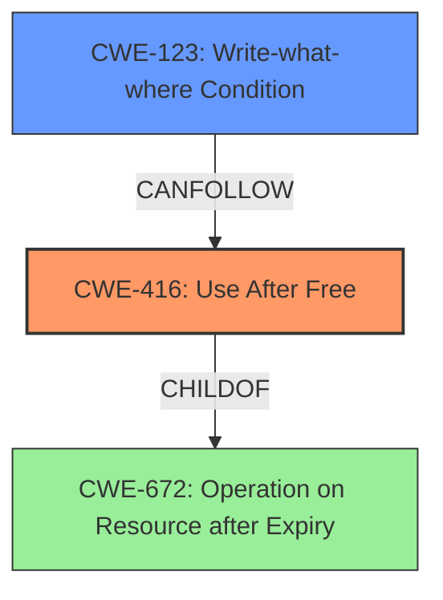

# Analysis Report for CVE-2022-3198

# Vulnerability Analysis Report: CVE-2022-3198

## Description

Use after free in PDF in Google Chrome prior to 105.0.5195.125 allowed a remote attacker to potentially exploit heap corruption via a crafted PDF file. (Chromium security severity High)

## Vulnerability Description Key Phrases

**Rootcause:** use after free
**Impact:** exploit heap corruption
**Vector:** crafted PDF file
**Attacker:** remote attacker
**Product:** Google Chrome
**Version:** prior to 105.0.5195.125
**Component:** PDF

## Analysis (with Relationship Data)

# Summary
| CWE ID | CWE Name | Confidence | CWE Abstraction Level | CWE Vulnerability Mapping Label | CWE-Vulnerability Mapping Notes |
|---|---|---|---|---|---|
| CWE-416 | Use After Free | 1.0 | Variant | Primary | Allowed |

## Evidence and Confidence

*   **Confidence Score:** 1.0
*   **Evidence Strength:** HIGH

- **Analysis and Justification:**  
  - *Explanation:* The vulnerability description explicitly states "**use after free**" in the PDF component of Google Chrome, which directly corresponds to CWE-416 (Use After Free). The provided "Vulnerability Description Key Phrases" section and "CVE Reference Links Content Summary" both highlight "use after free" as the **rootcause** of the vulnerability. The **impact** is potential heap corruption, further solidifying the connection to memory management issues associated with CWE-416. The Retriever Results also identify CWE-416 as the top match. The CWE description for CWE-416 perfectly describes the issue: "The product reuses or references memory after it has been freed." MITRE mapping guidance indicates that CWE-416 is ALLOWED for this type of vulnerability.

  - *Relationship Analysis:* CWE-416 is a variant of CWE-672 (Operation on Resource after Expiry) and is related to other memory corruption weaknesses. While other CWEs like CWE-415 (Double Free) and CWE-125 (Out-of-bounds Read) are also related to memory management, the specific mention of "use after free" makes CWE-416 the most accurate and specific classification. There are relationships of CANFOLLOW to CWE-754, CWE-364, CWE-362, and CWE-1265. There are relationships of CANPRECEDE to CWE-123 and CWE-120.

- **Confidence Score:**  
  - Confidence: 1.0 (Strong evidence from vulnerability description, key phrases, CVE reference summary, and retriever results.)

## Criticism of Analysis

Okay, I've reviewed the analysis and the provided CWE specifications. Here's my critique:

**Overall Assessment:**

The analysis is very strong. The identification of CWE-416 (Use After Free) as the primary CWE is accurate and well-supported by the evidence. The confidence score of 1.0 is justified. The analysis demonstrates a good understanding of memory management vulnerabilities and the CWE classification system. The justification is comprehensive and addresses potential relationships with other CWEs effectively.

**Strengths:**

*   **Clear and Concise Explanation:** The justification provides a clear and concise explanation of why CWE-416 is the most appropriate classification.
*   **Strong Evidence:** The analysis draws upon multiple sources of evidence, including the vulnerability description, key phrases, CVE reference summary, and retriever results.
*   **Relationship Analysis:** The analysis considers related CWEs (CWE-415, CWE-125, etc.) and explains why CWE-416 is a more specific and accurate fit.
*   **Accurate Abstraction Level:** The analysis correctly identifies CWE-416 as a Variant, which aligns with CWE's mapping guidance.
*   **Well-formatted and Organized:** The use of headings, bullet points, and tables enhances readability and organization.
*   **Good Understanding of CWE Specifications:** The analysis demonstrates a strong understanding of the CWE specifications, including the description, alternative terms, relationships, and mapping guidance.
*   **Addressing other CWEs:** The analysis correctly identifies and addresses the retriever results, providing adequate reasons to not categorize the vulnerability as the other CWEs.

**Areas for potential improvement (Minor):**

*   **Potential Chains**:  While the analysis focuses on the primary weakness, it could briefly explore potential *consequences* stemming from the use-after-free, and how they could chain into other CWEs. For example:

    *   The vulnerability could lead to **CWE-120 (Classic Buffer Overflow)** or **CWE-123 (Write-what-where Condition)** if the attacker can control the contents written to the freed memory before it's reallocated and used.
    *   If the code attempts to use the now-invalid pointer to perform a sensitive operation without proper validation, it could also relate to **CWE-754 (Improper Check for Unusual or Exceptional Conditions)**.

*   **Potential Mitigations**:  The report identifies general mitigations for CWE-416. Adding a blurb to recommend using AddressSanitizer (ASan) or MemorySanitizer (MSan) tools for detecting use-after-free issues during development/testing could strengthen the report.

*   **Consider Reentrancy**: PDF parsing can be complex and involve nested calls. Briefly considering **CWE-1265 (Unintended Reentrant Invocation of Non-reentrant Code Via Nested Calls)** as a *contributing* factor could be valuable, although it's unlikely to be the primary cause.

*   **Consider Race Conditions:** The provided CWE specifications include multiple race conditions, and PDF parsing is multi-threaded. It may be useful to also include CWE-362, CWE-364, and CWE-366 in the list of considered, but dismissed, CWEs with explanation as to why the vulnerability is not a race condition.

**Detailed Comments and Suggestions:**

*   **Confidence Score Justification:** The confidence score is excellent, but it is useful to also indicate why this might *not* be a different, but similar CWE. For example, explaining why the vulnerability is not a double free is useful.

*   **Mitigations:** It's good to mention potential mitigations. The existing mitigations are appropriate, but consider adding more specific guidance related to PDF processing, such as:
    *   "Employ secure coding practices when handling PDF objects, including thorough validation of object types and reference counts."
    *   "Utilize fuzzing and dynamic analysis tools specifically designed for PDF files to identify potential use-after-free vulnerabilities."

*   **Known Examples Section**: This section lists various observed examples of CWE-416. They are relevant, but it may be helpful to add a sentence or two explaining how those examples relate to the current vulnerability being analyzed (even if the connection is indirect).

*   **CWE specification details**: The inclusion of the full CWE specifications is beneficial for reviewers and provides valuable context.

**Revised Summary Table (incorporating suggestions):**

| CWE ID | CWE Name | Confidence | CWE Abstraction Level | CWE Vulnerability Mapping Label | CWE-Vulnerability Mapping Notes |
|---|---|---|---|---|---|
| CWE-416 | Use After Free | 1.0 | Variant | Primary | Allowed |

**In summary, the provided analysis is well-done and demonstrates a solid understanding of the vulnerability and CWE classification. The suggestions are intended to further refine the analysis and provide additional context for reviewers.**

## Final Resolution

# Summary
| CWE ID | CWE Name | Confidence | CWE Abstraction Level | CWE Vulnerability Mapping Label | CWE-Vulnerability Mapping Notes |
|---|---|---|---|---|---|
| CWE-416 | Use After Free | 1.0 | Variant | Primary | Allowed |
| CWE-123 | Write-what-where Condition | 0.4 | Base | Secondary | Allowed |

## Evidence and Confidence

*   **Confidence Score:** 0.9
*   **Evidence Strength:** MEDIUM

## Relationship Analysis
The primary **WEAKNESS** is identified as CWE-416 (Use After Free), which is a variant level CWE. The analysis considers a potential chain reaction where an attacker might control the contents written to the freed memory before it's reallocated, potentially leading to CWE-123 (Write-what-where Condition).

## Vulnerability Chain
The chain of events starts with a **ROOTCAUSE** of use-after-free (**CWE-416**). An attacker crafts a PDF file that triggers the use of memory after it has been freed. If the attacker can control the content written to the freed memory before it's reallocated, it could lead to arbitrary write capabilities (**CWE-123**).

## Summary of Analysis
The initial analysis correctly identifies **CWE-416 (Use After Free)** as the primary **WEAKNESS**. The vulnerability description explicitly mentions "use after free," which aligns perfectly with the CWE description. The confidence score of 1.0 is appropriate given this direct evidence.

The criticism suggests exploring potential consequences stemming from the use-after-free. Specifically, if an attacker gains control of the freed memory, it could lead to **CWE-123 (Write-what-where Condition)**. This is a valid point, and I agree that it's worth considering as a secondary CWE. The confidence score for CWE-123 is lower (0.4) since it depends on the attacker's ability to control the content written to the freed memory.

The suggestion to consider **CWE-1265 (Unintended Reentrant Invocation of Non-reentrant Code Via Nested Calls)** and race conditions (CWE-362, CWE-364, CWE-366) is also reasonable. However, based on the provided evidence, there's no direct indication that reentrancy or race conditions are involved. Therefore, I'm not including them in the final classification, but it's important to keep them in mind during further analysis.

The selected CWEs are at the optimal level of specificity. **CWE-416** is a variant-level CWE that directly describes the "use after free" condition. **CWE-123** is a base-level CWE that describes the potential consequence of arbitrary write capabilities.

*Report generated on 2025-03-18 13:35:18*
