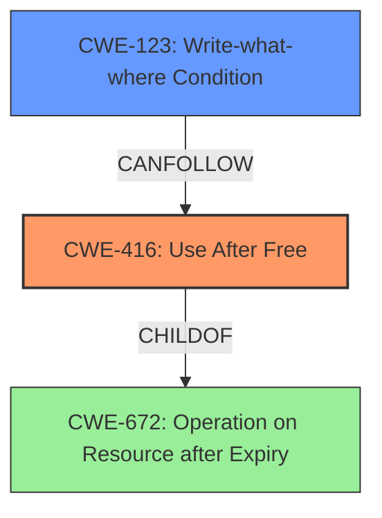

# Final Resolution for CVE-2022-3198

# Summary
| CWE ID | CWE Name | Confidence | CWE Abstraction Level | CWE Vulnerability Mapping Label | CWE-Vulnerability Mapping Notes |
|---|---|---|---|---|---|
| CWE-416 | Use After Free | 1.0 | Variant | Primary | Allowed |
| CWE-123 | Write-what-where Condition | 0.4 | Base | Secondary | Allowed |

## Evidence and Confidence

*   **Confidence Score:** 0.9
*   **Evidence Strength:** MEDIUM

## Relationship Analysis
The primary **WEAKNESS** is identified as CWE-416 (Use After Free), which is a variant level CWE. The analysis considers a potential chain reaction where an attacker might control the contents written to the freed memory before it's reallocated, potentially leading to CWE-123 (Write-what-where Condition).

## Vulnerability Chain
The chain of events starts with a **ROOTCAUSE** of use-after-free (**CWE-416**). An attacker crafts a PDF file that triggers the use of memory after it has been freed. If the attacker can control the content written to the freed memory before it's reallocated, it could lead to arbitrary write capabilities (**CWE-123**).

## Summary of Analysis
The initial analysis correctly identifies **CWE-416 (Use After Free)** as the primary **WEAKNESS**. The vulnerability description explicitly mentions "use after free," which aligns perfectly with the CWE description. The confidence score of 1.0 is appropriate given this direct evidence.

The criticism suggests exploring potential consequences stemming from the use-after-free. Specifically, if an attacker gains control of the freed memory, it could lead to **CWE-123 (Write-what-where Condition)**. This is a valid point, and I agree that it's worth considering as a secondary CWE. The confidence score for CWE-123 is lower (0.4) since it depends on the attacker's ability to control the content written to the freed memory.

The suggestion to consider **CWE-1265 (Unintended Reentrant Invocation of Non-reentrant Code Via Nested Calls)** and race conditions (CWE-362, CWE-364, CWE-366) is also reasonable. However, based on the provided evidence, there's no direct indication that reentrancy or race conditions are involved. Therefore, I'm not including them in the final classification, but it's important to keep them in mind during further analysis.

The selected CWEs are at the optimal level of specificity. **CWE-416** is a variant-level CWE that directly describes the "use after free" condition. **CWE-123** is a base-level CWE that describes the potential consequence of arbitrary write capabilities.