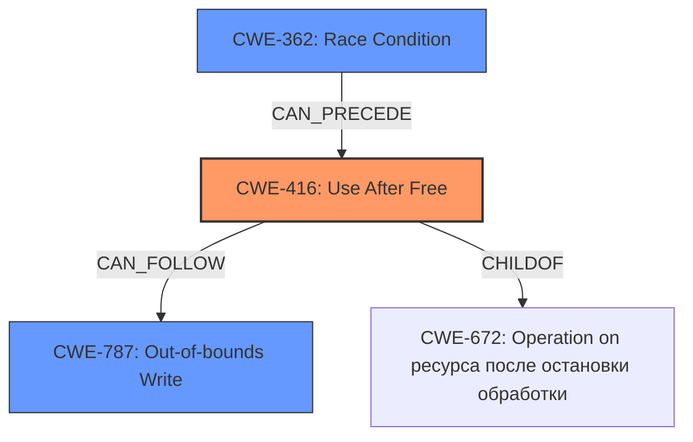

# Analysis Report for CVE-2022-3199

# Vulnerability Analysis Report: CVE-2022-3199

## Description

Use after free in Frames in Google Chrome prior to 105.0.5195.125 allowed a remote attacker to potentially exploit heap corruption via a crafted HTML page. (Chromium security severity High)

## Vulnerability Description Key Phrases

**Rootcause:** use after free
**Weakness:** heap corruption
**Vector:** crafted HTML page
**Attacker:** remote attacker
**Product:** Google Chrome
**Version:** prior to 105.0.5195.125
**Component:** Frames

## Analysis (with Relationship Data)

# Summary
| CWE ID | CWE Name | Confidence | CWE Abstraction Level | CWE Vulnerability Mapping Label | CWE-Vulnerability Mapping Notes |
|---|---|---|---|---|---|
| CWE-416 | Use After Free | 1.0 | Variant | Allowed | Primary CWE |

## Evidence and Confidence

*   **Confidence Score:** 1.0
*   **Evidence Strength:** HIGH

- **Analysis and Justification:**  
  - *Explanation:* The vulnerability description explicitly states "**use after free** in Frames in Google Chrome". The description also mentions "**heap corruption**" as a consequence. The CVE Reference Links Content Summary also highlights "**Use-after-free:** A memory location is accessed after it has been freed." CWE-416 (Use After Free) precisely describes this condition: "The product reuses or references memory after it has been freed." The **root cause** is clearly the use-after-free condition, making CWE-416 the most appropriate choice. The "Retriever Results" also gives CWE-416 a high score and notes its usage is ALLOWED.

  - *Relationship Analysis:* While heap corruption is mentioned, it is a consequence of the use-after-free, not the root cause. CWE-416 is a variant-level weakness, providing a more specific description than its potential parents. The retriever results do not show any direct parent relationships with CWE-416.

- **Confidence Score:**
  - Confidence: 1.0 (The evidence directly supports the CWE mapping, and there are no conflicting factors.)

## Criticism of Analysis

Okay, here's a review of the analysis, considering the full CWE specifications provided.

**Overall Assessment:**

The analysis is strong and correctly identifies CWE-416 (Use After Free) as the primary weakness. The confidence level of 1.0 is justified given the clear and direct language in the vulnerability description. The justification provided is also well-reasoned.

**Detailed Review:**

1.  **CWE-416 (Use After Free):**

    *   **Correct Identification:**  The analysis thoroughly supports the selection of CWE-416. The vulnerability description explicitly mentions "use after free," and the analysis connects this to the definition of CWE-416: "The product reuses or references memory after it has been freed."
    *   **Abstraction Level:** The analysis correctly notes that CWE-416 is a *Variant* level CWE, which is the preferred level for vulnerability mapping.
    *   **Mapping Guidance Compliance:** The analysis correctly adheres to the *Mapping Guidance* provided in the CWE specification.  It confirms that the name and description of CWE-416 appropriately fit the observed vulnerability.
    *   **Relationship Analysis:** The analysis correctly identifies that heap corruption is a consequence of the use-after-free, not the root cause. It's also correct that CWE-416 is a Variant and is more specific.
    *   **Observed Examples:** The provided *Observed Examples* from the CWE database do support the mapping. Several of those examples involve chains of weaknesses culminating in a CWE-416.
    *   **Potential Mitigations:** The Analysis does not mention the provided *Potential Mitigations*. It would improve the analysis to note that the use of a language with automatic memory management (e.g., Java, Go, Rust with smart pointers) is a potential architectural mitigation. Setting pointers to NULL after freeing is also an implementation-level mitigation, although its effectiveness can be limited in complex data structures.

2.  **Consideration of Other CWEs:**

    *   **CWE-362 (Race Condition):** The Retriever Results list CWE-362 as the second most relevant CWE. While the primary vulnerability description doesn't indicate a race condition, it is important to note that *use-after-free* conditions can *sometimes* be triggered by race conditions (as shown in some of the CWE-416 examples). If concurrency and timing issues are suspected of contributing to the use-after-free condition, it would be appropriate to *also* include CWE-362 and explain the potential relationship (e.g., "a race condition allows a thread to free memory while another thread still holds a pointer to it").  *Without further evidence of a race condition, it is correct to omit it as the primary CWE*.
    *   **CWE-787 (Out-of-bounds Write):** While *heap corruption* is mentioned, this is a consequence of the use-after-free. The core issue is the use of freed memory, not necessarily writing beyond the bounds of an allocated buffer. CWE-787 is therefore not the primary weakness, but could be a *consequence* of exploiting the UAF.
    *   **CWE-415 (Double Free):** While related to memory management issues, a double-free is a distinct type of vulnerability and is not present in the description.
    *   **CWE-843 (Type Confusion):**  There's no indication of type confusion in the provided vulnerability description.
    *   **CWE-125 (Out-of-bounds Read):** Similarly, the core issue is not reading data outside the bounds, but rather accessing memory that is no longer valid.
    *   **CWE-122 (Heap-based Buffer Overflow):** While heap corruption is a potential outcome of a UAF, the root cause is the reuse of freed memory, not necessarily writing beyond the boundaries of the allocated heap buffer.

**Recommendations for Improvement:**

1.  **Address Potential Mitigations:** Briefly discuss at least one or two potential mitigation strategies for CWE-416, drawing directly from the CWE specification (e.g., language selection, setting pointers to NULL).
2.  **Acknowledge Potential Secondary Weaknesses:** If there's any suspicion (even without definitive proof) that a race condition *might* be involved, acknowledge that possibility. Briefly mention CWE-362 and state why it's *not* being selected as the primary CWE (e.g., "While a race condition could potentially contribute to the UAF, there's no explicit evidence of concurrency issues in the provided description.").
3.  **Explain Exclusion of Other CWEs More Explicitly:**  For CWEs that are *close* matches but ultimately incorrect (e.g., CWE-787 due to the "heap corruption" keyword), provide a more direct explanation of why they are being excluded.  For example: "While 'heap corruption' is mentioned, this is a potential *consequence* of the use-after-free, rather than the root cause. The vulnerability is triggered by *accessing* freed memory, not necessarily by writing beyond the bounds of a buffer, so CWE-787 is not the most appropriate choice."

**Revised Summary Table:**

| CWE ID | CWE Name | Confidence | CWE Abstraction Level | CWE Vulnerability Mapping Label | CWE-Vulnerability Mapping Notes |
|---|---|---|---|---|---|
| CWE-416 | Use After Free | 1.0 | Variant | Allowed | Primary CWE.  Explicitly stated in vulnerability description.  Potential mitigations include using memory-safe languages and setting pointers to NULL after freeing. |
| (Optional) CWE-362 | Race Condition | Low (If applicable)| Class | Allowed-with-Review | Considered due to potential for concurrency, but no explicit evidence in the description. |

By incorporating these suggestions, the analysis becomes even more comprehensive and demonstrates a deeper understanding of the CWE framework.

## Final Resolution

# Summary
| CWE ID | CWE Name | Confidence | CWE Abstraction Level | CWE Vulnerability Mapping Label | CWE-Vulnerability Mapping Notes |
|---|---|---|---|---|---|
| **CWE-416** | **Use After Free** | 1.0 | Variant | Allowed | **Primary CWE**. Explicitly stated in vulnerability description. Potential mitigations include using memory-safe languages and setting pointers to NULL after freeing. |

## Evidence and Confidence

*   **Confidence Score:** 1.0
*   **Evidence Strength:** HIGH

## Relationship Analysis
The primary relationship considered is the direct match of the vulnerability description to **CWE-416 (Use After Free)**. While **CWE-787 (Out-of-bounds Write)** is mentioned due to the "heap corruption" consequence, it's not the root cause. There's no explicit evidence pointing towards other potential weaknesses like **CWE-362 (Race Condition)**, but it could be a secondary factor in some UAF scenarios. **CWE-416** is a variant, which is the preferred level of abstraction.

## Vulnerability Chain
The chain of events is as follows:
1.  Memory is allocated.
2.  The memory is freed.
3.  A pointer to the freed memory is still used (**CWE-416**, **Use After Free**).
4.  This can lead to heap corruption and potentially an out-of-bounds write (**CWE-787**).

The **root cause** is the **use-after-free** condition, and the impact is heap corruption.

## Summary of Analysis
The initial analysis correctly identified **CWE-416 (Use After Free)** as the primary weakness. The vulnerability description explicitly mentions "use after free", providing direct evidence. The criticism suggests improvements, such as addressing potential mitigations and acknowledging potential secondary weaknesses.

The decision is based on the provided evidence only, specifically the phrase "**use after free** in Frames in Google Chrome". This aligns directly with the definition of **CWE-416**: "The product reuses or references memory after it has been freed."

The graph relationships confirm that while other CWEs might be related (e.g., **CWE-787** as a consequence), **CWE-416** is the most specific and accurate representation of the **root cause**. The selection of **CWE-416** is at the optimal level of specificity (Variant), as it directly describes the vulnerability.

*Report generated on 2025-03-18 13:35:53*
