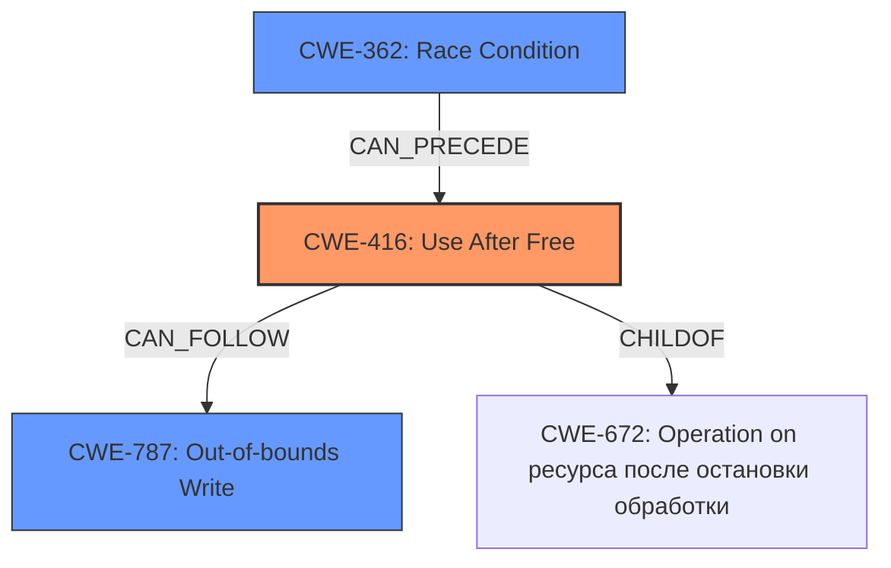

# Final Resolution for CVE-2022-3199

# Summary
| CWE ID | CWE Name | Confidence | CWE Abstraction Level | CWE Vulnerability Mapping Label | CWE-Vulnerability Mapping Notes |
|---|---|---|---|---|---|
| **CWE-416** | **Use After Free** | 1.0 | Variant | Allowed | **Primary CWE**. Explicitly stated in vulnerability description. Potential mitigations include using memory-safe languages and setting pointers to NULL after freeing. |

## Evidence and Confidence

*   **Confidence Score:** 1.0
*   **Evidence Strength:** HIGH

## Relationship Analysis
The primary relationship considered is the direct match of the vulnerability description to **CWE-416 (Use After Free)**. While **CWE-787 (Out-of-bounds Write)** is mentioned due to the "heap corruption" consequence, it's not the root cause. There's no explicit evidence pointing towards other potential weaknesses like **CWE-362 (Race Condition)**, but it could be a secondary factor in some UAF scenarios. **CWE-416** is a variant, which is the preferred level of abstraction.

## Vulnerability Chain
The chain of events is as follows:
1.  Memory is allocated.
2.  The memory is freed.
3.  A pointer to the freed memory is still used (**CWE-416**, **Use After Free**).
4.  This can lead to heap corruption and potentially an out-of-bounds write (**CWE-787**).

The **root cause** is the **use-after-free** condition, and the impact is heap corruption.

## Summary of Analysis
The initial analysis correctly identified **CWE-416 (Use After Free)** as the primary weakness. The vulnerability description explicitly mentions "use after free", providing direct evidence. The criticism suggests improvements, such as addressing potential mitigations and acknowledging potential secondary weaknesses.

The decision is based on the provided evidence only, specifically the phrase "**use after free** in Frames in Google Chrome". This aligns directly with the definition of **CWE-416**: "The product reuses or references memory after it has been freed."

The graph relationships confirm that while other CWEs might be related (e.g., **CWE-787** as a consequence), **CWE-416** is the most specific and accurate representation of the **root cause**. The selection of **CWE-416** is at the optimal level of specificity (Variant), as it directly describes the vulnerability.