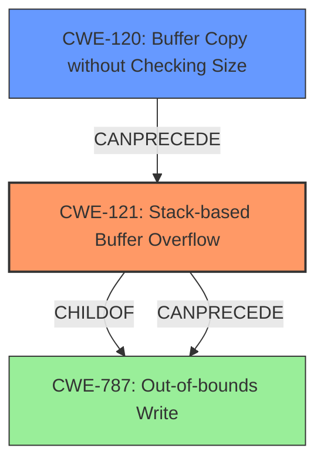

# Final Resolution for CVE-2022-32031

# Summary
| CWE ID | CWE Name | Confidence | CWE Abstraction Level | CWE Vulnerability Mapping Label | CWE-Vulnerability Mapping Notes |
|---|---|---|---|---|---|
| CWE-121 | Stack-based Buffer Overflow | 0.95 | Variant | Allowed | Primary CWE |
| CWE-120 | Buffer Copy without Checking Size of Input ('Classic Buffer Overflow') | 0.6 | Base | Allowed-with-Review | Secondary Candidate |

## Evidence and Confidence

*   **Confidence Score:** 0.90
*   **Evidence Strength:** MEDIUM

## Relationship Analysis
The primary relationship is that CWE-121 (Stack-based Buffer Overflow) is a variant of CWE-787 (Out-of-bounds Write). The analysis determined CWE-121 was a more specific and appropriate classification given the vulnerability description's explicit mention of a "stack overflow".

CWE-120 (Buffer Copy without Checking Size) was considered as a potential contributing factor if the root cause involved a buffer copy operation lacking proper size validation. While the vulnerability description doesn't explicitly state this, its potential relevance warrants its inclusion as a secondary candidate.

## Vulnerability Chain
The vulnerability chain starts with a lack of input validation or size checking, potentially related to a buffer copy operation. This leads to a **stack overflow** (CWE-121), where data is written beyond the boundaries of a buffer allocated on the stack. The consequence is potentially arbitrary code execution or denial of service.

If a buffer copy without checking size is the root cause then:
1.  Improper Input Validation (Missing Link)
2.  CWE-120: Buffer Copy without Checking Size of Input ('Classic Buffer Overflow')
3.  CWE-121: Stack-based Buffer Overflow
4.  Arbitrary Code Execution / Denial of Service (Missing Link)

## Summary of Analysis
The initial analysis correctly identified CWE-121 (**Stack-based Buffer Overflow**) as the primary **WEAKNESS** given the explicit mention of "stack overflow" in the vulnerability description. The criticism suggested increasing the confidence score and considering potential underlying causes.

The final determination maintains CWE-121 as the primary **ROOTCAUSE**, with an increased confidence score of 0.95 due to the strong evidence. CWE-120 (**Buffer Copy without Checking Size of Input ('Classic Buffer Overflow')**) is added as a secondary candidate with a confidence score of 0.6, acknowledging that a missing size check during a buffer copy could be a contributing factor.

The analysis is primarily based on the provided evidence from the vulnerability description: "Tenda AX1806 v1.0.0.1 was discovered to contain a **stack overflow** via the list parameter in the function fromSetRouteStatic." The graph relationships influenced the decision by highlighting that while CWE-787 (**Out-of-bounds Write**) is a parent of CWE-121, the latter is more specific and therefore more appropriate. CWE-120 was considered as a potential predecessor in the vulnerability chain, representing a possible root cause for the **stack overflow**.

The selected CWEs are at the optimal level of specificity. CWE-121 directly describes the **stack overflow**. While a deeper root cause might exist, such as a missing bounds check (CWE-120), the available information doesn't definitively confirm this, making CWE-121 the most accurate primary classification.