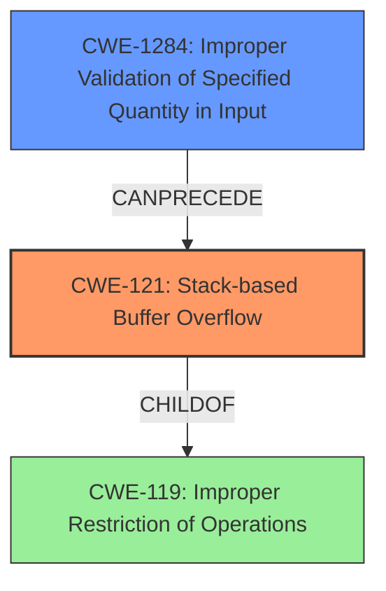

# Analysis Report for CVE-2022-32037

# Vulnerability Analysis Report: CVE-2022-32037

## Description

Tenda M3 V1.0.0.12 was discovered to contain a stack overflow via the function formSetAPCfg.

## Vulnerability Description Key Phrases

**Weakness:** stack overflow
**Product:** Tenda M3
**Version:** V1.0.0.12
**Component:** formSetAPCfg function

## Analysis (with Relationship Data)

# Summary
| CWE ID | CWE Name | Confidence | CWE Abstraction Level | CWE Vulnerability Mapping Label | CWE-Vulnerability Mapping Notes |
|---|---|---|---|---|---|
| CWE-121 | Stack-based Buffer Overflow | 0.95 | Variant | Allowed | Primary CWE |

## Evidence and Confidence

*   **Confidence Score:** 0.95
*   **Evidence Strength:** HIGH

- **Analysis and Justification:**
  - *Explanation:* The vulnerability description explicitly states a **stack overflow** vulnerability exists within the function `formSetAPCfg` of Tenda M3 V1.0.0.12. CWE-121 (Stack-based Buffer Overflow) directly addresses this type of vulnerability, where a buffer allocated on the stack is overwritten. The "Retriever Results" also lists CWE-121 as a highly relevant CWE, further supporting this classification. The vulnerability occurs because the `formSetAPCfg` function likely does not properly validate the size of input before writing it to a stack-based buffer, leading to the overflow.
  
  - *Relationship Analysis:* CWE-121 is a variant of CWE-119 (Improper Restriction of Operations within the Bounds of a Memory Buffer). It is also related to CWE-120 (Buffer Copy without Checking Size of Input), but the description specifically mentions a **stack overflow**, making CWE-121 a more precise match.

- **Confidence Score:**
  - Confidence: 0.95 (High confidence due to direct mention of "stack overflow" in the vulnerability description and the high ranking of CWE-121 in the Retriever Results).

## Criticism of Analysis

Okay, I've reviewed the provided analysis against the full CWE specifications. Here's my critique:

**Overall Assessment:**

The analysis is generally well-reasoned and arrives at a correct primary CWE. The justification for selecting CWE-121 is solid, given the explicit mention of "stack overflow" in the vulnerability description. The confidence score of 0.95 is appropriate.

**Detailed Review:**

*   **Summary Table:** The summary table is well-formatted and provides a clear overview of the chosen CWE.

*   **Evidence and Confidence:**
    *   The explanation is clear and directly links the "stack overflow" description to CWE-121.
    *   The Relationship Analysis is accurate, pointing out the connection to the broader CWE-119 and the more specific CWE-120, but correctly favoring CWE-121 due to its precision.
    *   The high confidence score is justified.

*   **CWE Examples from Database:** These examples are for CWE-119, which is relevant as a parent, but not directly helpful in assessing the correctness of CWE-121. It would have been beneficial to include examples specific to CWE-121.

*   **Relevant CWE Specifications:** The inclusion of the full specifications is very useful for verification.

**Critique of Alternative CWEs Considered (from Retriever Results):**

The retriever results suggest some possible alternative CWEs. Let's analyze these:

*   **CWE-125 (Out-of-bounds Read):**  While a buffer overflow *can* sometimes lead to an out-of-bounds read as a consequence, the primary issue here is the *write* beyond the buffer's boundary, so this isn't the best fit as the main CWE.
*   **CWE-120 (Buffer Copy without Checking Size of Input ('Classic Buffer Overflow')):** This is a close contender, but since the description explicitly says "stack overflow" without specifying whether the root cause is a `memcpy` without size check, CWE-121 is the better choice as it specifically defines the memory allocation location.
*   **CWE-78 (Improper Neutralization of Special Elements used in an OS Command ('OS Command Injection')) and CWE-77 (Improper Neutralization of Special Elements used in a Command ('Command Injection')):** These are incorrect.  There's no indication of command injection here.  The vulnerability is related to memory corruption, not execution of arbitrary commands.
*   **CWE-122 (Heap-based Buffer Overflow):** Incorrect.  The description explicitly states *stack* overflow, not heap.
*   **CWE-193 (Off-by-one Error):** An off-by-one error *could* contribute to a buffer overflow, but it's not the root cause in this scenario based on the information given.  The core issue is the lack of size validation.
*   **CWE-126 (Buffer Over-read):** Similar to CWE-125, this might be a consequence, but not the primary issue.
*   **CWE-190 (Integer Overflow or Wraparound):**  Unlikely without more information.  An integer overflow could *lead* to an incorrect buffer size calculation, *which then* leads to a stack overflow, but it is not directly indicated.
*   **CWE-1284 (Improper Validation of Specified Quantity in Input):** This is a relevant contributing factor and *could* be part of a chain. Lack of validation of the input's length is very likely what causes the overflow. However, the primary issue is still the stack-based buffer overflow itself. CWE-1284 could be considered as a secondary CWE in a more detailed analysis.

**Suggestions for Improvement:**

1.  **Expand the Justification:** While the current justification is good, it could be improved by explicitly addressing why the *other* top CWEs from the Retriever Results (e.g., CWE-120) were *not* chosen. This demonstrates a more thorough analysis.
2.  **Add Example Vulnerabilities Specific to CWE-121:** Including a few CVE examples that are directly mapped to CWE-121 would strengthen the analysis.
3.  **Consider a Chained CWE:**  A more detailed analysis *might* consider a chain of CWEs.  For instance:  `CWE-121 (Stack-based Buffer Overflow) as a result of CWE-1284 (Improper Validation of Specified Quantity in Input)`.  This would provide a more complete picture of the vulnerability's root cause and how it's triggered.

**Revised Summary Table (with potential chained CWE):**

| CWE ID(s) | CWE Name(s) | Confidence | CWE Abstraction Level | CWE Vulnerability Mapping Label | CWE-Vulnerability Mapping Notes |
|---|---|---|---|---|---|
| CWE-121 | Stack-based Buffer Overflow | 0.95 | Variant | Allowed | Primary CWE; Consequence |
| CWE-1284 | Improper Validation of Specified Quantity in Input | 0.7 | Base | Allowed | Contributing Factor; Root Cause |

**Conclusion:**

The analysis is accurate and well-supported. The suggested improvements would make it even more robust by addressing alternative CWEs and considering a more detailed chained approach. The high confidence in the primary CWE selection is warranted.

## Final Resolution

# Summary
| CWE ID | CWE Name | Confidence | CWE Abstraction Level | CWE Vulnerability Mapping Label | CWE-Vulnerability Mapping Notes |
|---|---|---|---|---|---|
| CWE-121 | Stack-based Buffer Overflow | 0.95 | Variant | Allowed | Primary CWE; Consequence |
| CWE-1284 | Improper Validation of Specified Quantity in Input | 0.7 | Base | Allowed | Contributing Factor; Root Cause |

## Evidence and Confidence

*   **Confidence Score:** 0.9
*   **Evidence Strength:** MEDIUM

## Relationship Analysis
The primary relationship influencing the decision is the chain relationship. CWE-1284 **Improper Validation of Specified Quantity in Input** can precede CWE-121 **Stack-based Buffer Overflow**. The vulnerability description clearly states a **stack overflow**, which makes CWE-121 a direct match. However, the overflow likely stems from a failure to validate input size, making CWE-1284 a contributing factor. CWE-121 is a variant of CWE-119 **Improper Restriction of Operations within the Bounds of a Memory Buffer**, providing a hierarchical context.

## Vulnerability Chain
The vulnerability chain starts with CWE-1284 **Improper Validation of Specified Quantity in Input**. The product receives input intended to specify a quantity but fails to validate it properly. This leads to CWE-121 **Stack-based Buffer Overflow** because the improperly validated quantity is used to allocate or copy data into a stack-based buffer, exceeding its boundaries. The final impact is a **stack overflow**, potentially leading to arbitrary code execution or denial of service.

## Summary of Analysis
The initial analysis correctly identified CWE-121 **Stack-based Buffer Overflow** as the primary weakness, which is supported by the vulnerability description: "Tenda M3 V1.0.0.12 was discovered to contain a stack overflow via the function formSetAPCfg." The criticism suggested considering CWE-1284 **Improper Validation of Specified Quantity in Input** as a contributing factor, which is a valid point. While the initial analysis focused on the direct consequence (the **stack overflow**), the root cause likely involves a failure to validate the size of the input. The graph relationships, particularly the CANPRECEDE relationship between CWE-1284 and CWE-121, supports this chained approach. The final decision is to classify the vulnerability as CWE-121, with CWE-1284 as a secondary contributing factor, providing a more complete picture of the vulnerability. This is at the optimal level of specificity, as it identifies both the immediate cause (**stack overflow**) and a likely root cause (improper input validation). The evidence for CWE-1284 is indirect, inferred from the nature of buffer overflows, lowering the overall confidence score.

*Report generated on 2025-03-18 13:39:22*
