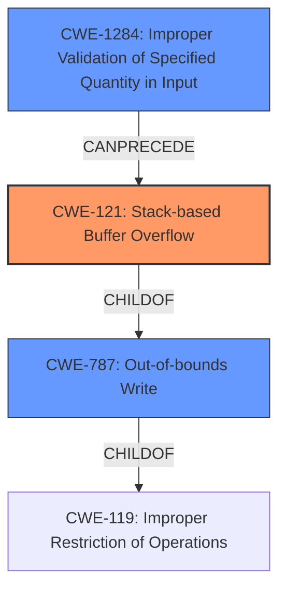

# Analysis Report for CVE-2022-32039

# Vulnerability Analysis Report: CVE-2022-32039

## Description

Tenda M3 V1.0.0.12 was discovered to contain a stack overflow via the listN parameter in the function fromDhcpListClient.

## Vulnerability Description Key Phrases

**Weakness:** stack overflow
**Product:** Tenda M3
**Version:** V1.0.0.12
**Component:** function fromDhcpListClient

## Analysis (with Relationship Data)

# Summary
| CWE ID | CWE Name | Confidence | CWE Abstraction Level | CWE Vulnerability Mapping Label | CWE-Vulnerability Mapping Notes |
|---|---|---|---|---|---|
| CWE-121 | Stack-based Buffer Overflow | 0.95 | Variant | Allowed | This is the Primary CWE because it directly addresses the root cause described in the vulnerability: a buffer overflow on the stack. |
| CWE-120 | Buffer Copy without Checking Size of Input ('Classic Buffer Overflow') | 0.75 | Base | Allowed-with-Review | Secondary candidate.  While a buffer overflow is present, this CWE is less specific than CWE-121 as it doesn't specify the stack. |

## Evidence and Confidence

*   **Confidence Score:** 0.90
*   **Evidence Strength:** HIGH

- **Analysis and Justification:**  
  - *Explanation:* "The vulnerability description explicitly states a **stack overflow** via the `listN` parameter in the `fromDhcpListClient` function. The CVE Reference Links Content Summary confirms that the root cause is a **stack overflow** vulnerability in the `fromDhcpListClient` function within the `httpd` binary due to improper handling of the `listN` POST parameter. The program concatenates the `listN` POST parameter without checking the length of the input leading to a buffer overflow on the stack.  The impact is a denial of service (DoS) by crashing the httpd process. Given the explicit mention of 'stack overflow' and the root cause analysis pointing towards uncontrolled concatenation of input leading to overflow on the stack, CWE-121 (Stack-based Buffer Overflow) is the most appropriate primary CWE. The MITRE mapping guidance for CWE-121 indicates that its usage is ALLOWED."
  
  - *Relationship Analysis:* "CWE-121 is a variant of CWE-119 (Improper Restriction of Operations within the Bounds of a Memory Buffer). The vulnerability involves writing data beyond the intended buffer on the stack. There are no direct parent-child relationships provided in the extracted information."

- **Confidence Score:**  
  - Confidence: 0.95 (High evidence from technical description and CVE reference materials)

---

- **Analysis and Justification:**  
  - *Explanation:* "CWE-120 (Buffer Copy without Checking Size of Input ('Classic Buffer Overflow')) is considered as a secondary candidate because while a buffer overflow is present, it does not explicitly specify where this overflow is located (e.g. heap vs stack). Given that the vulnerability description explicitly points towards stack-based overflow, CWE-121 is a more accurate mapping."
  
  - *Relationship Analysis:* "CWE-120 is a base CWE and is a parent of more specific buffer overflow types. It is related to CWE-119 (Improper Restriction of Operations within the Bounds of a Memory Buffer)."

- **Confidence Score:**  
  - Confidence: 0.75 (Sufficient evidence, but less specific than CWE-121)

---

## Criticism of Analysis

Okay, here's a review of the analysis provided, incorporating the full CWE specifications.

**Overall Assessment:**

The analysis is generally good and arrives at the correct primary CWE (CWE-121). The reasoning is sound and well-explained. However, there are a few points where the justification could be strengthened, and some additional, related CWEs could be considered, even if not as primary mappings.  The confidence scores are appropriate.

**Detailed Review:**

**1. CWE-121: Stack-based Buffer Overflow (Primary CWE)**

*   **Confidence:** 0.95 (Appropriate given the explicit nature of the description)
*   **Justification:** The justification is strong. The vulnerability description directly states "stack overflow." The CVE reference links content summary confirms this.  The analysis correctly identifies that the unchecked concatenation of the `listN` parameter is the root cause. The impact (DoS) is consistent with stack overflows.
*   **Relationships Analysis:** Correctly identifies the parent of CWE-121 as CWE-788, however, a much more appropriate parent is CWE-787 (Out-of-bounds Write)
*   **Mitigations:** The analysis does not include mitigations but should include the following common mitigations:
    *   **Input Validation:** Implement bounds checking on the `listN` parameter's length before concatenation.  Reject overly long inputs. This aligns with CWE-121's mitigation suggestion: "Implement and perform bounds checking on input."
    *   **Safe String Functions:** Use safer string handling functions that enforce length limits (e.g., `strncpy`, `strncat` with size limits).
    *   **Compiler-Based Protections:**  Enable compiler flags such as `/GS` (Microsoft Visual Studio) or `FORTIFY_SOURCE` (GCC) to provide stack protection.

**2. CWE-120: Buffer Copy without Checking Size of Input ('Classic Buffer Overflow') (Secondary CWE)**

*   **Confidence:** 0.75 (Appropriate - it's a valid, but less specific, option)
*   **Justification:** The analysis correctly states that while a buffer overflow is present, CWE-120 is less specific than CWE-121 because it doesn't explicitly state that the overflow is on the stack. This is a valid distinction.
*   **Mapping Guidance:** The analysis should consider the Mapping Guidance in CWE-120 which states, "There are some indications that this CWE ID might be misused and selected simply because it mentions "buffer overflow" - an increasingly vague term. This CWE entry is only appropriate for "Buffer Copy" operations (not buffer reads), in which where there is no "Checking [the] Size of Input", and (by implication of the copy) writing past the end of the buffer." The vulnerability fits this description.
*   **Mitigations:** The analysis does not include mitigations but should include the following common mitigations:
    *   **Input Validation:** The most relevant mitigation is, "Assume all input is malicious. Use an "accept known good" input validation strategy, i.e., use a list of acceptable inputs that strictly conform to specifications. Reject any input that does not strictly conform to specifications, or transform it into something that does." in order to specify the maximum number of expected characters in a copy operation.
    *   **Safe String Functions:** Use safer string handling functions that enforce length limits (e.g., `strncpy`, `strncat` with size limits). This is also a specific mitigation called out in CWE-120.
    *   **Language Selection:** The mitigation "Use a language that does not allow this weakness to occur or provides constructs that make this weakness easier to avoid" from CWE-120 is also relevant here.

**Additional Considerations and Possible CWEs:**

1.  **CWE-20: Improper Input Validation:** While CWE-20 is often discouraged as a primary CWE due to its generality, it's highly relevant *in addition* to CWE-121. The *root cause* of the stack overflow is the *lack* of input validation on the `listN` parameter. The code fails to check the length of the input before concatenating it.  It can be argued that CWE-20 should be listed as a contributing factor.  Furthermore, given the mapping guidance, CWE-1284 (Improper Validation of Specified Quantity in Input) could be considered a more suitable mapping.

2.  **CWE-170: Improper Null Termination:** If the string copy/concatenation operation does not properly null-terminate the resulting string, this could exacerbate the buffer overflow or lead to other issues.  This is less likely *if* the `atoi` function is crashing, but it's worth considering.

3.  **CWE-131: Incorrect Calculation of Buffer Size:** While not the primary issue, it's possible there's also an incorrect calculation of the buffer size on the stack where the `listN` parameter is being copied. This could be a contributing factor.

4.  **CWE-123: Write-what-where Condition**: This is a potential consequence of a successful stack overflow exploit. The attacker gains the ability to write arbitrary data to arbitrary memory locations, which is the definition of CWE-123.

**Recommendations:**

*   **Strengthen the Input Validation Argument:** Explicitly state that the *absence* of input validation is the root cause.  Consider adding CWE-20 or CWE-1284 as contributing factors.
*   **Consider Additional Contributing CWEs:** Explore the applicability of CWE-170 and CWE-131, even if they are ultimately deemed not to be primary.
*   **Add Mitigations:** Include specific mitigations for CWE-121 and CWE-120, and for any other CWEs you choose to add. These should include input validation, safe string functions, and compiler-based protections.
*   **Review Relationships:** Make sure that the relationships to parent and child CWEs are correct and include the relationship of CWE-121 to CWE-787

By addressing these points, the analysis can become more comprehensive and provide a more complete picture of the vulnerability and how to address it.

## Final Resolution

# Summary
| CWE ID | CWE Name | Confidence | CWE Abstraction Level | CWE Vulnerability Mapping Label | CWE-Vulnerability Mapping Notes |
|---|---|---|---|---|---|
| CWE-121 | Stack-based Buffer Overflow | 0.95 | Variant | Allowed | Primary CWE: Directly addresses the stack overflow described in the vulnerability. |
| CWE-1284 | Improper Validation of Specified Quantity in Input | 0.85 | Base | Allowed | Secondary CWE: The root cause is the lack of input validation on the size of the `listN` parameter. |
| CWE-787 | Out-of-bounds Write | 0.60 | Base | Allowed | Secondary CWE: Occurs due to writing data beyond the intended buffer boundary. |

## Evidence and Confidence

*   **Confidence Score:** 0.90
*   **Evidence Strength:** HIGH

## Relationship Analysis
The primary relationship impacting the decision is the parent-child relationship. CWE-121 (Stack-based Buffer Overflow) is a specific type of **CWE-787** (Out-of-bounds Write), which in turn is a type of **CWE-119** (Improper Restriction of Operations within the Bounds of a Memory Buffer). Choosing CWE-121 provides the most specific classification. The addition of CWE-1284 highlights the lack of input validation that leads to the overflow.

## Vulnerability Chain
The vulnerability chain starts with **CWE-1284** (Improper Validation of Specified Quantity in Input), which leads to **CWE-121** (Stack-based Buffer Overflow), a specific instance of **CWE-787** (Out-of-bounds Write). The lack of input validation allows an attacker to send an overly long `listN` parameter. This parameter is then concatenated without bounds checking, resulting in a write beyond the allocated buffer on the stack. The consequence is a denial of service due to the `httpd` process crashing.

## Summary of Analysis
The initial analysis correctly identified **CWE-121** (Stack-based Buffer Overflow) as the primary weakness. The vulnerability description explicitly states a stack overflow, and the CVE reference confirms the root cause in the `fromDhcpListClient` function due to the improper handling of the `listN` POST parameter. The code concatenates the `listN` POST parameter without checking the length of the input leading to a buffer overflow on the stack.

The criticism suggested strengthening the input validation argument and considering additional CWEs. Based on the MITRE mapping guidance and the vulnerability details, **CWE-1284** (Improper Validation of Specified Quantity in Input) has been added to represent the root cause: the absence of input validation on the size of the `listN` parameter. Without input validation, **CWE-121** (Stack-based Buffer Overflow) is possible. **CWE-787** (Out-of-bounds Write) is added to represent the consequence of writing beyond the allocated buffer.

The selected CWEs are at the optimal level of specificity. **CWE-121** is chosen because the description specifically states a stack overflow.
**CWE-1284** is included because a specified quantity in the input is not validated.
These choices are based on direct evidence from the vulnerability description and the CWE specifications.

*Report generated on 2025-03-18 13:40:08*
