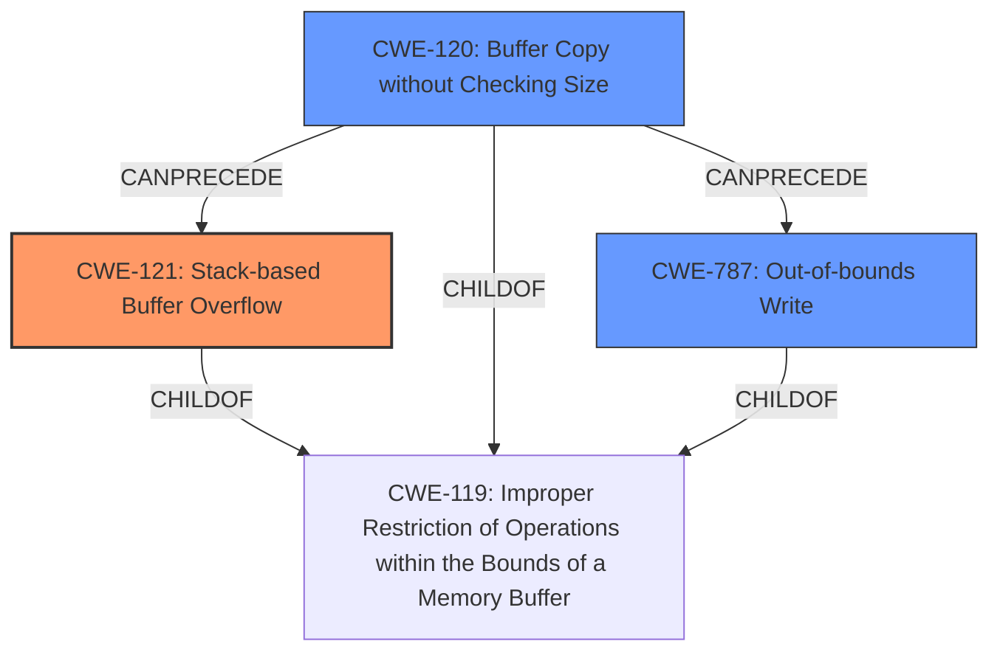

# Final Resolution for CVE-2022-32040

# Summary
| CWE ID  | CWE Name                                                                 | Confidence | CWE Abstraction Level | CWE Vulnerability Mapping Label | CWE-Vulnerability Mapping Notes                                                                                                                                                                                                                                                                       |
| :-------- | :----------------------------------------------------------------------- | :--------- | :-------------------- | :------------------------------ | :-------------------------------------------------------------------------------------------------------------------------------------------------------------------------------------------------------------------------------------------------------------------------------------------------- |
| CWE-121 | Stack-based Buffer Overflow                                              | 0.95       | Variant               | Allowed                         | Primary CWE                                                                                                                                                                                                                                                                                          |
| CWE-120 | Buffer Copy without Checking Size of Input ('Classic Buffer Overflow') | 0.80       | Base                  | Allowed-with-Review             | Secondary Candidate. Explicitly caused by the use of `sprintf` without length limits.                                                                                                                                                                                                           |
| CWE-787 | Out-of-bounds Write                                                      | 0.70       | Base                  | Allowed                         | Secondary Candidate. Describes the overall result of writing beyond the buffer's boundaries.                                                                                                                                                                                                        |

## Evidence and Confidence

*   **Confidence Score:** 0.95
*   **Evidence Strength:** HIGH

## Relationship Analysis
The decision was influenced by the hierarchical relationships between CWEs. CWE-121 is a variant of CWE-787 and a child of CWE-119. The primary selection of CWE-121 is due to its specificity in describing a stack-based buffer overflow, aligning precisely with the vulnerability description. CWE-120 is included as a secondary CWE because it represents the root cause of the overflow: copying data without checking the size of the input. CWE-787 is a more general description of an out-of-bounds write.

## Vulnerability Chain
The vulnerability chain starts with **CWE-120 (Buffer Copy without Checking Size of Input)**, leading to **CWE-121 (Stack-based Buffer Overflow)**, which results in an **CWE-787 (Out-of-bounds Write)**.
  - The use of `sprintf` without proper bounds checking allows an attacker-controlled `funcpara1` parameter to overwrite data on the stack.
  - The lack of input validation (**CWE-120**) is the **ROOTCAUSE** that leads to a buffer overflow on the stack (**CWE-121**).
  - This results in an out-of-bounds write (**CWE-787**), potentially causing a crash or allowing arbitrary code execution.

## Summary of Analysis
The analysis and criticism both agree that **CWE-121 (Stack-based Buffer Overflow)** is the most appropriate primary CWE. The evidence from the vulnerability description, which states "Tenda M3 V1.0.0.12 was discovered to contain a **stack overflow** via the function formSetCfm," strongly supports this classification. The use of `sprintf` without proper length validation in copying the `funcpara1` parameter to a stack buffer is the direct cause of the overflow.

The inclusion of **CWE-120 (Buffer Copy without Checking Size of Input)** as a secondary CWE is justified because it describes the underlying issue of copying data without proper size checks, which leads to the overflow. The `sprintf` function is a clear example of a buffer copy operation without input size validation.

**CWE-787 (Out-of-bounds Write)** is a valid but less specific secondary CWE that describes the overall result of the overflow.

The selected CWEs are at the optimal level of specificity. **CWE-121** accurately describes the location of the overflow (stack), while **CWE-120** captures the root cause (lack of input size checking during the buffer copy).