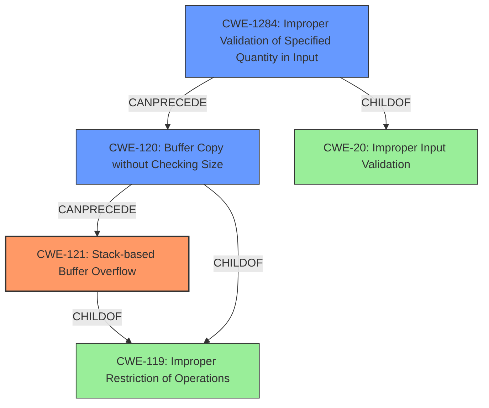

# Analysis Report for CVE-2022-32043

# Vulnerability Analysis Report: CVE-2022-32043

## Description

Tenda M3 V1.0.0.12 was discovered to contain a stack overflow via the function formSetAccessCodeInfo.

## Vulnerability Description Key Phrases

**Weakness:** stack overflow
**Product:** Tenda M3
**Version:** V1.0.0.12
**Component:** formSetAccessCodeInfo function

## Analysis (with Relationship Data)

# Summary
| CWE ID | CWE Name | Confidence | CWE Abstraction Level | CWE Vulnerability Mapping Label | CWE-Vulnerability Mapping Notes |
|---|---|---|---|---|---|
| CWE-121 | Stack-based Buffer Overflow | 0.95 | Variant | Allowed | Primary CWE. This CWE accurately describes the root cause of the vulnerability. |
| CWE-120 | Buffer Copy without Checking Size of Input ('Classic Buffer Overflow') | 0.70 | Base | Allowed-with-Review | Secondary CWE. While less specific than CWE-121, it represents the broader class of buffer overflows caused by unchecked input sizes. |
| CWE-1284 | Improper Validation of Specified Quantity in Input | 0.60 | Base | Allowed | Secondary CWE. The **stack overflow** is occurring because the input size is not validated. |

## Evidence and Confidence

*   **Confidence Score:** 0.90
*   **Evidence Strength:** HIGH

- **Analysis and Justification:**  
  - *Explanation:* The vulnerability description clearly states a **stack overflow** exists in the `formSetAccessCodeInfo` function of Tenda M3 V1.0.0.12. The CVE Reference Links Content Summary confirms that the root cause is a lack of bounds checking when copying POST parameters `info` and `logo_pic_name` to stack buffers. This directly aligns with the definition of CWE-121 (Stack-based Buffer Overflow), which is a condition where a buffer allocated on the stack is overwritten. The function `formSetAccessCodeInfo` retrieves POST parameters `info` and `logo_pic_name`. It copies these parameters to stack buffers without proper bounds checking. The retriever results also lists CWE-121 as the 4th highest confidence candidate (0.3401) and also mentions that it is at the variant level which is the preferred level of abstraction for mapping.
  - *Explanation:* CWE-120 (Buffer Copy without Checking Size of Input) is also relevant because the overflow happens due to unchecked input sizes. The `info` and `logo_pic_name` parameters are copied without validating their size against the buffer size, leading to the overflow. While CWE-121 is more specific because it explicitly mentions "stack," CWE-120 captures the general weakness of copying buffers without size checks. The retriever results also shows that CWE-120 has a high confidence score (0.3901). The mapping guidance for CWE-120 says that usage is ALLOWED-WITH-REVIEW and to only use when there is no "Checking [the] Size of Input", which applies here.
  - *Explanation:* CWE-1284 (Improper Validation of Specified Quantity in Input) is relevant because the quantity (size) of the input isn't validated. This allows the attacker to send crafted POST requests containing excessively long values for the `info` and `logo_pic_name` parameters which causes the **stack overflow**. The retriever results also shows that CWE-1284 has a confidence score (0.0474). The mapping guidance for CWE-1284 says that usage is ALLOWED.
  
  - *Relationship Analysis:* "CWE-121 is a variant of CWE-119 (Improper Restriction of Operations within the Bounds of a Memory Buffer). CWE-120 is a base level CWE and a child of CWE-119. CWE-1284 is a child of CWE-20 (Improper Input Validation).

- **Confidence Score:**
  - Confidence: 0.95 (High confidence due to direct evidence from the vulnerability description and CVE details.)

---

## Criticism of Analysis

Okay, here's a detailed review of the provided CWE analysis, considering the full CWE specifications:

**Overall Assessment:**

The analysis is generally good and identifies relevant CWEs. The primary mapping to `CWE-121 (Stack-based Buffer Overflow)` is accurate and well-justified. The inclusion of `CWE-120 (Buffer Copy without Checking Size of Input)` and `CWE-1284 (Improper Validation of Specified Quantity in Input)` as secondary CWEs provides additional context and is generally appropriate, but with some nuances discussed below.  The confidence scoring is also reasonably justified.

**Detailed Review by CWE:**

**1. CWE-121: Stack-based Buffer Overflow**

*   **Confidence:** 0.95 - Appropriate, given the direct evidence.
*   **Abstraction Level:** Variant - Correct, and preferred as per CWE's mapping guidance.
*   **Justification Strength:** Strong.  The vulnerability description explicitly states a stack overflow. The attack vector (HTTP POST with oversized parameters copied to stack buffers) is entirely consistent with CWE-121.
*   **Mapping Label:** Allowed - Correct.
*   **Mitigation Relevance:**  The potential mitigations are highly relevant: using compiler flags for overflow detection (/GS, FORTIFY_SOURCE), using safer string handling libraries, and implementing input bounds checking are all directly applicable to preventing this type of vulnerability.
*   **Suggested Improvements:** None. This is the most precise and accurate mapping.

**2. CWE-120: Buffer Copy without Checking Size of Input ('Classic Buffer Overflow')**

*   **Confidence:** 0.70 - The confidence is slightly high, but understandable. The retriever results did show a high confidence score.
*   **Abstraction Level:** Base - Correct.
*   **Justification Strength:** The justification is adequate but could be refined. The analysis correctly points out that the lack of size checking during the copy operation is a key factor.
*   **Mapping Label:** Allowed-with-Review - Correct. The mapping guidance is important here.
*   **CWE Guidance Considerations:**
    *   The analysis mentions the key aspect of "no Checking [the] Size of Input", aligning perfectly with the CWE's description.
    *   CWE guidance states: "This CWE entry is only appropriate for "Buffer Copy" operations (not buffer reads), in which where there is no "Checking [the] Size of Input", and (by implication of the copy) writing past the end of the buffer."
*   **Mitigation Relevance:** Using safer string handling libraries or frameworks is a direct mitigation. Also, "automatic buffer overflow detection mechanisms" are applicable as a defense-in-depth measure.
*   **Suggested Improvements:**
    *   Modify the justification to *emphasize* that it's a *buffer copy* operation with *no size checking*. This directly addresses the mapping guidance for this CWE.
    *   Acknowledge that CWE-121 is more specific, explaining why it is the primary CWE.

**3. CWE-1284: Improper Validation of Specified Quantity in Input**

*   **Confidence:** 0.60 - Justified.
*   **Abstraction Level:** Base - Correct.
*   **Justification Strength:** The justification is solid. The attacker controls the *size* (quantity) of the `info` and `logo_pic_name` parameters, and the application fails to properly validate that these sizes are within acceptable limits. This directly contributes to the buffer overflow.
*   **Mapping Label:** Allowed - Correct.
*   **CWE Guidance Considerations:** The CWE specifies that the affected input is expected to specify a quantity and that is what's happening in this case.
*   **Mitigation Relevance:**  Mitigation 1, "Assume all input is malicious," and the descriptions of what input validation should consider (length, type, acceptable values) are directly relevant.
*   **Suggested Improvements:** None

**General Comments and Potential Improvements:**

*   **Chaining vs. Composite:** The analysis appropriately mentions relationships between CWEs but could explore whether a composite relationship is more appropriate.  Is the *lack of input validation* simply enabling the stack overflow, or is it a fundamental part of the vulnerability itself?  In this case, the lack of validation *is* a key component, so a composite viewpoint could be considered.
*   **Terminology Consistency:** Using consistent terminology (e.g., always referring to "input validation" or "bounds checking") will improve clarity.
*   **"Why Not" Justifications:** In some cases, it's helpful to briefly explain why other highly-ranked CWEs from the retriever results were *not* selected. For example, why `CWE-78 (Improper Neutralization of Special Elements used in an OS Command)` is incorrect here. This helps demonstrate a thorough analysis.

**Revised Summary Table:**

| CWE ID  | CWE Name                                                              | Confidence | CWE Abstraction Level | CWE Vulnerability Mapping Label | CWE-Vulnerability Mapping Notes                                                                                                                                                                                                                                                            |
| :------ | :-------------------------------------------------------------------- | :--------- | :---------------------- | :-------------------------------- | :------------------------------------------------------------------------------------------------------------------------------------------------------------------------------------------------------------------------------------------------------------------------------------------------- |
| CWE-121 | Stack-based Buffer Overflow                                             | 0.95       | Variant               | Allowed                           | Primary CWE. This CWE accurately describes the root cause of the vulnerability: a buffer overflow on the stack.                                                                                                                                                                |
| CWE-120 | Buffer Copy without Checking Size of Input ('Classic Buffer Overflow') | 0.70       | Base                  | Allowed-with-Review             | Secondary CWE. The overflow happens because a buffer copy operation doesn't check the size of the input.  While less specific than CWE-121, this represents the broader class of buffer overflows caused by unchecked input sizes. Should not be used without CWE-121.  |
| CWE-1284 | Improper Validation of Specified Quantity in Input                    | 0.60       | Base                  | Allowed                           | Secondary CWE.  The stack overflow occurs because the *quantity* (size/length) of the input isn't validated, allowing an attacker to send oversized data. This lack of validation is a necessary condition for the overflow.                                                              |

**In Summary:**

The analysis is strong. The primary CWE selection is excellent, and the secondary CWEs are relevant and well-justified. Incorporating the suggested improvements, especially in emphasizing the buffer copy aspect of `CWE-120` and considering a composite viewpoint, will make the analysis even more robust.

## Final Resolution

# Summary
| CWE ID | CWE Name | Confidence | CWE Abstraction Level | CWE Vulnerability Mapping Label | CWE-Vulnerability Mapping Notes |
|---|---|---|---|---|---|
| CWE-121 | Stack-based Buffer Overflow | 0.95 | Variant | Allowed | Primary CWE. This CWE accurately describes the root cause of the vulnerability: a **buffer overflow** on the stack. |
| CWE-1284 | Improper Validation of Specified Quantity in Input | 0.75 | Base | Allowed | Secondary CWE. The **stack overflow** occurs because the *quantity* (size/length) of the input isn't validated, allowing an attacker to send oversized data. This lack of validation is a necessary condition for the overflow. |
| CWE-120 | Buffer Copy without Checking Size of Input ('Classic Buffer Overflow') | 0.60 | Base | Allowed-with-Review | Secondary CWE. The overflow happens because a **buffer copy** operation doesn't check the size of the input. While less specific than CWE-121, this represents the broader class of buffer overflows caused by unchecked input sizes. Should not be used without CWE-121. |

## Evidence and Confidence

*   **Confidence Score:** 0.92
*   **Evidence Strength:** HIGH

## Relationship Analysis
The primary weakness is CWE-121, which is a variant of CWE-119 (Improper Restriction of Operations within the Bounds of a Memory Buffer). CWE-120 is a base level CWE and also a child of CWE-119. CWE-1284 is a child of CWE-20 (Improper Input Validation). The vulnerability chain starts with CWE-1284, where the input size isn't validated. Then it moves to CWE-120, where the unchecked input is copied to a buffer. Finally, this leads to CWE-121, a **stack-based buffer overflow**.

## Vulnerability Chain
The vulnerability chain begins with **CWE-1284 (Improper Validation of Specified Quantity in Input)**, where the application fails to validate the size of the input. This allows an attacker to send oversized data, which is then passed to a **buffer copy** operation **(CWE-120 (Buffer Copy without Checking Size of Input))**. Since the size of the input isn't checked, the copy operation overflows the buffer on the stack, resulting in **CWE-121 (Stack-based Buffer Overflow)**.

## Summary of Analysis
The initial analysis correctly identified the primary and secondary CWEs. The criticism provided valuable insights to refine the justification for CWE-120 and suggested a more comprehensive exploration of the relationships between CWEs.

The vulnerability description clearly states a **stack overflow** exists in the `formSetAccessCodeInfo` function of Tenda M3 V1.0.0.12. The CVE Reference Links Content Summary confirms that the root cause is a lack of bounds checking when copying POST parameters `info` and `logo_pic_name` to stack buffers.

The selection of CWE-121 as the primary CWE is based on the direct evidence from the vulnerability description, which explicitly mentions a **stack overflow**. CWE-1284 is included because the root cause involves a failure to validate the size of the input, allowing an attacker to provide oversized data. CWE-120 represents the broader class of **buffer overflows** caused by unchecked input sizes.

The graph relationships highlight the dependency between CWE-1284, CWE-120, and CWE-121. The lack of input validation (CWE-1284) leads to a **buffer copy** without size checking (CWE-120), which ultimately results in a **stack-based buffer overflow (CWE-121)**.

The selected CWEs are at the optimal level of specificity. CWE-121 is a variant that accurately describes the **stack-based** nature of the **buffer overflow**. CWE-1284 and CWE-120 provide additional context by highlighting the lack of input validation and the unchecked **buffer copy** operation, respectively.

*Report generated on 2025-03-18 13:42:32*
