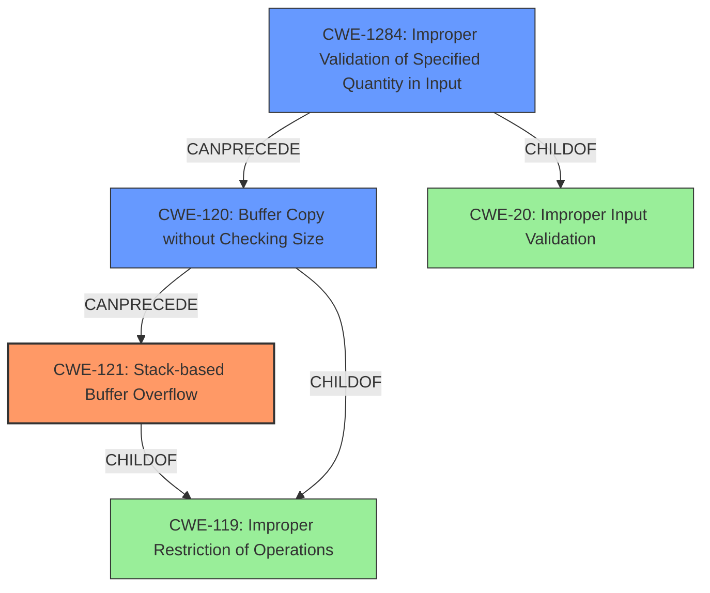

# Final Resolution for CVE-2022-32043

# Summary
| CWE ID | CWE Name | Confidence | CWE Abstraction Level | CWE Vulnerability Mapping Label | CWE-Vulnerability Mapping Notes |
|---|---|---|---|---|---|
| CWE-121 | Stack-based Buffer Overflow | 0.95 | Variant | Allowed | Primary CWE. This CWE accurately describes the root cause of the vulnerability: a **buffer overflow** on the stack. |
| CWE-1284 | Improper Validation of Specified Quantity in Input | 0.75 | Base | Allowed | Secondary CWE. The **stack overflow** occurs because the *quantity* (size/length) of the input isn't validated, allowing an attacker to send oversized data. This lack of validation is a necessary condition for the overflow. |
| CWE-120 | Buffer Copy without Checking Size of Input ('Classic Buffer Overflow') | 0.60 | Base | Allowed-with-Review | Secondary CWE. The overflow happens because a **buffer copy** operation doesn't check the size of the input. While less specific than CWE-121, this represents the broader class of buffer overflows caused by unchecked input sizes. Should not be used without CWE-121. |

## Evidence and Confidence

*   **Confidence Score:** 0.92
*   **Evidence Strength:** HIGH

## Relationship Analysis
The primary weakness is CWE-121, which is a variant of CWE-119 (Improper Restriction of Operations within the Bounds of a Memory Buffer). CWE-120 is a base level CWE and also a child of CWE-119. CWE-1284 is a child of CWE-20 (Improper Input Validation). The vulnerability chain starts with CWE-1284, where the input size isn't validated. Then it moves to CWE-120, where the unchecked input is copied to a buffer. Finally, this leads to CWE-121, a **stack-based buffer overflow**.

## Vulnerability Chain
The vulnerability chain begins with **CWE-1284 (Improper Validation of Specified Quantity in Input)**, where the application fails to validate the size of the input. This allows an attacker to send oversized data, which is then passed to a **buffer copy** operation **(CWE-120 (Buffer Copy without Checking Size of Input))**. Since the size of the input isn't checked, the copy operation overflows the buffer on the stack, resulting in **CWE-121 (Stack-based Buffer Overflow)**.

## Summary of Analysis
The initial analysis correctly identified the primary and secondary CWEs. The criticism provided valuable insights to refine the justification for CWE-120 and suggested a more comprehensive exploration of the relationships between CWEs.

The vulnerability description clearly states a **stack overflow** exists in the `formSetAccessCodeInfo` function of Tenda M3 V1.0.0.12. The CVE Reference Links Content Summary confirms that the root cause is a lack of bounds checking when copying POST parameters `info` and `logo_pic_name` to stack buffers.

The selection of CWE-121 as the primary CWE is based on the direct evidence from the vulnerability description, which explicitly mentions a **stack overflow**. CWE-1284 is included because the root cause involves a failure to validate the size of the input, allowing an attacker to provide oversized data. CWE-120 represents the broader class of **buffer overflows** caused by unchecked input sizes.

The graph relationships highlight the dependency between CWE-1284, CWE-120, and CWE-121. The lack of input validation (CWE-1284) leads to a **buffer copy** without size checking (CWE-120), which ultimately results in a **stack-based buffer overflow (CWE-121)**.

The selected CWEs are at the optimal level of specificity. CWE-121 is a variant that accurately describes the **stack-based** nature of the **buffer overflow**. CWE-1284 and CWE-120 provide additional context by highlighting the lack of input validation and the unchecked **buffer copy** operation, respectively.