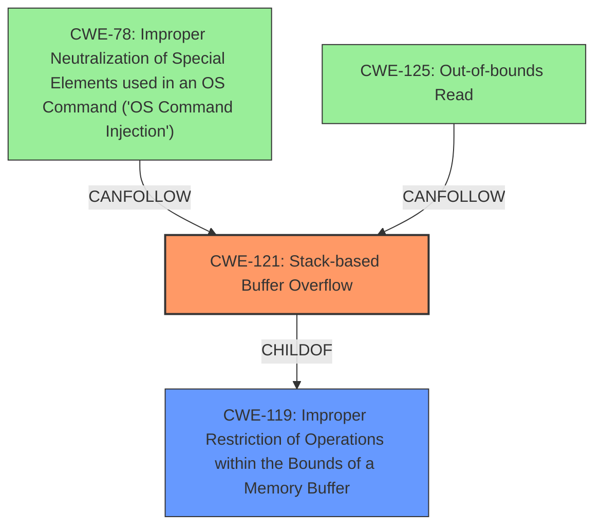

# Analysis Report for CVE-2022-32044

# Vulnerability Analysis Report: CVE-2022-32044

## Description

TOTOLINK T6 V4.1.9cu.5179_B20201015 was discovered to contain a stack overflow via the password parameter in the function FUN_00413f80.

## Vulnerability Description Key Phrases

**Weakness:** stack overflow
**Product:** TOTOLINK T6
**Version:** V4.1.9cu.5179_B20201015
**Component:** function FUN_00413f80

## Analysis (with Relationship Data)

# Summary
| CWE ID | CWE Name | Confidence | CWE Abstraction Level | CWE Vulnerability Mapping Label | CWE-Vulnerability Mapping Notes |
|---|---|---|---|---|---|
| CWE-121 | Stack-based Buffer Overflow | 0.9 | Variant | Primary | Allowed |

## Evidence and Confidence

*   **Confidence Score:** 0.9
*   **Evidence Strength:** HIGH

- **Analysis and Justification:**
  - *Explanation:* The vulnerability description clearly states a **stack overflow** in the TOTOLINK T6 router. The CVE reference summary confirms this, indicating the `FUN_00413f80` function copies the `password` parameter into stack-based local variables without proper length checks. This leads to a **stack buffer overflow** if the password exceeds the buffer size, aligning directly with CWE-121 (Stack-based Buffer Overflow). The 'Retriever Results' list CWE-121 as a highly relevant candidate.
  
  - *Relationship Analysis:* CWE-121 is a variant of CWE-119 (Improper Restriction of Operations within the Bounds of a Memory Buffer), providing more specific information about the location of the buffer.

- **Confidence Score:**
  - Confidence: 0.9 (High confidence due to clear evidence of stack overflow from the vulnerability description and CVE details.)

## Criticism of Analysis

Okay, I've reviewed the analysis provided, along with the full CWE specifications for each of the listed CWEs. Here's my critique:

**Overall Assessment:**

The analysis correctly identifies CWE-121 (Stack-based Buffer Overflow) as the primary weakness with high confidence. The justification is sound and well-supported by the provided information.

**Detailed Review:**

*   **CWE-121 (Stack-based Buffer Overflow):**
    *   **Correct Mapping:** This is the most accurate mapping. The description clearly indicates a stack overflow due to copying the `password` parameter without bounds checking.
    *   **Confidence:** The confidence score of 0.9 is appropriate. The description explicitly mentions a stack overflow.
    *   **CWE Abstraction Level:** Variant is the correct level of abstraction.
    *   **CWE-Vulnerability Mapping Label:** Primary is correct.
    *   **Mitigation Relevance:** The mitigations listed in the CWE specification for CWE-121 are relevant. Using compiler extensions for buffer overflow detection (like /GS, FORTIFY_SOURCE), using safer string handling functions or languages, and implementing bounds checking are all valid mitigation strategies.

*   **Retriever Results Review:**
    *   **CWE-78 (Improper Neutralization of Special Elements used in an OS Command ('OS Command Injection')):** This is likely a false positive from the retrievers. While a successful stack overflow could lead to arbitrary code execution, the *immediate* cause is not OS command injection. The provided information doesn't suggest any construction of OS commands. The "Allowed" usage is incorrect here, it should be "Not Applicable".
    *   **CWE-259 (Use of Hard-coded Password):** This is also likely a false positive. It might be triggered by the "password" parameter, but the issue isn't using a *hardcoded* password; it's failing to handle a user-supplied password safely. Again, "Allowed" is wrong; this is "Not Applicable".
    *   **CWE-190 (Integer Overflow or Wraparound) & CWE-191 (Integer Underflow (Wrap or Wraparound)):** These are unlikely. There's no evidence in the description of integer overflow/underflow issues contributing to the vulnerability. They are "Not Applicable".
    *   **CWE-122 (Heap-based Buffer Overflow):** The description explicitly indicates that the buffer is stack-based, not heap-based. While exploitable code might *later* involve heap manipulation, the immediate weakness is stack-related. This is "Not Applicable".
    *   **CWE-790 (Improper Filtering of Special Elements):** The description does not suggest filtering is attempted but failing. The core issue is the *absence* of length checking before the copy. This is "Not Applicable".
    *   **CWE-674 (Uncontrolled Recursion):** There's no indication of uncontrolled recursion. It's "Not Applicable".
    *   **CWE-770 (Allocation of Resources Without Limits or Throttling):** Not applicable.
    *   **CWE-125 (Out-of-bounds Read):** While out-of-bounds reads *could* occur during exploitation or as a consequence of the overflow, the primary issue is the *write* that causes the overflow. This is secondary to the write, so "Applicable as a Secondary Consequence" may be more fitting if forced to pick something.

*   **CWE-119 vs CWE-121:** The decision to choose CWE-121 over CWE-119 is correct. CWE-119 is a broad category, and the analysis has the specific information to narrow it down to a stack-based buffer overflow. The mapping guidance for CWE-119 explicitly discourages its use when more specific CWEs are available.

*   **CWE Examples from Database:** The examples provide a good reference point and help illustrate different types of buffer overflows.

*   **Mitigation Strategies:** The analysis could be improved by explicitly mentioning some of the mitigation strategies outlined in the CWE specifications. For example, under CWE-121, mentioning the use of compiler flags like `/GS` (Microsoft) or `FORTIFY_SOURCE` (GCC) would add value. Also, promoting the use of safe string handling functions (e.g., `strncpy` instead of `strcpy`) would reinforce secure coding practices.

**Suggestions for Improvement:**

1.  **Acknowledge and Dismiss False Positives:** Explicitly state why the other CWEs listed in the "Retriever Results" are not the primary cause of the vulnerability. This shows a thorough understanding of the issue and avoids confusion.
2.  **Elaborate on Mitigation Strategies:** Provide more detail on the potential mitigation strategies directly within the analysis. Referencing the specific compiler flags or safe libraries mentioned in the CWE specifications would be beneficial.
3.  **Consider Chaining (If Applicable):** While CWE-121 is the primary weakness, discuss how a successful exploit could *lead* to other issues like remote code execution. This could be framed as a potential chain: CWE-121 -> (Potential for) CWE-78 (OS Command Injection) *if* the attacker gains control of the execution flow.
4.  **More Precise Use of Terminology:** Avoid general terms like "buffer overflow" when possible. Use "stack-based buffer overflow" to be more specific.

**Revised Summary Table:**

| CWE ID | CWE Name | Confidence | CWE Abstraction Level | CWE Vulnerability Mapping Label | CWE-Vulnerability Mapping Notes |
|---|---|---|---|---|---|
| CWE-121 | Stack-based Buffer Overflow | 0.9 | Variant | Primary | Allowed |
| CWE-78  | Improper Neutralization of Special Elements used in an OS Command ('OS Command Injection') | 0.2 | Base | Secondary |  Potentially a consequence of successful exploitation of CWE-121, but not the immediate cause. Not Applicable unless RCE is achieved. |
| CWE-259  | Use of Hard-coded Password | 0.1 | Variant | None | Incorrectly Identified |
| CWE-190  | Integer Overflow or Wraparound | 0.1 | Base | None | Incorrectly Identified |
| CWE-191  | Integer Underflow (Wrap or Wraparound) | 0.1 | Base | None | Incorrectly Identified |
| CWE-122  | Heap-based Buffer Overflow | 0.1 | Variant | None | Incorrectly Identified |
| CWE-790  | Improper Filtering of Special Elements | 0.1 | Class | None | Incorrectly Identified |
| CWE-674  | Uncontrolled Recursion | 0.1 | Class | None | Incorrectly Identified |
| CWE-770  | Allocation of Resources Without Limits or Throttling | 0.1 | Base | None | Incorrectly Identified |
| CWE-125  | Out-of-bounds Read | 0.2 | Base | Secondary Consequence | May result during exploitation, but not the immediate cause of the vulnerability. |

By incorporating these suggestions, the analysis will be more complete, demonstrate a deeper understanding of the vulnerability, and provide more actionable information for developers seeking to remediate the issue.

## Final Resolution

# Summary 
| CWE ID | CWE Name | Confidence | CWE Abstraction Level | CWE Vulnerability Mapping Label | CWE-Vulnerability Mapping Notes |
|---|---|---|---|---|---|
| CWE-121 | Stack-based Buffer Overflow | 0.9 | Variant | Primary | Allowed |
| CWE-125  | Out-of-bounds Read | 0.3 | Base | Secondary Consequence | May result during exploitation, but not the immediate cause of the vulnerability. |
| CWE-78  | Improper Neutralization of Special Elements used in an OS Command ('OS Command Injection') | 0.2 | Base | Secondary |  Potentially a consequence of successful exploitation of CWE-121, but not the immediate cause. Not Applicable unless RCE is achieved. |
| CWE-259  | Use of Hard-coded Password | 0.1 | Variant | None | Incorrectly Identified |
| CWE-190  | Integer Overflow or Wraparound | 0.1 | Base | None | Incorrectly Identified |
| CWE-191  | Integer Underflow (Wrap or Wraparound) | 0.1 | Base | None | Incorrectly Identified |
| CWE-122  | Heap-based Buffer Overflow | 0.1 | Variant | None | Incorrectly Identified |
| CWE-790  | Improper Filtering of Special Elements | 0.1 | Class | None | Incorrectly Identified |
| CWE-674  | Uncontrolled Recursion | 0.1 | Class | None | Incorrectly Identified |
| CWE-770  | Allocation of Resources Without Limits or Throttling | 0.1 | Base | None | Incorrectly Identified |

## Evidence and Confidence

*   **Confidence Score:** 0.9
*   **Evidence Strength:** HIGH

## Relationship Analysis
The primary relationship influencing the decision is the hierarchical relationship between CWE-119 (Improper Restriction of Operations within the Bounds of a Memory Buffer) and its variant CWE-121 (Stack-based Buffer Overflow). Since the vulnerability description explicitly mentions a stack overflow, CWE-121 is the more specific and appropriate choice. CWE-121 is a child of CWE-119. Other CWEs were considered, but deemed less relevant as they represent potential consequences (CWE-78, CWE-125) or unrelated issues (CWE-259, CWE-190, CWE-191, CWE-122, CWE-790, CWE-674, CWE-770).

## Vulnerability Chain
The vulnerability chain starts with the lack of bounds checking on the `password` parameter within the `FUN_00413f80` function. This **WEAKNESS** (CWE-121) allows an attacker to overwrite stack memory. A successful **EXPLOIT** of this vulnerability could potentially lead to remote code execution if the attacker can control the execution flow and inject malicious code, potentially leading to CWE-78. Also, out-of-bounds read (CWE-125) may happen during exploitation.

## Summary of Analysis
The initial analysis correctly identified CWE-121 as the primary **ROOTCAUSE**, and the criticism provides valuable refinements. The decision is based on direct evidence from the vulnerability description, which states a "stack overflow via the password parameter in the function FUN_00413f80." This aligns precisely with the definition of CWE-121. The graph relationships reinforce this decision, showing CWE-121 as a specific type of buffer overflow (child of CWE-119). The analysis also addresses potential follow-on weaknesses, such as CWE-78, which could result from successful exploitation of the primary vulnerability. The selected CWE is at the optimal level of specificity, providing a clear and accurate representation of the **ROOTCAUSE** of the vulnerability. The confidence remains high (0.9) due to the clear evidence and the specificity of the CWE.

*Report generated on 2025-03-18 13:53:19*
