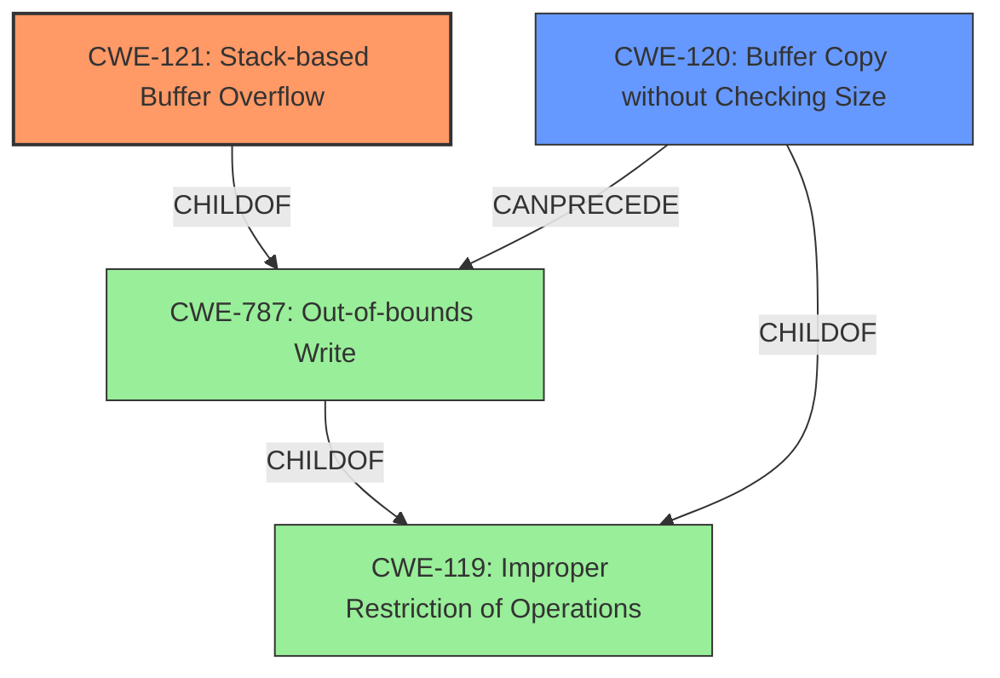

# Final Resolution for CVE-2022-32045

# Summary
| CWE ID | CWE Name | Confidence | CWE Abstraction Level | CWE Vulnerability Mapping Label | CWE-Vulnerability Mapping Notes |
|---|---|---|---|---|---|
| CWE-121 | Stack-based Buffer Overflow | 0.9 | Variant | Primary CWE | Allowed |
| CWE-120 | Buffer Copy without Checking Size of Input ('Classic Buffer Overflow') | 0.7 | Base | Secondary Candidate | Allowed-with-Review |

## Evidence and Confidence

*   **Confidence Score:** 0.9
*   **Evidence Strength:** MEDIUM

## Relationship Analysis
The primary CWE, CWE-121 (**CWE-121: Stack-based Buffer Overflow**), is a variant of CWE-787 (**CWE-787: Out-of-bounds Write**). CWE-120 (**CWE-120: Buffer Copy without Checking Size of Input ('Classic Buffer Overflow')**) can precede CWE-787 and is a child of CWE-119 (**CWE-119: Improper Restriction of Operations Within the Bounds of a Memory Buffer**). The choice of CWE-121 is driven by its specificity, as the vulnerability description explicitly mentions a stack overflow. Using CWE-787 alone would be less informative. Including CWE-120 highlights the likely mechanism of the overflow, involving a buffer copy operation without proper size validation.

## Vulnerability Chain
The vulnerability chain starts with a buffer copy operation (likely due to the "desc parameter" mentioned), where the size of the input is not checked (CWE-120). This leads to an out-of-bounds write (CWE-787), specifically a stack-based buffer overflow (CWE-121), because the buffer is located on the stack. The consequence is potential arbitrary code execution or denial of service.

## Summary of Analysis
The initial analysis correctly identified CWE-121 as the primary **WEAKNESS** due to the explicit mention of a stack overflow in the vulnerability description. The criticism suggested strengthening the justification for CWE-787 or considering a different secondary CWE. Based on the vulnerability description mentioning the "desc parameter," which suggests a buffer copy operation, CWE-120 (Buffer Copy without Checking Size of Input) is selected as a more relevant secondary CWE than CWE-787.

The vulnerability description states: "TOTOLINK T6 V4.1.9cu.5179_B20201015 was discovered to contain a stack overflow via the desc parameter in the function FUN_00413be4."

This evidence supports the selection of CWE-121 due to the "**stack overflow**" key phrase, which directly matches the CWE name and description. The presence of "desc parameter" hints at a buffer copy, making CWE-120 a logical predecessor.

The graph relationships confirm that CWE-121 is a specific type of CWE-787, but CWE-121 is more informative in this context. CWE-120 is a potential **ROOTCAUSE** that could lead to the overflow.

The selected CWEs are at the optimal level of specificity. CWE-121 is a Variant, which is preferred. CWE-120 is a Base, which is also appropriate and provides more context about the nature of the **WEAKNESS**.