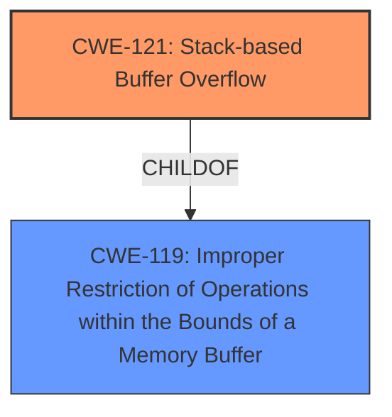

# Analysis Report for CVE-2022-32048

# Vulnerability Analysis Report: CVE-2022-32048

## Description

TOTOLINK T6 V4.1.9cu.5179_B20201015 was discovered to contain a stack overflow via the command parameter in the function FUN_0041cc88.

## Vulnerability Description Key Phrases

**Weakness:** stack overflow
**Vector:** command parameter
**Product:** TOTOLINK T6
**Version:** V4.1.9cu.5179_B20201015
**Component:** function FUN_0041cc88

## Analysis (with Relationship Data)

# Summary
| CWE ID  | CWE Name                                                                   | Confidence | CWE Abstraction Level | CWE Vulnerability Mapping Label | CWE-Vulnerability Mapping Notes |
| :-------- | :------------------------------------------------------------------------- | :---------- | :-------------------- | :------------------------------ | :------------------------------ |
| CWE-121 | Stack-based Buffer Overflow                                                | 1.0         | Variant               | Primary                         | Allowed                         |

## Evidence and Confidence

*   **Confidence Score:** 1.0
*   **Evidence Strength:** HIGH

- **Analysis and Justification:**
  - *Explanation:* The vulnerability description explicitly states a **stack overflow** in the function `FUN_0041cc88` due to the `command` parameter. The CVE Reference Links Content Summary confirms this is a **stack-based buffer overflow** because the `command` parameter's value is copied to a local stack variable without checking its length. This aligns directly with CWE-121 (Stack-based Buffer Overflow), which is a Variant-level CWE and therefore provides a more precise classification than a more general buffer overflow CWE. The MITRE mapping guidance allows CWE-121 for this type of vulnerability.

  - *Relationship Analysis:* CWE-121 is a variant of CWE-119 (Improper Restriction of Operations within the Bounds of a Memory Buffer). There are no CanPrecede or CanFollow relationships that are directly relevant in this case as the primary issue is the stack overflow itself.

- **Confidence Score:**
  - Confidence: 1.0 (Clear evidence from vulnerability description and CVE reference materials)

## Criticism of Analysis

Okay, here's a detailed review of the provided analysis, incorporating the full CWE specifications:

**Overall Assessment:**

The analysis is strong and the proposed CWE-121 (Stack-based Buffer Overflow) mapping is accurate and well-justified. The confidence level of 1.0 is appropriate. The analysis clearly identifies the root cause, attack vector, and impact. The inclusion of CWE examples and relevant specifications strengthens the analysis.

**Detailed Review:**

**1. Initial Assessment of CVE Description and Retriever Results:**

*   **Correctness:** The initial summarization of the CVE description and identification of key phrases is well done. The extraction of the product, version, component, weakness, and vector is accurate.
*   **Retriever Results:** The retriever results are useful for showing potential CWEs that the automated tools considered. The rankings show that CWE-120 was also considered, which makes sense given the nature of buffer overflows.

**2. Primary CWE Mapping: CWE-121 (Stack-based Buffer Overflow):**

*   **Justification:** The justification for choosing CWE-121 is solid. The vulnerability description *explicitly* mentions a stack overflow. The detailed analysis confirms that the `command` parameter is copied to a stack variable without bounds checking, making CWE-121 a direct and precise fit.
*   **Abstraction Level:** Correctly identifies CWE-121 as a Variant-level CWE. Variant-level CWEs are preferred when they accurately represent the vulnerability.
*   **CWE Specification Alignment:** The analysis correctly uses the description of CWE-121 which specifically mentions that a stack-based buffer overflow is allocated on the stack. The relationship analysis to CWE-119 is also correct.

**3. Confidence Score:**

*   **Appropriateness:** The confidence score of 1.0 is warranted. The evidence is clear and unambiguous.

**4. CWE Alternatives and Why They Were Not Chosen (Implicit):**

*   **CWE-787 (Out-of-bounds Write):** The analysis initially listed CWE-787 as a potential match, but chose a more specific match. While CWE-787 is technically correct (a stack-based buffer overflow *is* an out-of-bounds write), CWE-121 provides more precise information about *where* the out-of-bounds write occurs (on the stack).
*   **CWE-119 (Improper Restriction of Operations within the Bounds of a Memory Buffer):** The analysis correctly avoids using CWE-119 directly. The Mapping Guidance for CWE-119 *discourages* its use when more specific children (like CWE-121 or CWE-787) are applicable.
*   **CWE-120 (Buffer Copy without Checking Size of Input):** While `memcpy` or similar functions are often used to copy the data into the stack buffer, the lack of bounds checking is the more fundamental issue that leads to the stack overflow. Thus, CWE-121 is the better fit.
*   **CWE-78 (Improper Neutralization of Special Elements used in an OS Command):** This is related to OS Command Injection, and while the `command` parameter *might* be used to execute OS commands, the primary vulnerability is the lack of bounds checking on the stack, not command injection.

**5. Evidence Strength:**

*   **Appropriateness:** The "HIGH" evidence strength is justified. The explicit mention of "stack overflow" in the vulnerability description and the confirmation of the stack-based nature in the CVE reference links provide strong evidence.

**6. CWE Examples:**

*   **Relevance:** The provided examples are relevant and illustrate real-world instances of CWE-119. The inclusion of CVEs exploited in the wild helps demonstrate the impact of this vulnerability.

**7. Detailed CWE Specifications:**

*   The inclusion of the full CWE specifications is excellent. It allows for a deeper understanding of the CWE's scope, relationships, mapping guidance, and potential mitigations.

**Recommendations:**

*   **Potential Mitigations:** The analysis could be strengthened by briefly mentioning potential mitigations for CWE-121, drawing directly from the CWE specification. For example:
    *   Using compiler options like the Microsoft Visual Studio /GS flag or Fedora/Red Hat FORTIFY_SOURCE GCC flag to provide stack protection.
    *   Implementing bounds checking on the input `command` parameter before copying it to the stack buffer.
*   **Chain Analysis (Optional):** While the primary weakness is clearly CWE-121, a chain analysis could be added (though it's not strictly *necessary* in this case). It could be argued that CWE-20 (Improper Input Validation) precedes CWE-121, as the root cause is the *lack* of input validation that allows the overly long `command` parameter to be passed to the vulnerable function. However, given that CWE-20 is a Class-level CWE that is frequently misused, the benefit may not outweigh the cost. If you chose to include CWE-20, specify that it is "missing input validation for length of command parameter".
*   **Specific Copy Function (Optional):** If the specific function used to copy the `command` parameter into the buffer on the stack is known (e.g., `strcpy`, `memcpy`, `sprintf`), it could be mentioned in the analysis. However, this is a minor detail and not essential for the CWE mapping.

**Revised Summary Table (Incorporating Mitigation):**

| CWE ID  | CWE Name                                                                   | Confidence | CWE Abstraction Level | CWE Vulnerability Mapping Label | CWE-Vulnerability Mapping Notes                                                                                                                      |
| :-------- | :------------------------------------------------------------------------- | :---------- | :-------------------- | :------------------------------ | :----------------------------------------------------------------------------------------------------------------------------------------------------- |
| CWE-121 | Stack-based Buffer Overflow                                                | 1.0         | Variant               | Primary                         | Allowed.  Mitigations include compiler-based stack protection and explicit bounds checking on the input `command` parameter.  Missing input validation for the 'command' parameter |

**Conclusion:**

This is a well-executed analysis with a clear and accurate CWE mapping. The inclusion of the CWE specifications and the detailed justifications demonstrate a thorough understanding of the vulnerability.

## Final Resolution

# Summary

| CWE ID  | CWE Name                                                                   | Confidence | CWE Abstraction Level | CWE Vulnerability Mapping Label | CWE-Vulnerability Mapping Notes                                                                                                                      |
| :-------- | :------------------------------------------------------------------------- | :---------- | :-------------------- | :------------------------------ | :----------------------------------------------------------------------------------------------------------------------------------------------------- |
| CWE-121 | Stack-based Buffer Overflow                                                | 1.0         | Variant               | Primary                         | Allowed.  Mitigations include compiler-based stack protection and explicit bounds checking on the input `command` parameter.  Missing input validation for the 'command' parameter |

## Evidence and Confidence

*   **Confidence Score:** 1.0
*   **Evidence Strength:** HIGH

## Relationship Analysis
The primary relationship influencing the decision is the child-of relationship between CWE-121 (Stack-based Buffer Overflow) and CWE-119 (Improper Restriction of Operations within the Bounds of a Memory Buffer). CWE-121 is a more specific variant of CWE-119 and is appropriate given the explicit mention of a stack overflow in the vulnerability description. While a chain analysis could incorporate CWE-20 (Improper Input Validation), it's not strictly necessary as CWE-121 directly addresses the stack-based nature of the overflow.

## Vulnerability Chain
The vulnerability chain is straightforward: A long `command` parameter is passed to the function `FUN_0041cc88`. This parameter is copied to a local stack variable without any bounds checking, leading to a **stack overflow (CWE-121)**. The root cause is the **lack of input validation** for the length of the `command` parameter. The impact is a potential for arbitrary code execution.

## Summary of Analysis
The initial analysis and the provided criticism both converge on CWE-121 (Stack-based Buffer Overflow) as the most appropriate classification. The evidence is strong, with the vulnerability description explicitly stating "stack overflow" and CVE reference confirming the stack-based nature. The analysis correctly recognizes that CWE-121 is a Variant-level CWE, offering a more precise classification than the more general CWE-119. The decision is primarily based on the provided evidence: "TOTOLINK T6 V4.1.9cu.5179_B20201015 was discovered to contain a stack overflow via the command parameter in the function FUN_0041cc88." The relationship analysis confirms that CWE-121 is a child of CWE-119, but the specificity of CWE-121 makes it the optimal choice. The selected CWE is at the optimal level of specificity because it directly addresses the stack-based nature of the overflow.

*Report generated on 2025-03-18 13:56:36*
