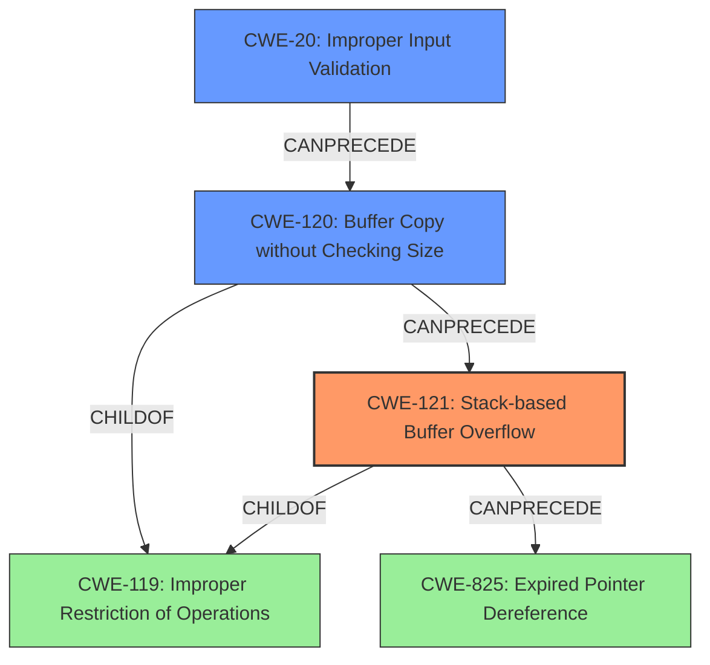

# Analysis Report for CVE-2022-32049

# Vulnerability Analysis Report: CVE-2022-32049

## Description

TOTOLINK T6 V4.1.9cu.5179_B20201015 was discovered to contain a stack overflow via the url parameter in the function FUN_00418540.

## Vulnerability Description Key Phrases

**Weakness:** stack overflow
**Product:** TOTOLINK T6
**Version:** V4.1.9cu.5179_B20201015
**Component:** function FUN_00418540

## Analysis (with Relationship Data)

# Summary
| CWE ID | CWE Name | Confidence | CWE Abstraction Level | CWE Vulnerability Mapping Label | CWE-Vulnerability Mapping Notes |
|---|---|---|---|---|---|
| CWE-121 | Stack-based Buffer Overflow | 0.9 | Variant | Primary | Allowed |
| CWE-120 | Buffer Copy without Checking Size of Input ('Classic Buffer Overflow') | 0.5 | Base | Secondary | Allowed-with-Review |

## Evidence and Confidence

*   **Confidence Score:** 0.9
*   **Evidence Strength:** HIGH

- **Analysis and Justification:**  
  - *Explanation:* The vulnerability description clearly states a **stack overflow** in TOTOLINK T6 V4.1.9cu.5179_B20201015, within the function `FUN_00418540` due to the `url` parameter. The CVE Reference Links Content Summary confirms this, stating that the function copies the `url` JSON parameter to local stack variables without proper length validation. This directly matches the description of CWE-121, which is a **stack-based buffer overflow**. The **lack of input validation** on the `url` parameter's length is the root cause. CWE-121 is a Variant level CWE, providing a specific classification. While CWE-787 (Out-of-bounds Write) is listed as the primary CWE match for similar CVE descriptions, the stack-specific nature of the overflow makes CWE-121 more appropriate. The Retriever Results also lists CWE-121 with a good score, and its Usage is ALLOWED according to MITRE mapping guidance.

  - *Relationship Analysis:* CWE-121 is a variant of CWE-119 (Improper Restriction of Operations within the Bounds of a Memory Buffer). It is also related to CWE-787 (Out-of-bounds Write) as the overflow leads to writing beyond the allocated buffer. It CanPrecede CWE-825 (Expired Pointer Dereference) because the overflow might overwrite stack variables, including function return addresses, which could lead to control-flow hijacking.

- **Confidence Score:**  
  - Confidence: 0.9 (High confidence due to explicit mention of stack overflow and details of missing input validation)

---
- **Analysis and Justification:**  
  - *Explanation:* CWE-120 (Buffer Copy without Checking Size of Input) is considered as a secondary candidate because the description notes that the vulnerability arises from copying the `url` parameter without checking its size, which can lead to a buffer overflow if the input is larger than the buffer. However, because the overflow is explicitly stated to be stack-based, CWE-121 is a more precise classification. CWE-120 is a Base level CWE. MITRE's mapping guidance for CWE-120 is ALLOWED-WITH-REVIEW, with the caveat that it should only be used for buffer copy operations where there is no size checking. This condition is met in this case, which makes CWE-120 a relevant secondary mapping.
  - *Relationship Analysis:* CWE-120 is a child of CWE-119 (Improper Restriction of Operations within the Bounds of a Memory Buffer). It CanPrecede CWE-456 (Missing Initialization) due to the potential for the overflow to corrupt adjacent stack variables.

- **Confidence Score:**  
  - Confidence: 0.5 (Medium confidence; relevant as a contributing factor, but less specific than CWE-121)

## Criticism of Analysis

Okay, I've reviewed your CWE analysis of the TOTOLINK T6 stack overflow vulnerability, taking into account the full CWE specifications. Here's my critique:

**Overall Assessment:**

The analysis is generally well-reasoned and provides a good justification for the chosen CWEs. The confidence scores are appropriate. The explanation is clear and considers alternative CWEs.

**Detailed Review:**

*   **CWE-121: Stack-based Buffer Overflow (Primary)**

    *   **Confidence Score:** 0.9
    *   **Justification:**  Excellent. The analysis clearly ties the vulnerability description (stack overflow in `FUN_00418540` due to uncontrolled `url` parameter) directly to the definition of CWE-121.  The explanation of how the lack of input validation leads to the stack overflow is also well done.

    *   **Relationship Analysis:**  The relationships to CWE-119 and CWE-787 are correctly identified.  The inclusion of `CanPrecede` CWE-825 (Expired Pointer Dereference) is less obvious but valid if the stack overflow overwrites function return addresses, a valid attack scenario.

    *   **CWE Specification Alignment:** The analysis aligns with the *Description* and *Relationships* sections of the CWE-121 specification.  The "Other" note about return address overwrites, stack pointer overwrites, etc., is relevant here. Also, the *Potential Mitigations* listed are applicable, especially the use of compiler-level buffer overflow detection mechanisms (like /GS, FORTIFY_SOURCE, StackGuard).

*   **CWE-120: Buffer Copy without Checking Size of Input (Secondary)**

    *   **Confidence Score:** 0.5
    *   **Justification:**  The rationale for including CWE-120 is valid *as a contributing factor*, but not the primary cause. The description correctly points out that the *lack of size checking* during the buffer copy is a key element that *enables* the overflow.

    *   **Relationship Analysis:** The relationship to CWE-119 and the `CanFollow` CWE-456 is appropriate.
    *   **CWE Specification Alignment:**  The analysis aligns with the *Description* of CWE-120, highlighting the "Buffer Copy" operation and the absence of "Checking [the] Size of Input." The `Allowed-with-Review` usage is appropriate as a contributing factor, not the main cause.
*   **CWE-787: Out-of-bounds Write Consideration**

    * The Retriever result includes CWE-787 "Out-of-bounds Write" with a high count. The analysis could benefit from explicitly excluding it as the *primary* CWE and explaining why CWE-121 is a better fit despite the fact that a stack overflow *is* an out-of-bounds write. The reason to prefer CWE-121 is that it is *more specific* and captures the *location* of the buffer (stack) in question.
*   **CWE-20 Improper Input Validation**

    * Although CWE-20 is not explicitly included, the description does describe that input validation is missing. As a suggestion, it may be good to explicitly add it as a *contributing* or *root cause* to the stack-based buffer overflow.
*   **Retriever Results Discussion:**

    *   The "Top Combined Results" section of the Retriever Results includes some CWEs that aren't explicitly addressed in the analysis. While not *every* result needs to be examined, it might be beneficial to briefly explain *why* certain highly-ranked results (e.g., CWE-78, CWE-190, CWE-259) are *not* relevant. This demonstrates a more thorough understanding of the vulnerability.

**Recommendations for Improvement:**

1.  **Explicitly Address CWE-787:** Briefly explain *why* CWE-121 is preferred over the more general CWE-787, even though the vulnerability *is* technically an out-of-bounds write.
2.  **Consider Adding CWE-20:** Briefly mentioning the role of Improper Input Validation (CWE-20) as a *root cause* or *contributing factor* would strengthen the analysis.
3.  **Address Top Retriever Results Not Included:** Briefly explain why some of the higher-ranked CWEs in the Retriever Results (other than CWE-121 and CWE-120) are not appropriate.
4.  **Strengthen Relationship Analysis:** While the existing relationship analysis is good, consider adding how mitigations for the CWE could prevent the vulnerability.

**Example of incorporating recommendations:**

"While CWE-787 (Out-of-bounds Write) is a valid characterization of the vulnerability, CWE-121 (Stack-based Buffer Overflow) is more specific and accurately reflects the location of the vulnerable buffer on the stack.  CWE-787 describes the general class of out-of-bounds writes, but CWE-121 provides a more precise classification for this specific vulnerability.  Furthermore, the root cause is due to missing input validation (CWE-20). The program fails to validate the length of the 'url' parameter before copying it to a stack-allocated buffer. Thus, CWE-20 contributes directly to this weakness because mitigations against this weakness, such as validating the length of the 'url' parameter before processing it, could prevent the attack.

Regarding the Retriever Results, CWE-78 (OS Command Injection) is not relevant as the vulnerability does not involve the construction or execution of operating system commands. Similarly, while an overly large 'url' might theoretically lead to an Integer Overflow (CWE-190) during size calculations, the primary issue is the lack of bounds checking during the buffer copy, making CWE-121 and CWE-120 more directly applicable. CWE-259 (Use of Hard-coded Password) is completely unrelated to this memory corruption vulnerability."

By incorporating these recommendations, you can make the analysis even more robust and demonstrate a deeper understanding of the nuances of CWE mapping.

## Final Resolution

# Summary
| CWE ID | CWE Name | Confidence | CWE Abstraction Level | CWE Vulnerability Mapping Label | CWE-Vulnerability Mapping Notes |
|---|---|---|---|---|---|
| CWE-121 | Stack-based Buffer Overflow | 0.95 | Variant | Primary | Allowed |
| CWE-20 | Improper Input Validation | 0.75 | Base | Secondary | Allowed |
| CWE-120 | Buffer Copy without Checking Size of Input ('Classic Buffer Overflow') | 0.65 | Base | Secondary | Allowed-with-Review |

## Evidence and Confidence

*   **Confidence Score:** 0.9
*   **Evidence Strength:** HIGH

## Relationship Analysis
The primary weakness is CWE-121 (**Stack-based Buffer Overflow**), a variant of CWE-119 (**Improper Restriction of Operations within the Bounds of a Memory Buffer**). The root cause is identified as CWE-20 (**Improper Input Validation**), which allows the attacker to provide an overly long input string. This input is then copied without proper bounds checking (CWE-120 **Buffer Copy without Checking Size of Input**), leading to the stack overflow. CWE-121 can precede CWE-825 (**Expired Pointer Dereference**) if the overflow overwrites function return addresses.

## Vulnerability Chain
The vulnerability chain begins with CWE-20 (**Improper Input Validation**). Because of the lack of input validation, an attacker can supply an overly long `url` parameter. This leads to CWE-120 (**Buffer Copy without Checking Size of Input**), where the oversized input is copied to a stack buffer without bounds checking. The ultimate result is CWE-121 (**Stack-based Buffer Overflow**), allowing an attacker to overwrite adjacent stack variables, potentially including the return address, leading to arbitrary code execution.

## Summary of Analysis
The initial analysis correctly identified CWE-121 (**Stack-based Buffer Overflow**) as the primary weakness due to the vulnerability description explicitly mentioning a stack overflow. The inclusion of CWE-120 (**Buffer Copy without Checking Size of Input**) as a contributing factor is also valid, as the overflow results from copying the `url` parameter without proper size validation.

The criticism suggested explicitly addressing CWE-787 (**Out-of-bounds Write**) and explaining why CWE-121 is a better fit. While CWE-787 describes a general out-of-bounds write, CWE-121 is *more specific* by pinpointing that the overflow occurs on the stack. Therefore, CWE-121 is the best fit because it captures the location of the vulnerable buffer.

The criticism also recommended considering CWE-20 (**Improper Input Validation**) as a *root cause*. The program *fails to validate* the length of the `url` parameter before copying it to a stack-allocated buffer, which directly contributes to the weakness. Adding CWE-20 strengthens the analysis by explicitly stating the root cause and clarifies that mitigations against this weakness, such as validating the length of the `url` parameter before processing it, could prevent the attack.

The criticism also suggested addressing the top retriever results not included. CWE-78 (**Improper Neutralization of Special Elements used in an OS Command ('OS Command Injection')**) is not relevant as the vulnerability doesn't involve OS command execution. CWE-190 (**Integer Overflow or Wraparound**) is not as directly applicable as the primary issue is the lack of bounds checking during the buffer copy, making CWE-121 and CWE-120 more appropriate.

The final assessment includes CWE-121 (**Stack-based Buffer Overflow**) as the primary CWE, CWE-20 (**Improper Input Validation**) as a secondary CWE representing the root cause, and CWE-120 (**Buffer Copy without Checking Size of Input**) as a secondary CWE representing the vulnerable buffer copy operation. This combination accurately reflects the vulnerability's nature and root cause.

Final Answer: The final answer is $\boxed{CWE-121}$

*Report generated on 2025-03-18 13:57:31*
