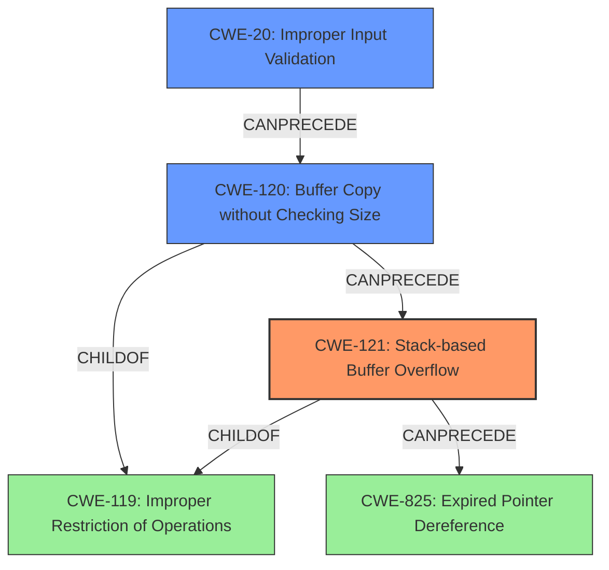

# Final Resolution for CVE-2022-32049

# Summary
| CWE ID | CWE Name | Confidence | CWE Abstraction Level | CWE Vulnerability Mapping Label | CWE-Vulnerability Mapping Notes |
|---|---|---|---|---|---|
| CWE-121 | Stack-based Buffer Overflow | 0.95 | Variant | Primary | Allowed |
| CWE-20 | Improper Input Validation | 0.75 | Base | Secondary | Allowed |
| CWE-120 | Buffer Copy without Checking Size of Input ('Classic Buffer Overflow') | 0.65 | Base | Secondary | Allowed-with-Review |

## Evidence and Confidence

*   **Confidence Score:** 0.9
*   **Evidence Strength:** HIGH

## Relationship Analysis
The primary weakness is CWE-121 (**Stack-based Buffer Overflow**), a variant of CWE-119 (**Improper Restriction of Operations within the Bounds of a Memory Buffer**). The root cause is identified as CWE-20 (**Improper Input Validation**), which allows the attacker to provide an overly long input string. This input is then copied without proper bounds checking (CWE-120 **Buffer Copy without Checking Size of Input**), leading to the stack overflow. CWE-121 can precede CWE-825 (**Expired Pointer Dereference**) if the overflow overwrites function return addresses.

## Vulnerability Chain
The vulnerability chain begins with CWE-20 (**Improper Input Validation**). Because of the lack of input validation, an attacker can supply an overly long `url` parameter. This leads to CWE-120 (**Buffer Copy without Checking Size of Input**), where the oversized input is copied to a stack buffer without bounds checking. The ultimate result is CWE-121 (**Stack-based Buffer Overflow**), allowing an attacker to overwrite adjacent stack variables, potentially including the return address, leading to arbitrary code execution.

## Summary of Analysis
The initial analysis correctly identified CWE-121 (**Stack-based Buffer Overflow**) as the primary weakness due to the vulnerability description explicitly mentioning a stack overflow. The inclusion of CWE-120 (**Buffer Copy without Checking Size of Input**) as a contributing factor is also valid, as the overflow results from copying the `url` parameter without proper size validation.

The criticism suggested explicitly addressing CWE-787 (**Out-of-bounds Write**) and explaining why CWE-121 is a better fit. While CWE-787 describes a general out-of-bounds write, CWE-121 is *more specific* by pinpointing that the overflow occurs on the stack. Therefore, CWE-121 is the best fit because it captures the location of the vulnerable buffer.

The criticism also recommended considering CWE-20 (**Improper Input Validation**) as a *root cause*. The program *fails to validate* the length of the `url` parameter before copying it to a stack-allocated buffer, which directly contributes to the weakness. Adding CWE-20 strengthens the analysis by explicitly stating the root cause and clarifies that mitigations against this weakness, such as validating the length of the `url` parameter before processing it, could prevent the attack.

The criticism also suggested addressing the top retriever results not included. CWE-78 (**Improper Neutralization of Special Elements used in an OS Command ('OS Command Injection')**) is not relevant as the vulnerability doesn't involve OS command execution. CWE-190 (**Integer Overflow or Wraparound**) is not as directly applicable as the primary issue is the lack of bounds checking during the buffer copy, making CWE-121 and CWE-120 more appropriate.

The final assessment includes CWE-121 (**Stack-based Buffer Overflow**) as the primary CWE, CWE-20 (**Improper Input Validation**) as a secondary CWE representing the root cause, and CWE-120 (**Buffer Copy without Checking Size of Input**) as a secondary CWE representing the vulnerable buffer copy operation. This combination accurately reflects the vulnerability's nature and root cause.

Final Answer: The final answer is $\boxed{CWE-121}$