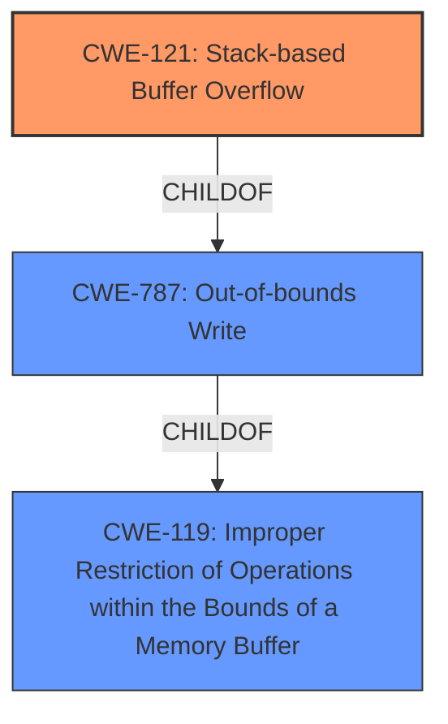

# Analysis Report for CVE-2022-32050

# Vulnerability Analysis Report: CVE-2022-32050

## Description

TOTOLINK T6 V4.1.9cu.5179_B20201015 was discovered to contain a stack overflow via the cloneMac parameter in the function FUN_0041af40.

## Vulnerability Description Key Phrases

**Weakness:** stack overflow
**Product:** TOTOLINK T6
**Version:** V4.1.9cu.5179_B20201015
**Component:** function FUN_0041af40

## Analysis (with Relationship Data)

# Summary
| CWE ID | CWE Name | Confidence | CWE Abstraction Level | CWE Vulnerability Mapping Label | CWE-Vulnerability Mapping Notes |
|---|---|---|---|---|---|
| CWE-121 | Stack-based Buffer Overflow | 0.9 | Variant | Allowed | Primary CWE |
| CWE-787 | Out-of-bounds Write | 0.6 | Base | Allowed | Secondary Candidate |

## Evidence and Confidence

*   **Confidence Score:** 0.9
*   **Evidence Strength:** HIGH

- **Analysis and Justification:**  
  - *Explanation:* The vulnerability description clearly states a **stack overflow** in the TOTOLINK T6 router, version V4.1.9cu.5179_B20201015, within the function FUN_0041af40. The CVE Reference Links Content Summary confirms that the root cause is an unchecked copy of the `cloneMac` parameter to stack-allocated local variables. This aligns directly with the definition of CWE-121, "Stack-based Buffer Overflow," which is a condition where a buffer being overwritten is allocated on the stack. The evidence is compelling, and the CWE is at the Variant level of abstraction, which is preferred.

  - *Relationship Analysis:* CWE-121 is a specific type of CWE-787 (Out-of-bounds Write). Because the vulnerability is specifically a stack-based overflow, CWE-121 is the more precise choice. CWE-121 is a child of CWE-119 (Improper Restriction of Operations within the Bounds of a Memory Buffer), indicating a general class of buffer-related errors.

- **Confidence Score:**  
  - Confidence: 0.9 (High confidence due to direct evidence of a stack overflow)

---
- **Analysis and Justification:**  
  - *Explanation:* While the primary weakness is a stack-based buffer overflow (CWE-121), a more general classification could be CWE-787 (Out-of-bounds Write). The vulnerability involves writing data beyond the allocated buffer. However, given the explicit mention of a "stack overflow," CWE-121 is the more accurate and specific choice. CWE-787 is also listed as the Primary CWE Match from similar CVE descriptions.

  - *Relationship Analysis:* CWE-787 is a parent of CWE-121. The retriever results also show a hierarchical relationship where CWE-787 is a parent to CWE-121.

- **Confidence Score:**  
  - Confidence: 0.6 (Lower confidence because CWE-121 is more specific)

## Criticism of Analysis

Okay, I've reviewed the analysis, the provided vulnerability description, the CVE reference links, retriever results, and the full CWE specifications for each referenced CWE. Here's my critique:

**Overall Assessment:**

The analysis is generally good, and the primary mapping to CWE-121 (Stack-based Buffer Overflow) is appropriate and well-justified. The secondary mapping to CWE-787 (Out-of-bounds Write) is also reasonable, although less precise, as the analysis itself acknowledges. The confidence scores are also appropriate. The analysis also does a good job of explaining why CWE-121 is a better fit than CWE-787.

**Detailed Critique:**

*   **CWE-121 (Stack-based Buffer Overflow):**
    *   **Strengths:** The analysis correctly identifies the key characteristic of the vulnerability: the overflow occurs on a buffer allocated on the stack. The description and extended description of CWE-121 directly align with the vulnerability details. The analysis also acknowledges that this is a Variant level of abstraction, and that this is ideal. The analysis also recognizes that CWE-121 is a child of CWE-787.
    *   **Weaknesses:** None. The mapping is accurate and well-supported by the information provided.
    *   **Mitigations:** The analysis could include mentioning the mitigations mentioned in the CWE specification, such as environment hardening with compiler flags (e.g., /GS in Visual Studio, FORTIFY_SOURCE in GCC), using abstraction libraries, and implementing bounds checking on input.
    *   **Mapping Guidance:** Complies with the recommendation to avoid "forcing" a mapping to a lower-level CWE if it is not an appropriate fit.

*   **CWE-787 (Out-of-bounds Write):**
    *   **Strengths:** Correctly identifies that the vulnerability involves writing outside the intended buffer boundaries.
    *   **Weaknesses:** While technically correct, it's less precise than CWE-121 because it doesn't specify where the buffer is located (heap, stack, etc.). The analysis acknowledges this.
    *   **Mitigations:** The analysis is missing mentioning the mitigations mentioned in the CWE specification. The mitigations are similar to that of CWE-121, including using memory safe languages, using vetted libraries, and compiler based buffer overflow detection.
    *   **Mapping Guidance:** The analysis complies with the recommendation to carefully read the name and description to make sure the mapping is an appropriate fit. It also uses the CWE entry at the Base level of abstraction as a secondary concern, since a more specific child entry is a better fit.

*   **Retriever Results:**
    *   The retriever results provide additional context, but some of the top results aren't applicable (e.g., CWE-78, OS Command Injection). This highlights the importance of not relying solely on automated tools and instead using human analysis to make the final determination. CWE-120 was also a high result, but the analysis recognizes that this is not a "classic" copy without checking size, but rather a lack of any check in the first place.

*   **CWE Examples from Database:**
    * The examples are helpful to understand the breadth of CWE-119, but given the choice of CWE-121, examples from that CWE would be more relevant.

**Suggestions for Improvement:**

1.  **Mitigation Details:** Briefly mention the key mitigations for CWE-121 and CWE-787 in the analysis itself. Even a short summary can improve the overall value of the analysis. This helps the reader understand not only the *what* (the vulnerability) but also the *how to fix it*.
2.  **Relationship to CWE-119:** While the analysis mentions that CWE-121 is a child of CWE-787, it might be worth noting that both are children of CWE-119 (Improper Restriction of Operations within the Bounds of a Memory Buffer). However, it correctly states that CWE-119 is commonly misused in low-information vulnerability reports when more information is available.
3.  **Expand on the "Why" for Lower Confidence:** The analysis mentions that CWE-787 has a lower confidence score because CWE-121 is more specific. Briefly elaborate on why specificity is important. For example, more specific CWEs allow for better targeted mitigations, which may not be relevant for a broader CWE mapping.

**Revised Summary Table (Incorporating suggestions):**

| CWE ID | CWE Name | Confidence | CWE Abstraction Level | CWE Vulnerability Mapping Label | CWE-Vulnerability Mapping Notes |
|---|---|---|---|---|---|
| CWE-121 | Stack-based Buffer Overflow | 0.9 | Variant | Allowed | Primary CWE. Occurs because the `cloneMac` parameter is copied to a stack-allocated buffer without length validation. Mitigations include compiler-based buffer overflow detection and input validation. |
| CWE-787 | Out-of-bounds Write | 0.6 | Base | Allowed | Secondary Candidate. More general classification, but less specific than CWE-121. Mitigations include using memory-safe languages and vetted libraries. |

Overall, this is a solid analysis. The suggested improvements would further enhance its value by providing more actionable information for remediation.

## Final Resolution

# Summary

| CWE ID | CWE Name | Confidence | CWE Abstraction Level | CWE Vulnerability Mapping Label | CWE-Vulnerability Mapping Notes |
|---|---|---|---|---|---|
| CWE-121 | Stack-based Buffer Overflow | 0.9 | Variant | Allowed | Primary CWE. Occurs because the `cloneMac` parameter is copied to a stack-allocated buffer without length validation. Mitigations include compiler-based buffer overflow detection and input validation. |
| CWE-787 | Out-of-bounds Write | 0.6 | Base | Allowed | Secondary Candidate. More general classification, but less specific than CWE-121. Mitigations include using memory-safe languages and vetted libraries. |

## Evidence and Confidence

*   **Confidence Score:** 0.9
*   **Evidence Strength:** HIGH

## Relationship Analysis
The selection of CWE-121 as the primary weakness is based on its specific description aligning with the stack-based nature of the buffer overflow. CWE-787 is a parent of CWE-121, indicating that CWE-787 represents a broader category of out-of-bounds write issues. The decision to prioritize CWE-121 reflects the desire for a more specific classification. Both CWE-121 and CWE-787 are children of CWE-119 (Improper Restriction of Operations within the Bounds of a Memory Buffer).

## Vulnerability Chain
The vulnerability chain starts with a lack of input validation for the `cloneMac` parameter. This leads to a **buffer overflow** on the stack (CWE-121 or CWE-787), potentially allowing an attacker to overwrite adjacent memory regions and gain control of the program execution.

## Summary of Analysis
The initial analysis correctly identified CWE-121 as the primary **weakness** due to the stack-based nature of the **buffer overflow**, supported by the vulnerability description stating a "stack overflow via the cloneMac parameter in the function FUN_0041af40." The CVE Reference Links Content Summary confirms that the **root cause** is an unchecked copy of the `cloneMac` parameter to stack-allocated local variables. The decision is also influenced by the higher specificity of CWE-121 compared to its parent CWE-787, offering more targeted remediation strategies. The relationships, especially the parent-child relationship between CWE-787 and CWE-121, solidify the classification, ensuring the chosen CWE is at the optimal level of specificity.

*Report generated on 2025-03-18 13:58:42*
