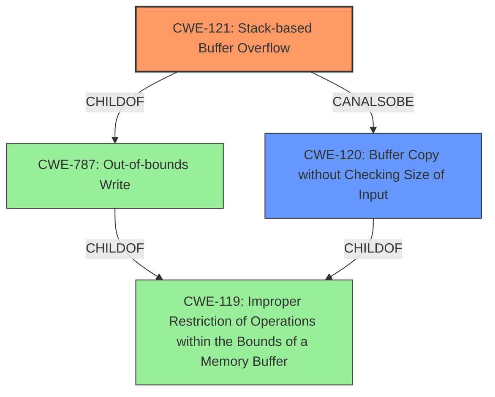

# Final Resolution for CVE-2022-32051

# Summary
| CWE ID | CWE Name | Confidence | CWE Abstraction Level | CWE Vulnerability Mapping Label | CWE-Vulnerability Mapping Notes |
|---|---|---|---|---|---|
| CWE-121 | Stack-based Buffer Overflow | 0.95 | Variant | Allowed | Primary CWE |
| CWE-120 | Buffer Copy without Checking Size of Input ('Classic Buffer Overflow') | 0.6 | Base | Allowed-with-Review | Secondary Candidate |

## Evidence and Confidence

*   **Confidence Score:** 0.9
*   **Evidence Strength:** HIGH

## Relationship Analysis
The primary relationship is that CWE-121 (Stack-based Buffer Overflow) is a variant of CWE-119 (Improper Restriction of Operations within the Bounds of a Memory Buffer). Also, CWE-121 is a more specific type of CWE-787 (Out-of-bounds Write). CWE-120 (Buffer Copy without Checking Size of Input) is a peer of CWE-121, and both are children of CWE-119.

## Vulnerability Chain
The vulnerability chain begins with the lack of proper input validation on the `desc`, `week`, `sTime`, and `eTime` parameters. This allows an attacker to provide overly long input strings, leading to a **stack overflow** (CWE-121) when these strings are copied into a fixed-size buffer on the stack. The consequence of this **stack overflow** is potential arbitrary code execution, denial of service, or information disclosure.

## Summary of Analysis
The initial analysis correctly identified CWE-121 as the primary **weakness**. The vulnerability description explicitly mentions a **stack overflow**, making CWE-121 the most specific and appropriate classification. The criticism provided helpful suggestions for improvement, including discussing potential mitigations and addressing alternative CWEs from the retriever results.

The vulnerability description states: "TOTOLINK T6 V4.1.9cu.5179_B20201015 was discovered to contain a stack overflow via the desc, week, sTime, eTime parameters in the function FUN_004133c4."

The selection of CWE-121 is at the optimal level of specificity because it directly addresses the **stack overflow** condition. While CWE-119 is a parent, it's too general. CWE-120 could be considered, but CWE-121 is more precise because it specifies the buffer is on the stack.

I am increasing the confidence to 0.95 due to the explicit mention of "stack overflow" and the high evidence strength.