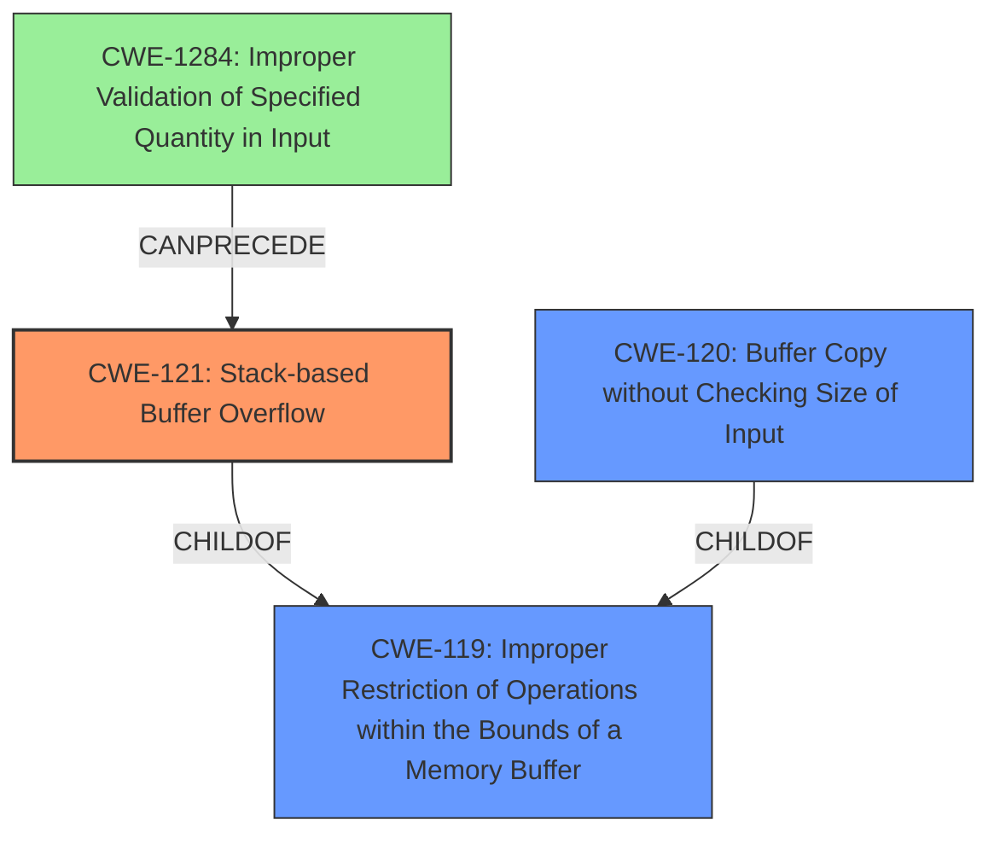

# Final Resolution for CVE-2022-32052

# Summary
| CWE ID | CWE Name | Confidence | CWE Abstraction Level | CWE Vulnerability Mapping Label | CWE-Vulnerability Mapping Notes |
|---|---|---|---|---|---|
| CWE-121 | Stack-based Buffer Overflow | 0.95 | Variant | Primary CWE | The **stack overflow** occurs because the `desc` parameter is copied to a stack buffer without checking its length. |
| CWE-120 | Buffer Copy without Checking Size of Input ('Classic Buffer Overflow') | 0.75 | Base | Secondary Candidate | The overflow happens during a buffer copy operation where the size of the input is not validated against the destination buffer's size. |

## Evidence and Confidence

*   **Confidence Score:** 0.9
*   **Evidence Strength:** HIGH

## Relationship Analysis
The primary relationship is that CWE-121 (Stack-based Buffer Overflow) is a variant of the more general CWE-119 (Improper Restriction of Operations within the Bounds of a Memory Buffer). CWE-120 (Buffer Copy without Checking Size of Input) is also a child of CWE-119. The choice of CWE-121 is driven by the explicit mention of "stack overflow" in the vulnerability description, making it a more specific and accurate classification than its parent, CWE-119, or the related CWE-120. A potential vulnerability chain could involve CWE-1284 (Improper Validation of Specified Quantity in Input) which can precede CWE-121.

## Vulnerability Chain
The vulnerability chain starts with the application receiving an untrusted `desc` parameter without proper length validation. This missing input validation (potentially mapped to CWE-1284) leads to the `desc` parameter being copied to a stack buffer without any bounds checking. This **lack of bounds checking** in the `FUN_004137a4` function results in a **stack-based buffer overflow** (CWE-121). The impact of this overflow could be arbitrary code execution if an attacker is able to overwrite critical data or function pointers on the stack.

## Summary of Analysis
The initial analysis and criticism both converge on the selection of CWE-121 as the primary CWE due to the explicit mention of "**stack overflow**" in the vulnerability description and the CVE summary. The evidence directly supports this classification. The analysis also correctly identifies CWE-120 as a secondary CWE, highlighting the **lack of input size validation** during the buffer copy operation. The criticism offers additional perspectives on potential vulnerability chains and the relationship between different CWEs. The final decision reinforces the selection of CWE-121 as the optimal level of specificity, representing the **root cause** of the vulnerability. The evidence "TOTOLINK T6 V4.1.9cu.5179_B20201015 was discovered to contain a **stack overflow** via the desc parameter in the function FUN_004137a4" clearly points to a stack overflow condition.