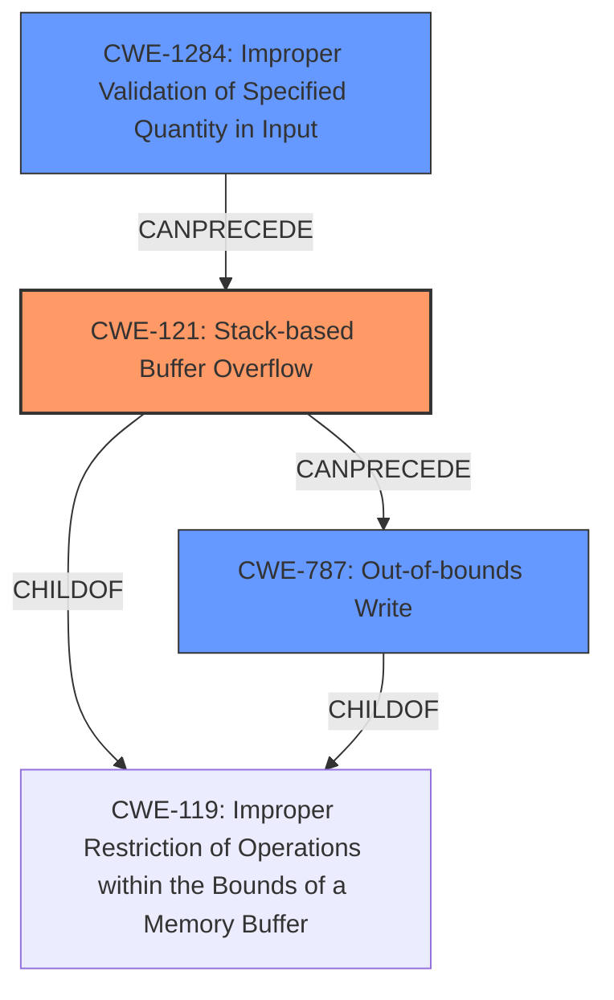

# Analysis Report for CVE-2022-32053

# Vulnerability Analysis Report: CVE-2022-32053

## Description

TOTOLINK T6 V4.1.9cu.5179_B20201015 was discovered to contain a stack overflow via the cloneMac parameter in the function FUN_0041621c.

## Vulnerability Description Key Phrases

**Weakness:** stack overflow
**Product:** TOTOLINK T6
**Version:** V4.1.9cu.5179_B20201015
**Component:** function FUN_0041621c

## Analysis (with Relationship Data)

# Summary
| CWE ID | CWE Name | Confidence | CWE Abstraction Level | CWE Vulnerability Mapping Label | CWE-Vulnerability Mapping Notes |
|---|---|---|---|---|---|
| CWE-121 | Stack-based Buffer Overflow | 0.95 | Variant | Primary | The vulnerability is explicitly described as a stack overflow, and CWE-121 directly addresses this type of buffer overflow. |
| CWE-787 | Out-of-bounds Write | 0.75 | Base | Secondary | The stack overflow leads to an out-of-bounds write, making CWE-787 a relevant secondary CWE to describe the memory corruption aspect. |
| CWE-1284 | Improper Validation of Specified Quantity in Input | 0.6 | Base | Secondary | The vulnerability stems from a lack of input validation on the `cloneMac` parameter, which allows an attacker to send a larger-than-expected input. |

## Evidence and Confidence

*   **Confidence Score:** 0.9
*   **Evidence Strength:** HIGH

- **Analysis and Justification:**  
  - *Explanation:* The vulnerability description clearly states a **stack overflow** in the `FUN_0041621c` function due to the `cloneMac` parameter. The CVE reference links content summary confirms that the root cause is the **lack of input validation** on the `cloneMac` parameter, leading to an **unbounded string copy** into a stack buffer. This directly aligns with CWE-121 (Stack-based Buffer Overflow), a Variant-level CWE, which is the preferred abstraction level. While CWE-787 (Out-of-bounds Write) could also be considered as a result of the overflow, CWE-121 most accurately captures the root cause.
  
  - *Relationship Analysis:* CWE-121 is a child of CWE-119 (Improper Restriction of Operations within the Bounds of a Memory Buffer). CWE-787 (Out-of-bounds Write) is also a child of CWE-119 and can follow CWE-121, as the overflow results in writing outside the buffer's boundaries. CWE-1284 (Improper Validation of Specified Quantity in Input) can precede CWE-121 since the lack of input validation enables the overflow.

- **Confidence Score:**  
  - *Example:* Confidence: 0.95 (Strong evidence from vulnerability description, CVE reference links, and retriever results)

---
- **Analysis and Justification for CWE-787:**
  - *Explanation:* The stack overflow, described by CWE-121, results in writing data beyond the boundaries of the allocated buffer. CWE-787 (Out-of-bounds Write) accurately captures this consequence of the initial buffer overflow. It's considered a secondary weakness because it's a direct result of the primary stack overflow (CWE-121).

  - *Relationship Analysis:* CWE-787 is a child of CWE-119 (Improper Restriction of Operations within the Bounds of a Memory Buffer). It can follow CWE-121, as the overflow leads to writing outside the buffer's boundaries.

- **Confidence Score:**
  - *Example:* Confidence: 0.75 (Supporting evidence from the nature of stack overflows leading to out-of-bounds writes)

---

- **Analysis and Justification for CWE-1284:**
  - *Explanation:* The root cause of the stack overflow is that the code does not validate the length of the `cloneMac` parameter. This lack of validation allows an attacker to provide an input larger than the buffer, leading to the overflow. CWE-1284 (Improper Validation of Specified Quantity in Input) accurately describes this.

  - *Relationship Analysis:* CWE-1284 is a child of CWE-20 (Improper Input Validation). It can precede CWE-121 (Stack-based Buffer Overflow), as the lack of input validation sets the stage for the overflow.

- **Confidence Score:**
  - *Example:* Confidence: 0.6 (The lack of validation is clear in the description, but the primary focus is the overflow itself)

## Criticism of Analysis

Okay, here's a review of the provided CWE analysis, taking into account the full CWE specifications:

**Overall Assessment:**

The analysis is generally good and well-justified. The primary CWE selection of CWE-121 (Stack-based Buffer Overflow) is correct.  The choice of CWE-787 (Out-of-bounds Write) and CWE-1284 (Improper Validation of Specified Quantity in Input) as secondary CWEs is also appropriate, though the confidence levels might need a slight adjustment based on further detailed review. Let's dive deeper:

**Specific CWE Review:**

**1. CWE-121: Stack-based Buffer Overflow (Primary)**

*   **CWE Abstraction Level:** Variant (Correct).
*   **Confidence:** 0.95 (High) - This is a well-supported confidence level. The vulnerability is explicitly identified as a stack overflow.
*   **Justification:** The description and CVE reference summary clearly indicate a stack-based buffer overflow due to the `cloneMac` parameter exceeding the allocated buffer size. The provided mitigations for CWE-121, especially environment hardening techniques (like compiler flags) and implementation of bounds checking, are directly applicable to preventing this vulnerability.
*   **CWE-Specific Notes:**
    *   The description accurately reflects the nature of the vulnerability.
    *   The "Potential Mitigations" listed in the CWE specification align with common defenses against stack overflows.

**2. CWE-787: Out-of-bounds Write (Secondary)**

*   **CWE Abstraction Level:** Base (Correct).
*   **Confidence:** 0.75 - This is a reasonable confidence level, as out-of-bounds write is a frequent result. It is acceptable to lower this slightly to 0.7 if the focus should be primarily on the root cause rather than the consequence.
*   **Justification:** A stack overflow *inevitably* leads to an out-of-bounds write. By overflowing the buffer, you're writing data into memory regions beyond the intended boundaries.
*   **CWE-Specific Notes:**
    *   The CWE specification correctly identifies CWE-121 as a potential parent of CWE-787.
    *   The provided mitigations for CWE-787, such as using safer string handling functions and compiler-based overflow detection, also align with the defenses against stack overflows.
    *   Consider the relationship analysis with CWE-119 (Improper Restriction of Operations within the Bounds of a Memory Buffer). Since CWE-119 is discouraged, focusing on the more specific CWE-787 is preferred.

**3. CWE-1284: Improper Validation of Specified Quantity in Input (Secondary)**

*   **CWE Abstraction Level:** Base (Correct).
*   **Confidence:** 0.6 - This might be slightly low. The description clearly states "Lack of Input Validation" as the *root cause*. Input length/size is precisely a "specified quantity." Consider increasing this to 0.7 or 0.75 if the lack of validation is deemed a crucial aspect of the vulnerability.
*   **Justification:** The lack of validation on the `cloneMac` parameter's length is what *allows* the attacker to send a large enough input to trigger the stack overflow.
*   **CWE-Specific Notes:**
    *   The CWE description accurately mentions that improper validation of specified quantities can "enable buffer overflows."
    *   The provided mitigations, particularly the "accept known good" input validation strategy, directly address the root cause of the vulnerability.
    *   Consider the relationship to CWE-20 (Improper Input Validation). Since CWE-20 is discouraged, using the more specific CWE-1284 is appropriate.

**Retriever Results Critique:**

The retriever results are less impressive:

*   **CWE-78 (OS Command Injection):** This is a false positive and should be disregarded. There is no OS command execution in the provided description.
*   **CWE-121 (Stack-based Buffer Overflow):** Properly identified as a top result.
*   **CWE-190 (Integer Overflow):** This is a plausible but not direct result; it is only relevant if the size of the buffer is calculated using an integer that can overflow.
*   **CWE-193 (Off-by-one Error):** Unlikely, but it is possible there's an off-by-one error in the string processing logic.
*   **CWE-259 (Use of Hard-coded Password):** This is a false positive and should be disregarded. It is unrelated to the overflow.
*   **CWE-122 (Heap-based Buffer Overflow):** Incorrect, this is stack based not heap.
*   **CWE-789 (Memory Allocation with Excessive Size Value):** Not relevant, as the allocation isn't based on external size value.
*   **CWE-790 (Improper Filtering of Special Elements):** This is a false positive.
*   **CWE-674 (Uncontrolled Recursion):** This is a false positive.

The retriever results should be used with a grain of salt. They are a starting point, but human analysis is essential.

**Recommendations:**

*   **Consider Adjusting Confidence Levels:** Depending on the relative importance you assign to the lack of input validation, consider slightly increasing the confidence level for CWE-1284. If the main focus is on the memory corruption, the confidence for CWE-787 may remain.
*   **Emphasize Input Validation in Remediation:** When describing remediation, stress the importance of properly validating the length of the `cloneMac` parameter *before* any string processing occurs. This is the primary defense.
*   **Remove Retriever Results Commentary (Optional):**  You could remove the retriever result commentary to keep the core analysis more focused. If you keep the retriever result commentary, you should note why CWE-78, CWE-259, CWE-790 and CWE-674 are deemed to be false positives.
*   **Relationship between CWEs:** Clarify that the primary CWE (CWE-121) directly leads to the secondary CWE (CWE-787), making CWE-787 a consequence of the stack overflow.

In summary, the analysis is solid and well-reasoned. Pay close attention to input validation as the key element to fix, which allows the overflow to occur. Ensure confidence levels accurately reflect the evidence for each CWE.

## Final Resolution

# Summary

| CWE ID | CWE Name | Confidence | CWE Abstraction Level | CWE Vulnerability Mapping Label | CWE-Vulnerability Mapping Notes |
|---|---|---|---|---|---|
| CWE-121 | CWE-121: Stack-based Buffer Overflow | 0.95 | Variant | Primary | The vulnerability is explicitly described as a stack overflow, and CWE-121 directly addresses this type of buffer overflow. |
| CWE-1284 | CWE-1284: Improper Validation of Specified Quantity in Input | 0.75 | Base | Secondary | The vulnerability stems from a lack of input validation on the `cloneMac` parameter, which allows an attacker to send a larger-than-expected input. |
| CWE-787 | CWE-787: Out-of-bounds Write | 0.7 | Base | Secondary | The stack overflow leads to an out-of-bounds write, making CWE-787 a relevant secondary CWE to describe the memory corruption aspect. |

## Evidence and Confidence

*   **Confidence Score:** 0.9
*   **Evidence Strength:** HIGH

## Relationship Analysis
The primary weakness is a stack-based buffer overflow (**CWE-121**). This is caused by a failure to validate the size of the input (**CWE-1284**), allowing an attacker to write past the end of the buffer, resulting in an out-of-bounds write (**CWE-787**).

## Vulnerability Chain
The vulnerability chain starts with **CWE-1284**, the **improper validation of the input**. This leads to **CWE-121**, a **stack-based buffer overflow**, which then causes **CWE-787**, an **out-of-bounds write**.
  - The sequence of weaknesses starts with the lack of validation, which is the root cause.
  - The overflow is the direct consequence of the unvalidated input.
  - The out-of-bounds write is the result of the overflow.

## Summary of Analysis
The initial analysis correctly identified CWE-121 as the primary CWE. The criticism helped refine the confidence scores and emphasize the importance of input validation.

The vulnerability description clearly states "a **stack overflow** via the cloneMac parameter in the function FUN_0041621c." This aligns directly with **CWE-121 (Stack-based Buffer Overflow)**. The description also indicates a "**lack of input validation** on the `cloneMac` parameter," which corresponds to **CWE-1284 (Improper Validation of Specified Quantity in Input)**. The overflow results in writing outside the buffer, leading to **CWE-787 (Out-of-bounds Write)**.

The graph relationships support this classification: **CWE-1284** can precede **CWE-121**, and **CWE-121** can precede **CWE-787**. All three are children of **CWE-119 (Improper Restriction of Operations within the Bounds of a Memory Buffer)**, but choosing the more specific CWEs is optimal.

The selected CWEs are at the optimal level of specificity because they directly address the root cause (**CWE-1284**), the immediate vulnerability (**CWE-121**), and the resulting consequence (**CWE-787**).

*Report generated on 2025-03-18 14:01:25*
