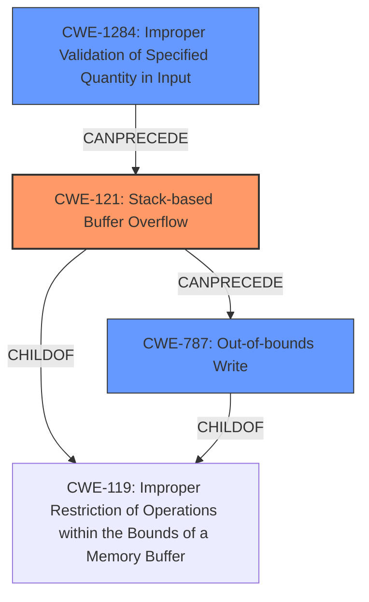

# Final Resolution for CVE-2022-32053

# Summary

| CWE ID | CWE Name | Confidence | CWE Abstraction Level | CWE Vulnerability Mapping Label | CWE-Vulnerability Mapping Notes |
|---|---|---|---|---|---|
| CWE-121 | CWE-121: Stack-based Buffer Overflow | 0.95 | Variant | Primary | The vulnerability is explicitly described as a stack overflow, and CWE-121 directly addresses this type of buffer overflow. |
| CWE-1284 | CWE-1284: Improper Validation of Specified Quantity in Input | 0.75 | Base | Secondary | The vulnerability stems from a lack of input validation on the `cloneMac` parameter, which allows an attacker to send a larger-than-expected input. |
| CWE-787 | CWE-787: Out-of-bounds Write | 0.7 | Base | Secondary | The stack overflow leads to an out-of-bounds write, making CWE-787 a relevant secondary CWE to describe the memory corruption aspect. |

## Evidence and Confidence

*   **Confidence Score:** 0.9
*   **Evidence Strength:** HIGH

## Relationship Analysis
The primary weakness is a stack-based buffer overflow (**CWE-121**). This is caused by a failure to validate the size of the input (**CWE-1284**), allowing an attacker to write past the end of the buffer, resulting in an out-of-bounds write (**CWE-787**).

## Vulnerability Chain
The vulnerability chain starts with **CWE-1284**, the **improper validation of the input**. This leads to **CWE-121**, a **stack-based buffer overflow**, which then causes **CWE-787**, an **out-of-bounds write**.
  - The sequence of weaknesses starts with the lack of validation, which is the root cause.
  - The overflow is the direct consequence of the unvalidated input.
  - The out-of-bounds write is the result of the overflow.

## Summary of Analysis
The initial analysis correctly identified CWE-121 as the primary CWE. The criticism helped refine the confidence scores and emphasize the importance of input validation.

The vulnerability description clearly states "a **stack overflow** via the cloneMac parameter in the function FUN_0041621c." This aligns directly with **CWE-121 (Stack-based Buffer Overflow)**. The description also indicates a "**lack of input validation** on the `cloneMac` parameter," which corresponds to **CWE-1284 (Improper Validation of Specified Quantity in Input)**. The overflow results in writing outside the buffer, leading to **CWE-787 (Out-of-bounds Write)**.

The graph relationships support this classification: **CWE-1284** can precede **CWE-121**, and **CWE-121** can precede **CWE-787**. All three are children of **CWE-119 (Improper Restriction of Operations within the Bounds of a Memory Buffer)**, but choosing the more specific CWEs is optimal.

The selected CWEs are at the optimal level of specificity because they directly address the root cause (**CWE-1284**), the immediate vulnerability (**CWE-121**), and the resulting consequence (**CWE-787**).