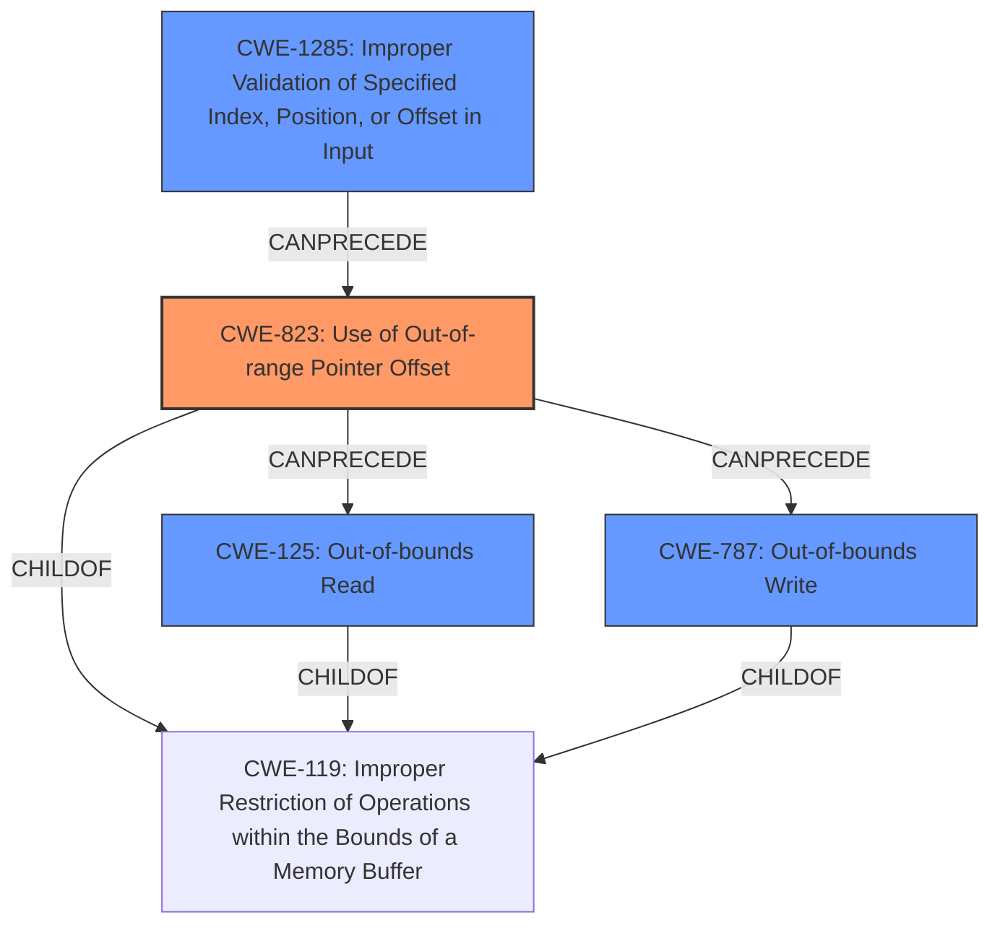

# Final Resolution for CVE-2022-32142

# Summary

| CWE ID  | CWE Name                                                      | Confidence | CWE Abstraction Level | CWE Vulnerability Mapping Label | CWE-Vulnerability Mapping Notes |
| ------- | ------------------------------------------------------------- | ---------- | --------------------- | ------------------------------- | ----------------------------- |
| CWE-823 | Use of Out-of-range Pointer Offset                            | 0.95       | Base                  | Allowed                         | Primary CWE                   |
| CWE-787 | Out-of-bounds Write                                           | 0.80       | Base                  | Allowed                         | Secondary Candidate           |
| CWE-125 | Out-of-bounds Read                                            | 0.80       | Base                  | Allowed                         | Secondary Candidate           |
| CWE-1285 | Improper Validation of Specified Index, Position, or Offset in Input | 0.70       | Base                  | Allowed                         | Secondary Candidate           |

## Evidence and Confidence

*   **Confidence Score:** 0.95
*   **Evidence Strength:** HIGH

## Relationship Analysis
The primary weakness is CWE-823 **(Use of Out-of-range Pointer Offset)**, which directly leads to either CWE-125 **(Out-of-bounds Read)** or CWE-787 **(Out-of-bounds Write)**. CWE-1285 **(Improper Validation of Specified Index, Position, or Offset in Input)** can precede CWE-823 by allowing the attacker to provide the out-of-range offset. All CWEs are base level which is a preferred level for mapping to the root causes of vulnerabilities.

## Vulnerability Chain
The vulnerability chain starts with a crafted request containing an invalid offset. If **(Improper Validation of Specified Index, Position, or Offset in Input - CWE-1285)** is present, the invalid offset is not caught, leading to **(Use of Out-of-range Pointer Offset - CWE-823)**. This then causes either an **(Out-of-bounds Read - CWE-125)** or an **(Out-of-bounds Write - CWE-787)**, ultimately resulting in a denial-of-service condition or local memory overwrite.

## Summary of Analysis
The initial analysis and criticism both agree that CWE-823 is the primary **WEAKNESS**. The evidence provided in the vulnerability description, specifically the mention of "out-of-bounds read or write access" due to an "invalid offset," directly supports this classification. The criticism suggests considering potential mitigations, which reinforces the understanding of the nature of the **ROOTCAUSE**.

The relationship analysis highlights how CWE-1285 can precede CWE-823 in a vulnerability chain, where improper validation allows the out-of-range offset to be used. The hierarchical relationships show that CWE-125 and CWE-787 are children of CWE-119, indicating that they are specific types of buffer access errors that can result from the use of an out-of-range pointer offset.

Based on the evidence and the relationship analysis, I am increasing the confidence in CWE-787 and CWE-125 to 0.80. I am also increasing the confidence in CWE-1285 to 0.70. All selected CWEs are at the optimal level of specificity (Base).

The selection of CWE-823 is well-justified and is the most accurate representation of the **ROOTCAUSE** based on the available information.