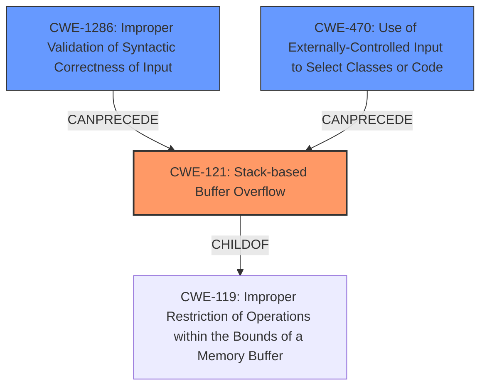

# Final Resolution for CVE-2022-3216

# Summary
| CWE ID | CWE Name | Confidence | CWE Abstraction Level | CWE Vulnerability Mapping Label | CWE-Vulnerability Mapping Notes |
|---|---|---|---|---|---|
| CWE-121 | Stack-based Buffer Overflow | 0.85 | Variant | Allowed | The vulnerability causes a **stack overflow** by injecting control characters, leading to arbitrary code execution. |
| CWE-1286 | Improper Validation of Syntactic Correctness of Input | 0.75 | Base | Allowed | The game does not validate the player name's syntax, allowing control characters to be injected. |
| CWE-470 | Use of Externally-Controlled Input to Select Classes or Code ('Unsafe Reflection') | 0.55 | Base | Allowed | The control characters `0x15` and `0x3F` are user controllable which causes the game to jump to a specified address. |

## Evidence and Confidence

*   **Confidence Score:** 0.80
*   **Evidence Strength:** HIGH

## Relationship Analysis
The primary weakness is CWE-121, a Variant of CWE-119 (**Improper Restriction of Operations within the Bounds of a Memory Buffer**). CWE-1286 (**Improper Validation of Syntactic Correctness of Input**) and CWE-470 (**Use of Externally-Controlled Input to Select Classes or Code ('Unsafe Reflection')**) can both *precede* CWE-121. The relationships show that the lack of input validation allows specific control characters to be injected, which then leads to the stack overflow.

## Vulnerability Chain
The vulnerability chain starts with the injection of control characters due to **CWE-1286 (Improper Validation of Syntactic Correctness of Input)**. If the code uses the injected control characters to jump to specific code locations based on the input, then **CWE-470 (Use of Externally-Controlled Input to Select Classes or Code ('Unsafe Reflection'))** occurs. The injected control character then causes a recursive loop during the printing of the opponent's name, leading to **CWE-121 (Stack-based Buffer Overflow)**, and finally to **memory corruption**.

## Summary of Analysis
The initial analysis correctly identified the stack overflow but used a broad CWE for the **ROOTCAUSE**, namely CWE-20. The criticism correctly pointed out the need for more specific CWEs. The final selection replaces CWE-20 with CWE-1286 and CWE-470, which more accurately describe the **ROOTCAUSE** of the vulnerability: specifically, the failure to validate the syntax of the player name input and the unsafe usage of externally controlled input to select which code to execute.

The vulnerability description states that "The manipulation leads to **memory corruption**" and "This vulnerability affects unknown code of the component Mobile Adapter GB. The manipulation leads to **memory corruption**. The attack can be initiated remotely. The exploit has been disclosed to the public and may be used." This evidence directly supports the stack overflow and the potential for remote exploitation.
The choice of CWE-121, CWE-1286, and CWE-470 provides a more precise understanding of the vulnerability, leading to more effective mitigation strategies. These CWEs are at the appropriate level of specificity.