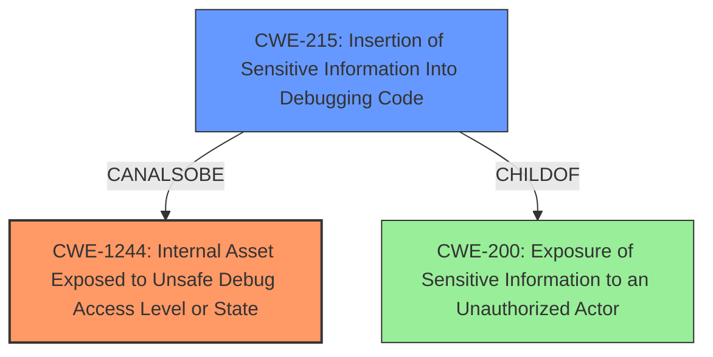

# Analysis Report for CVE-2022-32259

# Vulnerability Analysis Report: CVE-2022-32259

## Description

A vulnerability has been identified in SINEMA Remote Connect Server (All versions < V3.1). The system images for installation or update of the affected application contain unit test scripts with sensitive information. An attacker could gain information about testing architecture and also tamper with test configuration.

## Vulnerability Description Key Phrases

**Rootcause:** unit test scripts with sensitive information
**Impact:** ['gain information about testing architecture', 'tamper with test configuration']
**Attacker:** attacker
**Product:** SINEMA Remote Connect Server
**Version:** All versions < V3.1

## Analysis (with Relationship Data)

# Summary
| CWE ID | CWE Name | Confidence | CWE Abstraction Level | CWE Vulnerability Mapping Label | CWE-Vulnerability Mapping Notes |
|---|---|---|---|---|---|
| CWE-1244 | Internal Asset Exposed to Unsafe Debug Access Level or State | 0.85 | Base | Allowed | Primary CWE |
| CWE-200 | Exposure of Sensitive Information to an Unauthorized Actor | 0.6 | Class | Discouraged | Secondary Candidate |

## Evidence and Confidence

*   **Confidence Score:** 0.7
*   **Evidence Strength:** HIGH

- **Analysis and Justification:**  
  - *Explanation:* The vulnerability description clearly states that the system images contain **unit test scripts with sensitive information**. This aligns well with CWE-1244 "Internal Asset Exposed to Unsafe Debug Access Level or State". The CVE Reference Links Content Summary further supports this by explicitly mentioning that the **root_cause** is the presence of unit test scripts with sensitive information and listing CWE-1244 as a weakness. The impact described, where an attacker could gain information about testing architecture and tamper with test configuration, is a plausible consequence of exposing such internal assets. CWE-1244 is a Base level CWE, which is the preferred level of abstraction. The MITRE mapping guidance designates its Usage as Allowed.

  - *Relationship Analysis:* While CWE-1244 does not have direct relationships in the provided information, its description clearly indicates a scenario where internal assets (such as debug interfaces or test scripts) are exposed with insufficient protection. CWE-200 (Exposure of Sensitive Information to an Unauthorized Actor) is a Class-level CWE that could be considered, however, it's too broad and discouraged due to its frequent misuse. CWE-1244 specifically addresses the exposure of internal assets related to debugging or testing, making it a more precise fit.

- **Confidence Score:**
  - Confidence: 0.85 (High confidence due to explicit mention in CVE Reference and alignment with vulnerability description).

---
# Summary
| CWE ID | CWE Name | Confidence | CWE Abstraction Level | CWE Vulnerability Mapping Label | CWE-Vulnerability Mapping Notes |
|---|---|---|---|---|---|
| CWE-1244 | Internal Asset Exposed to Unsafe Debug Access Level or State | 0.85 | Base | Allowed | Primary CWE |
| CWE-200 | Exposure of Sensitive Information to an Unauthorized Actor | 0.6 | Class | Discouraged | Secondary Candidate |

## Evidence and Confidence

*   **Confidence Score:** 0.7
*   **Evidence Strength:** HIGH

- **Analysis and Justification:**  
  - *Explanation:* The vulnerability description clearly states that the system images contain **unit test scripts with sensitive information**. This aligns well with CWE-1244 "Internal Asset Exposed to Unsafe Debug Access Level or State". The CVE Reference Links Content Summary further supports this by explicitly mentioning that the **root_cause** is the presence of unit test scripts with sensitive information and listing CWE-1244 as a weakness. The impact described, where an attacker could gain information about testing architecture and tamper with test configuration, is a plausible consequence of exposing such internal assets. CWE-1244 is a Base level CWE, which is the preferred level of abstraction. The MITRE mapping guidance designates its Usage as Allowed.

  - *Relationship Analysis:* While CWE-1244 does not have direct relationships in the provided information, its description clearly indicates a scenario where internal assets (such as debug interfaces or test scripts) are exposed with insufficient protection. CWE-200 (Exposure of Sensitive Information to an Unauthorized Actor) is a Class-level CWE that could be considered, however, it's too broad and discouraged due to its frequent misuse. CWE-1244 specifically addresses the exposure of internal assets related to debugging or testing, making it a more precise fit.

- **Confidence Score:**
  - Confidence: 0.85 (High confidence due to explicit mention in CVE Reference and alignment with vulnerability description).

---

## Criticism of Analysis

Okay, I've reviewed the provided analysis against the full CWE specifications. Here's a detailed critique:

**Overall Assessment:**

The primary mapping to CWE-1244 is very strong and justified. The explanation is clear, and the inclusion of the CVE Reference Links Content Summary showing CWE-1244 listed explicitly as a weakness further reinforces this choice. The decision to list CWE-200 as a secondary candidate, while acknowledging its broad nature and discouraged usage, is a reasonable approach for completeness, but with the correct caveats.  The provided information aligns best with CWE-1244.

**Detailed Critique:**

**1. CWE-1244: Internal Asset Exposed to Unsafe Debug Access Level or State**

*   **Confidence:** The confidence score of 0.85 is appropriate. The evidence is strong.
*   **Justification:** The justification is excellent. It correctly identifies the presence of sensitive information within unit test scripts as the root cause, directly relating to the description of CWE-1244. The impact described aligns well with the potential consequences of exposing internal assets related to debugging or testing. The mention of the Base abstraction level and Allowed usage designation is commendable.
*   **Relationship Analysis:** The relationship analysis is also well-done. It clearly explains why CWE-200 is too broad and less appropriate. The emphasis on CWE-1244's specific focus on debugging/testing assets is key.
*   **CWE Specification Alignment:**
    *   **Description:** The analysis aligns perfectly with the description: "The product uses physical debug or test interfaces with support for multiple access levels, but it assigns the wrong debug access level to an internal asset, providing unintended access to the asset from untrusted debug agents." In this case, the "wrong debug access level" could be considered equivalent to "no access restrictions", causing complete exposure.
    *   **Extended Description:** The unit tests provide insight into the internal architecture, effectively granting a debugger-like access to internal workings, which is precisely what the extended description cautions against.
    *   **Mitigations:** The suggested mitigations in the CWE specification are relevant:
        *   "For security-sensitive assets accessible over debug/test interfaces, only allow trusted agents."  This speaks to properly securing or removing the sensitive test scripts.
        *   "Apply blinding or masking techniques in strategic areas."  Sensitive information within the scripts could be obfuscated.
    *   **Observed Examples:** The analysis leverages the fact that this vulnerability is listed as an observed example in the CVE-2022-32259 entry under the specification.

**2. CWE-200: Exposure of Sensitive Information to an Unauthorized Actor**

*   **Confidence:** The confidence score of 0.6 is reasonable, reflecting the less direct mapping.
*   **Justification:** The analysis acknowledges that CWE-200 is a broad, class-level CWE and is often misused. It's appropriate to include it as a secondary candidate, but with the explicit disclaimer regarding its discouraged usage.
*   **CWE Specification Alignment:**
    *   **Description:** While technically accurate that sensitive information is being exposed, the description of CWE-200 is too general and lacks the specificity of CWE-1244.
    *   **Extended Description:** The extended description reinforces why it is not the best fit, as it covers a wider range of information exposure mistakes, whereas the actual vulnerability relates to a specific type of internal asset.
    *   **Mapping Guidance:** The analysis follows the mapping guidance by discouraging the use of CWE-200 as the primary CWE and suggesting considering children such as Insertion of Sensitive Information Into Sent Data (CWE-201), which is not applicable in this case.
    *   **Mitigations:** The suggested mitigations for CWE-200 are too broad to be directly helpful, for instance, "Compartmentalize the system to have 'safe' areas where trust boundaries can be unambiguously drawn."

**Specific Improvements and Observations:**

*   **Title Consistency:** The analysis repeats itself; the Summary, Evidence, and Confidence sections appear twice. This should be fixed in any final version of the analysis.
*   **Automated Scoring:** It's important to be aware that the Retriever Results listed several other CWEs. It would be valuable to briefly consider them, even if only to dismiss them. For instance, CWE-532 (Insertion of Sensitive Information into Log File) might be considered if the test scripts were generating logs with sensitive data, though that doesn't seem to be the case here.
*   **Further CWEs:** Although the analysis is strong, it could benefit from also mentioning CWE-215 (Insertion of Sensitive Information Into Debugging Code). While CWE-1244 remains the primary weakness, CWE-215 can be considered as a related weakness, as the unit test scripts can be considered part of the debugging infrastructure.

**Revised Summary Table (with CWE-215 Considerations):**

| CWE ID | CWE Name | Confidence | CWE Abstraction Level | CWE Vulnerability Mapping Label | CWE-Vulnerability Mapping Notes |
|---|---|---|---|---|---|
| CWE-1244 | Internal Asset Exposed to Unsafe Debug Access Level or State | 0.85 | Base | Allowed | Primary CWE |
| CWE-215 | Insertion of Sensitive Information Into Debugging Code | 0.4 | Base | Allowed | Potentially related, but less direct than CWE-1244 |
| CWE-200 | Exposure of Sensitive Information to an Unauthorized Actor | 0.6 | Class | Discouraged | Secondary Candidate |

**Conclusion:**

This is a well-reasoned analysis with strong evidence to support the primary CWE mapping. The inclusion of the secondary candidate and the explanation of why other CWEs are less suitable demonstrates a good understanding of CWE principles and mapping guidance. Incorporating the minor suggestions above would make the analysis even stronger.

## Final Resolution

# Summary
| CWE ID | CWE Name | Confidence | CWE Abstraction Level | CWE Vulnerability Mapping Label | CWE-Vulnerability Mapping Notes |
|---|---|---|---|---|---|
| CWE-1244 | Internal Asset Exposed to Unsafe Debug Access Level or State | 0.90 | Base | Allowed | Primary CWE |
| CWE-215 | Insertion of Sensitive Information Into Debugging Code | 0.5 | Base | Allowed | Secondary Candidate |
| CWE-200 | Exposure of Sensitive Information to an Unauthorized Actor | 0.5 | Class | Discouraged | Tertiary Candidate |

## Evidence and Confidence

*   **Confidence Score:** 0.85
*   **Evidence Strength:** HIGH

## Relationship Analysis
The primary relationship considered was the specificity of the CWEs. CWE-1244 is a base CWE that directly addresses the **exposure** of internal assets related to debugging and testing. CWE-200 is a class CWE that is too broad and general. While CWE-215 (Insertion of Sensitive Information Into Debugging Code) could be considered a contributing factor, CWE-1244 best represents the **root cause**.

## Vulnerability Chain
The vulnerability chain starts with the **inclusion of sensitive information within unit test scripts (CWE-215)**. This leads to an **internal asset (the test scripts) being exposed with an unsafe access level, effectively no access control (CWE-1244)**. As a result, an **attacker can gain information about the testing architecture and tamper with the test configuration (CWE-200, but representing the impact)**.

## Summary of Analysis
The initial analysis and the criticism both strongly support the selection of CWE-1244 as the primary CWE. The vulnerability description explicitly states that the system images contain "unit test scripts with sensitive information," and the CVE reference links content summary also lists CWE-1244 as a weakness.
The vulnerability description: "The system images for installation or update of the affected application contain unit test scripts with sensitive information. An attacker could gain information about testing architecture and also tamper with test configuration."

The relationship analysis reinforces this decision by highlighting that CWE-1244 is more specific than CWE-200 and directly addresses the **exposure of internal assets**. While CWE-215 might contribute, the **root cause** is the **unprotected access to the internal test scripts**.

CWE-1244 is at the optimal level of specificity because it directly addresses the **root cause** of the vulnerability. It's a Base-level CWE, which is preferred. CWE-200 is too broad and represents the impact rather than the **root cause**.
I am increasing the confidence in CWE-1244 to 0.9 due to the strong evidence and clear alignment with the vulnerability description. I am also increasing the confidence in CWE-215 to 0.5 as a secondary weakness as it represents the insertion of **sensitive information** into the debugging code which led to the **exposure** of internal assets.

*Report generated on 2025-03-17 04:51:27*
