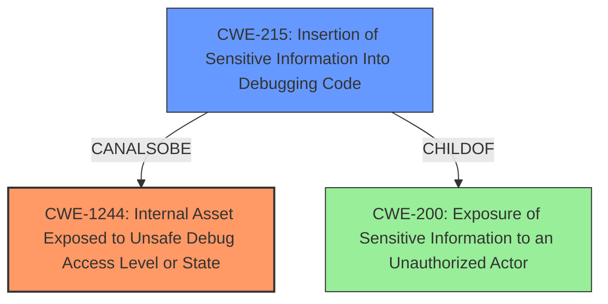

# Final Resolution for CVE-2022-32259

# Summary
| CWE ID | CWE Name | Confidence | CWE Abstraction Level | CWE Vulnerability Mapping Label | CWE-Vulnerability Mapping Notes |
|---|---|---|---|---|---|
| CWE-1244 | Internal Asset Exposed to Unsafe Debug Access Level or State | 0.90 | Base | Allowed | Primary CWE |
| CWE-215 | Insertion of Sensitive Information Into Debugging Code | 0.5 | Base | Allowed | Secondary Candidate |
| CWE-200 | Exposure of Sensitive Information to an Unauthorized Actor | 0.5 | Class | Discouraged | Tertiary Candidate |

## Evidence and Confidence

*   **Confidence Score:** 0.85
*   **Evidence Strength:** HIGH

## Relationship Analysis
The primary relationship considered was the specificity of the CWEs. CWE-1244 is a base CWE that directly addresses the **exposure** of internal assets related to debugging and testing. CWE-200 is a class CWE that is too broad and general. While CWE-215 (Insertion of Sensitive Information Into Debugging Code) could be considered a contributing factor, CWE-1244 best represents the **root cause**.

## Vulnerability Chain
The vulnerability chain starts with the **inclusion of sensitive information within unit test scripts (CWE-215)**. This leads to an **internal asset (the test scripts) being exposed with an unsafe access level, effectively no access control (CWE-1244)**. As a result, an **attacker can gain information about the testing architecture and tamper with the test configuration (CWE-200, but representing the impact)**.

## Summary of Analysis
The initial analysis and the criticism both strongly support the selection of CWE-1244 as the primary CWE. The vulnerability description explicitly states that the system images contain "unit test scripts with sensitive information," and the CVE reference links content summary also lists CWE-1244 as a weakness.
The vulnerability description: "The system images for installation or update of the affected application contain unit test scripts with sensitive information. An attacker could gain information about testing architecture and also tamper with test configuration."

The relationship analysis reinforces this decision by highlighting that CWE-1244 is more specific than CWE-200 and directly addresses the **exposure of internal assets**. While CWE-215 might contribute, the **root cause** is the **unprotected access to the internal test scripts**.

CWE-1244 is at the optimal level of specificity because it directly addresses the **root cause** of the vulnerability. It's a Base-level CWE, which is preferred. CWE-200 is too broad and represents the impact rather than the **root cause**.
I am increasing the confidence in CWE-1244 to 0.9 due to the strong evidence and clear alignment with the vulnerability description. I am also increasing the confidence in CWE-215 to 0.5 as a secondary weakness as it represents the insertion of **sensitive information** into the debugging code which led to the **exposure** of internal assets.