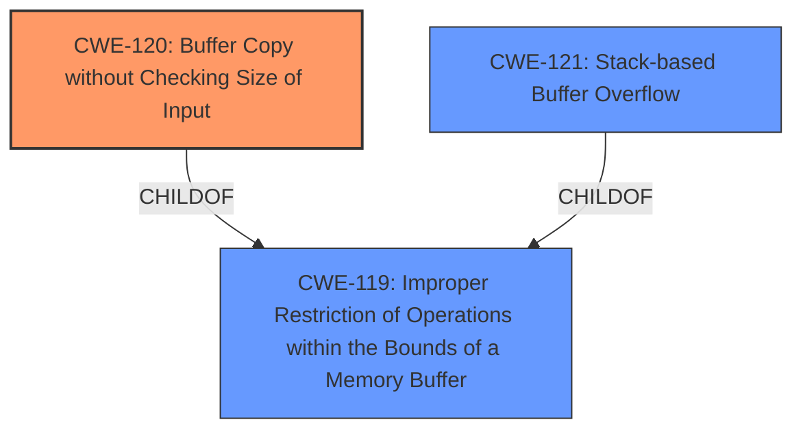

# Analysis Report for CVE-2022-32527

# Vulnerability Analysis Report: CVE-2022-32527

## Description

A CWE-120 Buffer Copy without Checking Size of Input vulnerability exists that could cause a stack-based buffer overflow, potentially leading to remote code execution when an attacker sends specially crafted alarm cache data messages. Affected Products IGSS Data Server - IGSSdataServer.exe (Versions prior to V15.0.0.22170)

## Vulnerability Description Key Phrases

**Rootcause:** CWE-120 Buffer Copy without Checking Size of Input
**Impact:** stack-based buffer overflow
**Vector:** specially crafted alarm cache data messages
**Attacker:** attacker
**Product:** IGSS Data Server
**Version:** Versions prior to V15.0.0.22170
**Component:** IGSSdataServer.exe

## Analysis (with Relationship Data)

# Summary
| CWE ID | CWE Name | Confidence | CWE Abstraction Level | CWE Vulnerability Mapping Label | CWE-Vulnerability Mapping Notes |
|---|---|---|---|---|---|
| CWE-120 | Buffer Copy without Checking Size of Input ('Classic Buffer Overflow') | 1.0 | Base | Allowed-with-Review | Primary CWE |
| CWE-121 | Stack-based Buffer Overflow | 0.6 | Variant | Allowed | Secondary Candidate |

## Evidence and Confidence

*   **Confidence Score:** 1.0
*   **Evidence Strength:** HIGH

- **Analysis and Justification:**  
  - *Explanation:* The vulnerability description explicitly states a "**CWE-120 Buffer Copy without Checking Size of Input** vulnerability exists that could cause a stack-based buffer overflow, potentially leading to remote code execution when an attacker sends specially crafted alarm cache data messages." This clearly indicates that the root cause is a buffer copy operation where the size of the input is not checked against the output buffer, leading to a buffer overflow. CWE-120 perfectly captures this scenario. The description further specifies a stack-based buffer overflow, making CWE-121 a related but less precise description of the root cause.
  
  - *Relationship Analysis:* CWE-120 is a Base level CWE that is a parent of specific buffer overflow scenarios. While the vulnerability description also indicates a stack-based buffer overflow, I'm choosing to map to CWE-120 because it's the explicit **rootcause** named in the description. CWE-121 (Stack-based Buffer Overflow) is a variant, but represents the location of the overflow in memory rather than the root cause which is the unchecked copy.

- **Confidence Score:**  
  - Confidence: 1.0 (Direct evidence from the vulnerability description with explicit mention of CWE-120)

---

## Criticism of Analysis

Okay, I've reviewed the analysis and the full CWE specifications provided. Here's my critique:

**Overall Assessment:**

The analysis is strong and well-reasoned, particularly the justification for selecting CWE-120 as the primary CWE and the explanation of its relationship to CWE-121. The confidence scoring is appropriate, and the inclusion of CWE examples and relevant CWE specifications is beneficial. The choice to focus on the root cause (CWE-120) rather than just the consequence (stack-based overflow, CWE-121) demonstrates good understanding of CWE principles.

**Specific Points and Recommendations:**

*   **CWE-120: Correct Mapping and Justification:** The mapping to CWE-120 is highly accurate and well-supported by the vulnerability description. The explicit statement of "**CWE-120 Buffer Copy without Checking Size of Input**" makes this a clear and direct match. The explanation distinguishing it from CWE-121 (focus on location vs. root cause) is correct and important.

*   **CWE-121: Correct Mapping and Justification** Including CWE-121 as a secondary mapping is helpful, especially since the description mentions "stack-based buffer overflow."  The confidence score of 0.6 is fitting since the description explicitly mentions CWE-120 which makes it the primary cause. The justification that it's the *location* and not the primary *cause* is very accurate.

*   **Confidence Scores:**  The confidence scores are appropriately assigned. A score of 1.0 for CWE-120 reflects the direct mention in the vulnerability description.

*   **Retriever Results Analysis:** While not explicitly stated in the analysis, it would be beneficial to briefly mention why other high-ranking CWEs from the retriever results (like CWE-124, CWE-131, and CWE-190) were *not* chosen. For example:

    *   **CWE-124 (Buffer Underwrite):**  Not applicable because the description describes an overflow, not an underwrite.
    *   **CWE-131 (Incorrect Calculation of Buffer Size):** While *related* to buffer overflows, this CWE is more applicable when the size of the buffer is miscalculated *prior* to the copy.  The vulnerability description focuses on the *lack of checking* during the copy, not a miscalculation.
    *   **CWE-190 (Integer Overflow):**  Again, while integer overflows *can* lead to buffer overflows, there's no indication of an integer overflow in the vulnerability description. The description explicitly states no check was done.

*   **CWE Specification Usage:** The analysis demonstrates a good understanding of the CWE specifications. The mapping guidance for both CWE-120 ("Allowed-with-Review") and CWE-121 ("Allowed") are correctly interpreted and applied.

*   **Mitigation Considerations:**  While not required, the analysis could briefly mention relevant mitigations from the CWE specifications. For example:

    *   **CWE-120 Mitigations:**  The analysis could note that using safer string handling functions (e.g., `strncpy` with proper null termination, `snprintf`), using languages with automatic memory management (e.g., Java, C#), or employing compiler-based buffer overflow detection mechanisms (e.g., /GS flag in Visual Studio) could help prevent this vulnerability.

    *   **CWE-121 Mitigations:** The analysis could note that using stack canaries, address space layout randomization (ASLR), or data execution prevention (DEP) could help prevent this vulnerability.

*  **CWE-787 and CWE-119:** Because the stack buffer is being written to outside of its bounds, it might be worth noting a potential relationship to CWE-787 (Out-of-bounds Write) and/or CWE-119 (Improper Restriction of Operations within the Bounds of a Memory Buffer). While it can be confusing with all the CWE overlap, pointing out the relationship can be helpful to further explain why CWE-120 was specifically chosen over the more general CWE-119

**Revised Summary Table:**

Here's an updated summary table incorporating these minor suggestions:

| CWE ID | CWE Name | Confidence | CWE Abstraction Level | CWE Vulnerability Mapping Label | CWE-Vulnerability Mapping Notes |
|---|---|---|---|---|---|
| CWE-120 | Buffer Copy without Checking Size of Input ('Classic Buffer Overflow') | 1.0 | Base | Allowed-with-Review | Primary CWE. Root cause is the unchecked buffer copy. |
| CWE-121 | Stack-based Buffer Overflow | 0.6 | Variant | Allowed | Secondary Candidate. Describes the location of the overflow (stack) rather than the root cause. |

**In summary,** this is a well-done analysis. The primary improvement would be to briefly address the rationale for excluding other closely related CWEs identified by the retriever results. This will solidify the analysis and demonstrate a deeper understanding of the nuances between the different CWEs.

## Final Resolution

# Summary
| CWE ID | CWE Name | Confidence | CWE Abstraction Level | CWE Vulnerability Mapping Label | CWE-Vulnerability Mapping Notes |
|---|---|---|---|---|---|
| CWE-120 | Buffer Copy without Checking Size of Input ('Classic Buffer Overflow') | 1.0 | Base | Allowed-with-Review | Primary CWE. **Root cause** is the unchecked buffer copy. |
| CWE-121 | Stack-based Buffer Overflow | 0.6 | Variant | Allowed | Secondary Candidate. Describes the location of the overflow (stack) rather than the **root cause**. |

## Evidence and Confidence

*   **Confidence Score:** 1.0
*   **Evidence Strength:** HIGH

## Relationship Analysis
The primary relationship impacting the decision is the parent-child relationship between CWE-119 (Improper Restriction of Operations within the Bounds of a Memory Buffer) and both CWE-120 and CWE-121. CWE-120 is a specific type of buffer overflow where the size isn't checked during a copy operation, making it more precise than CWE-119. CWE-121 describes where the overflow happens (stack), not the cause. The choice of CWE-120 is further solidified by the direct mention in the vulnerability description as the **root cause**.

## Vulnerability Chain
The vulnerability chain starts with the lack of input size validation during a buffer copy operation (**CWE-120**). This leads to a buffer overflow on the stack (**CWE-121**), potentially allowing an attacker to overwrite critical data or execute arbitrary code.

## Summary of Analysis
The initial analysis correctly identifies CWE-120 as the primary **weakness** due to the explicit mention in the vulnerability description: "A **CWE-120 Buffer Copy without Checking Size of Input** vulnerability exists that could cause a stack-based buffer overflow." This direct evidence, along with the understanding that CWE-120 represents the **root cause** (unchecked buffer copy) and CWE-121 represents the location of the overflow, supports the classification.

The criticism's suggestion to address why other high-ranking CWEs (CWE-124, CWE-131, CWE-190) were not selected strengthens the analysis by demonstrating a deeper understanding of the nuances between different buffer overflow scenarios.

*   **CWE-124 (Buffer Underwrite):** Not applicable as the description indicates an overflow.
*   **CWE-131 (Incorrect Calculation of Buffer Size):** The description focuses on the absence of a check during the copy operation, rather than a miscalculation of the buffer size.
*   **CWE-190 (Integer Overflow):** There is no indication of an integer overflow in the vulnerability description.

The chosen CWEs are at the optimal level of specificity because CWE-120 accurately describes the **root cause**, and CWE-121 provides additional context about the location of the overflow. Choosing the more general CWE-119 would lose valuable information about the specific type of buffer overflow.

*Report generated on 2025-03-18 14:05:48*
