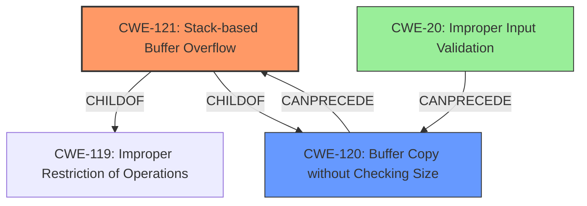

# Final Resolution for CVE-2022-32529

# Summary
| CWE ID | CWE Name | Confidence | CWE Abstraction Level | CWE Vulnerability Mapping Label | CWE-Vulnerability Mapping Notes |
|---|---|---|---|---|---|
| CWE-121 | Stack-based Buffer Overflow | 0.9 | Variant | Allowed | Primary CWE |
| CWE-120 | Buffer Copy without Checking Size of Input ('Classic Buffer Overflow') | 0.7 | Base | Allowed-with-Review | Secondary Candidate |
| CWE-20 | Improper Input Validation | 0.3 | Class | Allowed | Contributing factor |

## Evidence and Confidence

*   **Confidence Score:** 0.9
*   **Evidence Strength:** HIGH

## Relationship Analysis
The analysis correctly identifies CWE-121 as a variant of **CWE-119 Improper Restriction of Operations within the Bounds of a Memory Buffer**, focusing on the location of the overflow (stack). The parent-child relationship between CWE-120 and CWE-121 is also accurate, as an unchecked buffer copy can lead to a stack overflow. The addition of CWE-20 highlights a potential vulnerability chain starting with improper input validation. The abstraction levels (Variant for CWE-121, Base for CWE-120, Class for CWE-20) are appropriately considered for specificity.

## Vulnerability Chain
The vulnerability chain starts with a lack of input validation (**CWE-20**), which allows an attacker to send a specially crafted log data request message. This message is then processed using a buffer copy operation without proper size checking (**CWE-120**), leading to a stack-based buffer overflow (**CWE-121**). The overflow can then allow arbitrary code execution.

## Summary of Analysis
The initial analysis and criticism both converge on the appropriateness of selecting **CWE-121 Stack-based Buffer Overflow** as the primary **WEAKNESS**, given the explicit mention of "stack-based buffer overflow" in the vulnerability description: "A **CWE-120 Buffer Copy without Checking Size of Input** vulnerability exists that could cause a stack-based buffer overflow".
The inclusion of **CWE-120 Buffer Copy without Checking Size of Input** as a secondary candidate is also justified, as it represents the **ROOTCAUSE** of the vulnerability - the unchecked buffer copy operation. Adding CWE-20 is to show the potential start of the vulnerability chain.
The graph relationships reinforce these choices, with CWE-121 being a child of both CWE-119 and CWE-120.
The selected CWEs are at an optimal level of specificity, with CWE-121 providing a more precise classification than the general **CWE-119 Improper Restriction of Operations within the Bounds of a Memory Buffer**, and **CWE-120** explaining the root cause of the vulnerability.
The confidence score is high (0.9) due to the direct evidence in the vulnerability description.