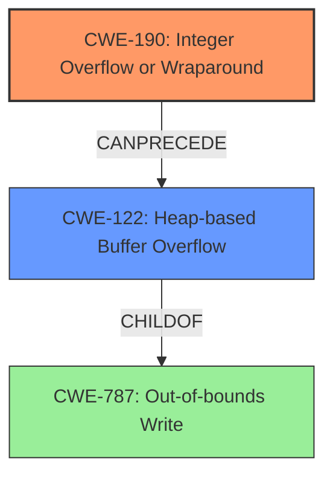

# Analysis Report for CVE-2022-32543

# Vulnerability Analysis Report: CVE-2022-32543

## Description

An integer overflow vulnerability exists in the way ESTsoft Alyac 2.5.8.544 parses OLE files. A specially-crafted OLE file can lead to a heap buffer overflow which can result in arbitrary code execution. An attacker can provide a malicious file to trigger this vulnerability.

## Vulnerability Description Key Phrases

**Rootcause:** integer overflow
**Weakness:** heap buffer overflow
**Impact:** arbitrary code execution
**Vector:** specially-crafted OLE file
**Product:** ESTsoft Alyac
**Version:** 2.5.8.544

## Analysis (with Relationship Data)

# Summary
| CWE ID | CWE Name | Confidence | CWE Abstraction Level | CWE Vulnerability Mapping Label | CWE-Vulnerability Mapping Notes |
|---|---|---|---|---|---|
| CWE-190 | Integer Overflow or Wraparound | 0.95 | Base | Allowed | The **integer overflow** leads to a heap buffer overflow, resulting in arbitrary code execution. |
| CWE-122 | Heap-based Buffer Overflow | 0.85 | Variant | Allowed |  The **integer overflow** results in a smaller than required heap allocation, which then leads to a **heap buffer overflow**. |

## Evidence and Confidence

*   **Confidence Score:** 0.90
*   **Evidence Strength:** HIGH

- **Analysis and Justification:**  
  - *Explanation:* The vulnerability description clearly states an **integer overflow** exists when parsing OLE files in ESTsoft Alyac. This **integer overflow** leads to a **heap buffer overflow**, allowing arbitrary code execution. The "CVE Reference Links Content Summary" confirms the root cause: an **integer overflow** during heap allocation size calculation, leading to a heap buffer overflow because a smaller buffer is allocated. The subsequent `memcpy` operation writes beyond the allocated buffer. The retriever results also lists CWE-190 as the highest-ranked CWE. CWE-190 (Integer Overflow or Wraparound) is a Base level CWE, which is appropriate for mapping the root cause. The MITRE mapping guidance lists its Usage as Allowed.
  - *Relationship Analysis:* CWE-190 does not have any direct relationships in the provided data, but it's a common precursor to buffer overflows.

- **Confidence Score:**  
  - Confidence: 0.95 (Strong evidence from the vulnerability description, CVE reference, and retriever results.)

---
- **Analysis and Justification:**  
  - *Explanation:* The **integer overflow** leads to a smaller heap buffer being allocated, then a subsequent write operation overflows the buffer. The "Vulnerability Description" mentions "**heap buffer overflow**" directly. The "CVE Reference Links Content Summary" confirms that the **integer overflow** results in a smaller than required memory buffer being allocated on the heap, and subsequent `memcpy` operations write beyond the allocated buffer. CWE-122 (Heap-based Buffer Overflow) is a Variant level CWE, which is appropriate because the buffer overflow occurs on the heap. The MITRE mapping guidance lists its Usage as Allowed.
  - *Relationship Analysis:* CWE-122 is a parent of CWE-787 (Out-of-bounds Write), where CWE-787 is a more general out-of-bounds write.

- **Confidence Score:**  
  - Confidence: 0.85 (Strong evidence from the vulnerability description and CVE reference materials.)

## Criticism of Analysis

Okay, here's a detailed review of the analysis, considering the full CWE specifications provided:

**Overall Assessment:**

The analysis is generally sound and well-reasoned. The identification of CWE-190 (Integer Overflow or Wraparound) as the root cause and CWE-122 (Heap-based Buffer Overflow) as the resulting weakness is accurate. The confidence scores are appropriate given the evidence. The explanations are clear and connect the vulnerability description with the CWE definitions.

**Specific CWE Mapping Review:**

*   **CWE-190 (Integer Overflow or Wraparound):**

    *   **Correct Mapping:**  This is a correct and appropriate mapping.  The description clearly indicates that an integer overflow leads to the vulnerability.
    *   **Abstraction Level:** Base level is correct as it represents the foundational issue.
    *   **Usage:** The usage is "Allowed" according to MITRE.
    *   **Mapping Guidance:** The guidance correctly points out the importance of paying attention to terminology problems with overflow, underflow, and wraparound.
    *   **Mitigations:** The analysis doesn't explicitly call out mitigations but the CWE specification provides good ones:  using safe integer handling packages, language selection (automatic bounds checking), and ensuring strict protocol definitions to prevent out-of-bounds behavior.  These mitigations are relevant.
    *   **Observed Examples:** The observed example CVE-2021-43537 is highly relevant because it shows how an Integer Overflow (CWE-190) results in heap memory corruption (CWE-122), which is exactly what's happening in the vulnerability being analyzed. CVE-2022-0545 is also highly relevant.

*   **CWE-122 (Heap-based Buffer Overflow):**

    *   **Correct Mapping:** This is also a correct and appropriate mapping. The vulnerability description explicitly mentions a heap buffer overflow, and the analysis correctly identifies that it's a consequence of the integer overflow.
    *   **Abstraction Level:** Variant level is correct, as it's a more specific type of buffer overflow.
    *   **Usage:** The usage is "Allowed" according to MITRE.
    *   **Mapping Guidance:** The guidance correctly emphasizes reading the name and description carefully.
    *   **Mitigations:** The analysis doesn't explicitly call out mitigations but the CWE specification provides good ones: Using languages or compilers that perform automatic bounds checking, using abstraction libraries, and utilizing automatic buffer overflow detection mechanisms. These are relevant.
    *   **Observed Examples:** The observed examples are relevant. Specifically, CVE-2021-43537, CVE-2007-4268, CVE-2009-2523 and CVE-2010-1866 are extremely relevant as they are chains that show an integer overflow or signedness error can lead to a heap buffer overflow.

**Areas for Potential Improvement (Minor):**

*   **Explicitly connect Mitigations:** While the analysis is strong, it could be slightly improved by explicitly mentioning some of the mitigations listed in the CWE specifications within the analysis justification, even if it's just a sentence or two. For example:
    *   "Mitigations for CWE-190 would include using safe integer handling libraries or choosing a language with automatic bounds checking."
    *   "Mitigations for CWE-122 would include using automatic buffer overflow detection mechanisms provided by compilers."
*   **Relationship to CWE-787:** While CWE-122 is a child of CWE-787, the relationship between CWE-787 and CWE-122 could be explicitly mentioned in the analysis for CWE-122.
*   **Could mention CWE-680:** CWE-680, *Integer Overflow to Buffer Overflow* is a Compound CWE that is specifically designed for this type of vulnerability. However, since it's flagged as "Discouraged" because it's a named chain and recommends mapping to each separate weakness in the chain would be more precise, the analysis is still correct in choosing CWE-190 and CWE-122.
*   **Consider CWE-131:** CWE-131 (Incorrect Calculation of Buffer Size) could also be considered, as the integer overflow leads to an incorrect buffer size calculation. However, CWE-190 and CWE-122 capture the core of the vulnerability, so this is not strictly necessary.
*   **Input Validation:** CWE-20 is very broad, but since the integer overflow is directly caused by processing a crafted input file, it *could* be argued that improper input validation is a contributing factor. However, it's better to focus on the more specific CWEs (190 and 122).

**Conclusion:**

This is a well-done analysis with accurate CWE mappings. The minor suggestions above are just for added completeness and to make the analysis even more robust. The confidence scores are well justified, and the analysis clearly explains the vulnerability.

## Final Resolution

# Summary
| CWE ID | CWE Name | Confidence | CWE Abstraction Level | CWE Vulnerability Mapping Label | CWE-Vulnerability Mapping Notes |
|---|---|---|---|---|---|
| CWE-190 | Integer Overflow or Wraparound | 0.95 | Base | Allowed | Primary CWE. The **integer overflow** leads to a heap buffer overflow, resulting in arbitrary code execution. |
| CWE-122 | Heap-based Buffer Overflow | 0.85 | Variant | Allowed | Secondary candidate. The **integer overflow** results in a smaller than required heap allocation, which then leads to a **heap buffer overflow**. |

## Evidence and Confidence

*   **Confidence Score:** 0.95
*   **Evidence Strength:** HIGH

## Relationship Analysis
The primary relationship is that CWE-190 (**Integer Overflow or Wraparound**) can precede CWE-122 (**Heap-based Buffer Overflow**). CWE-122 is a variant of a more general buffer overflow (CWE-787). The abstraction levels are appropriate, with CWE-190 as a Base and CWE-122 as a Variant.

## Vulnerability Chain
The vulnerability chain starts with a specially crafted OLE file. The parsing of this file leads to an **integer overflow** (CWE-190) when calculating the required heap allocation size. This results in the allocation of a smaller-than-required buffer. Subsequently, a `memcpy` operation writes beyond the boundaries of this undersized buffer, leading to a **heap buffer overflow** (CWE-122). This culminates in arbitrary code execution.

## Summary of Analysis
The initial analysis and criticism are both accurate. The vulnerability description clearly indicates an **integer overflow** leading to a **heap buffer overflow**. The choice of CWE-190 and CWE-122 is justified by the evidence provided, and the abstraction levels are appropriate.

The vulnerability description states: "An integer overflow vulnerability exists in the way ESTsoft Alyac 2.5.8.544 parses OLE files. A specially-crafted OLE file can lead to a heap buffer overflow which can result in arbitrary code execution." This statement provides direct evidence for both CWE-190 and CWE-122.

The graph relationships further solidify this decision. CWE-190 can precede CWE-122, indicating a causal relationship. CWE-122 is a child of CWE-787, reflecting the specific type of out-of-bounds write.

The selected CWEs are at the optimal level of specificity because they accurately capture the root cause (**integer overflow**) and the resulting weakness (**heap buffer overflow**). While CWE-680 (Integer Overflow to Buffer Overflow) could be considered, mapping to the individual weaknesses provides more precision, as recommended by MITRE.

*Report generated on 2025-03-18 14:07:18*
