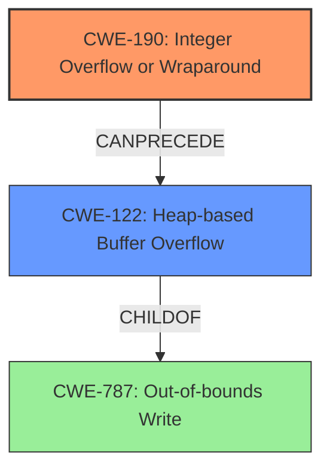

# Final Resolution for CVE-2022-32543

# Summary
| CWE ID | CWE Name | Confidence | CWE Abstraction Level | CWE Vulnerability Mapping Label | CWE-Vulnerability Mapping Notes |
|---|---|---|---|---|---|
| CWE-190 | Integer Overflow or Wraparound | 0.95 | Base | Allowed | Primary CWE. The **integer overflow** leads to a heap buffer overflow, resulting in arbitrary code execution. |
| CWE-122 | Heap-based Buffer Overflow | 0.85 | Variant | Allowed | Secondary candidate. The **integer overflow** results in a smaller than required heap allocation, which then leads to a **heap buffer overflow**. |

## Evidence and Confidence

*   **Confidence Score:** 0.95
*   **Evidence Strength:** HIGH

## Relationship Analysis
The primary relationship is that CWE-190 (**Integer Overflow or Wraparound**) can precede CWE-122 (**Heap-based Buffer Overflow**). CWE-122 is a variant of a more general buffer overflow (CWE-787). The abstraction levels are appropriate, with CWE-190 as a Base and CWE-122 as a Variant.

## Vulnerability Chain
The vulnerability chain starts with a specially crafted OLE file. The parsing of this file leads to an **integer overflow** (CWE-190) when calculating the required heap allocation size. This results in the allocation of a smaller-than-required buffer. Subsequently, a `memcpy` operation writes beyond the boundaries of this undersized buffer, leading to a **heap buffer overflow** (CWE-122). This culminates in arbitrary code execution.

## Summary of Analysis
The initial analysis and criticism are both accurate. The vulnerability description clearly indicates an **integer overflow** leading to a **heap buffer overflow**. The choice of CWE-190 and CWE-122 is justified by the evidence provided, and the abstraction levels are appropriate.

The vulnerability description states: "An integer overflow vulnerability exists in the way ESTsoft Alyac 2.5.8.544 parses OLE files. A specially-crafted OLE file can lead to a heap buffer overflow which can result in arbitrary code execution." This statement provides direct evidence for both CWE-190 and CWE-122.

The graph relationships further solidify this decision. CWE-190 can precede CWE-122, indicating a causal relationship. CWE-122 is a child of CWE-787, reflecting the specific type of out-of-bounds write.

The selected CWEs are at the optimal level of specificity because they accurately capture the root cause (**integer overflow**) and the resulting weakness (**heap buffer overflow**). While CWE-680 (Integer Overflow to Buffer Overflow) could be considered, mapping to the individual weaknesses provides more precision, as recommended by MITRE.